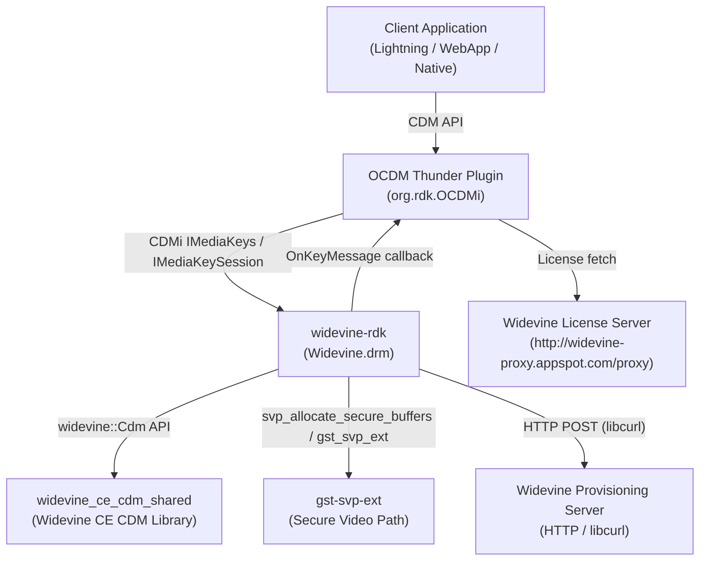
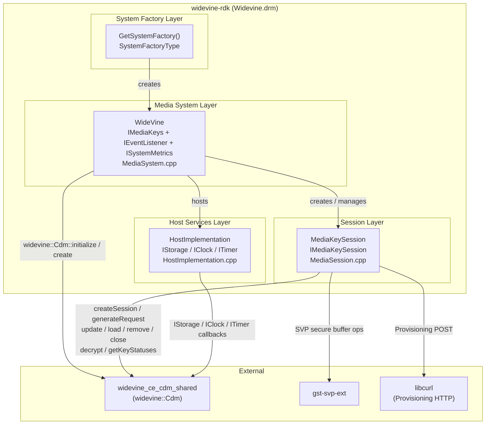
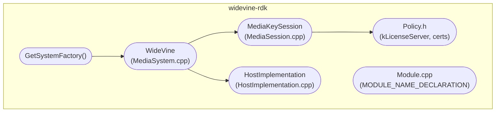
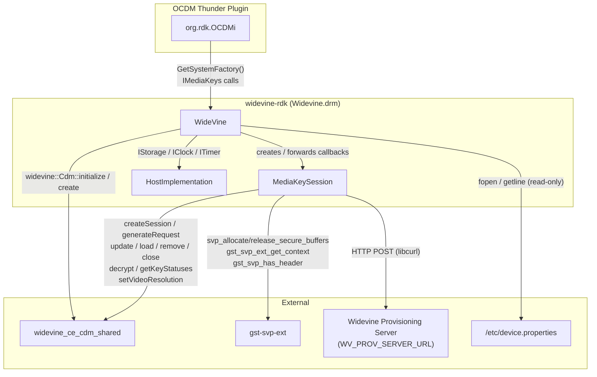
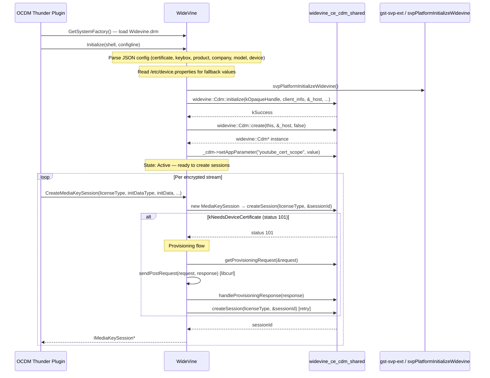
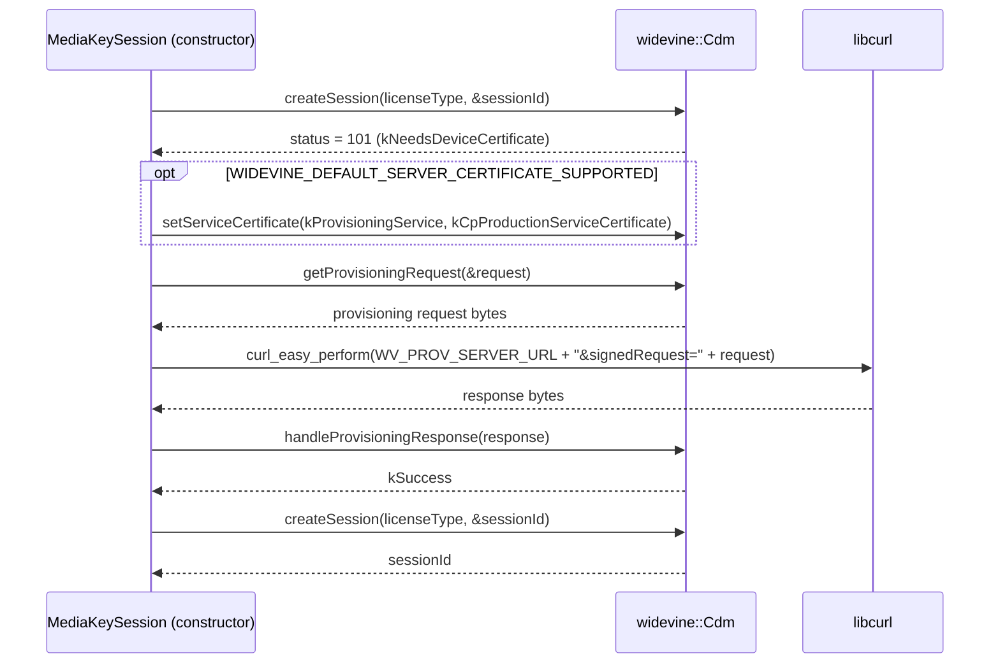
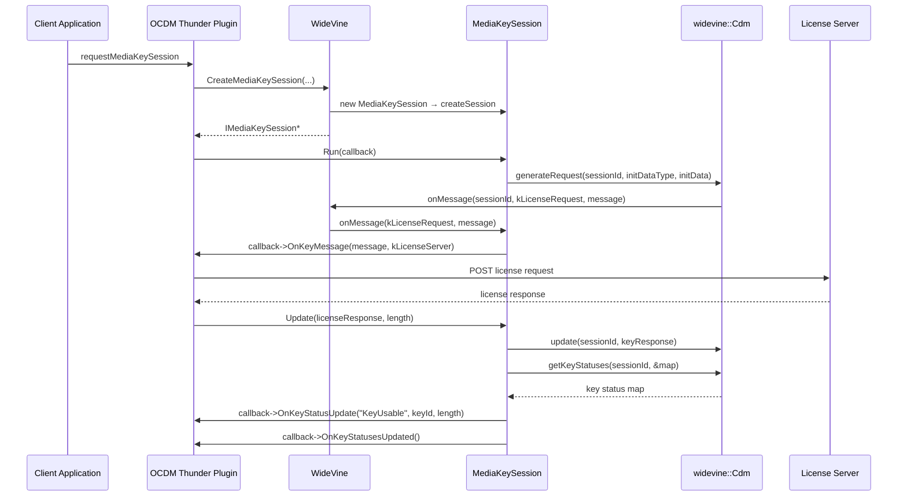
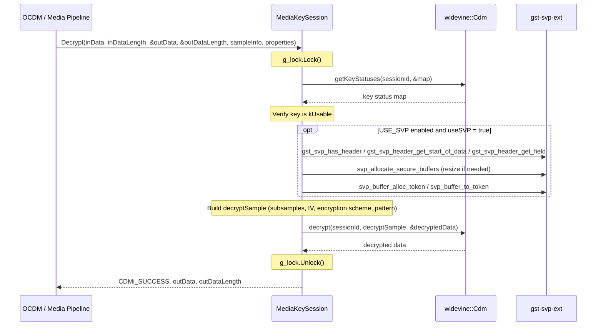

# widevine-rdk

CDMi (Content Decryption Module interface) implementation of Google Widevine DRM for the RDK-E OCDM framework, providing encrypted media session management and hardware-accelerated decryption.

---

## Overview

`widevine-rdk` is the RDK-E layer implementation of the Open Content Decryption Module (OCDM) interface for Widevine. It is not a Thunder plugin itself — it is a `.drm` shared library loaded at runtime by the OCDM Thunder plugin. It bridges the CDMi abstract interface and the Widevine CE CDM library, managing key sessions, device provisioning, and sample decryption.

At the device level, this component enables Widevine-protected video and audio playback across `video/webm`, `video/mp4`, `audio/webm`, and `audio/mp4` MIME types. At the middleware level, it exposes the `IMediaKeys` and `IMediaKeySession` CDMi interfaces to the OCDM plugin, which routes decryption requests from the media pipeline.



**Key Features & Responsibilities:**

- **Session management**: Creates, loads, updates, removes, and closes Widevine CDM sessions via `widevine::Cdm` APIs. Supports `kTemporary`, `kPersistentLicense`, and (for Widevine versions earlier than 17) `kPersistentUsageRecord` session types.
- **Device provisioning**: Detects `kNeedsDeviceCertificate` (status 101) on session creation and automatically performs the provisioning flow: generates a provisioning request, posts it to `WV_PROV_SERVER_URL` via libcurl, and processes the response with `handleProvisioningResponse()`.
- **Sample decryption**: Decrypts CENC and WebM encrypted samples. Integrates with `gst-svp-ext` for Secure Video Path (SVP) support when `USE_SVP` is defined, allocating and managing hardware-secure memory regions.
- **Key status reporting**: Maps Widevine key status and error codes to CDMi string constants and forwards them to the OCDM framework via `IMediaKeySessionCallback`.
- **Host services**: Implements all host interfaces required by the Widevine CDM: in-memory file storage (`IStorage`), system clock (`IClock`), and timer scheduling (`ITimer`) using WPEFramework core primitives.
- **Multi-platform support**: Conditionally links platform-specific libraries for Broadcom (NEXUS/NXCLIENT), Realtek (`liboec_ref_shared.so`), and Amlogic (OpenSSL) at build time.

---

## Architecture

### High-Level Architecture

```
┌──────────────────────────────────────────────────────────────┐
│               OCDM Thunder Plugin (org.rdk.OCDMi)             │
│                  CDMi IMediaKeys / IMediaKeySession           │
├──────────────────────────────────────────────────────────────┤
│                         widevine-rdk                          │
│  ┌─────────────────────┬──────────────────────────────────┐  │
│  │   WideVine class    │      MediaKeySession class       │  │
│  │  (IMediaKeys +      │  (IMediaKeySession +             │  │
│  │   IEventListener +  │   Decrypt + SVP integration)     │  │
│  │   ISystemMetrics)   │                                  │  │
│  └─────────────────────┴──────────────────────────────────┘  │
│  ┌─────────────────────────────────────────────────────────┐  │
│  │              HostImplementation                          │  │
│  │    (IStorage  /  IClock  /  ITimer  [/ ILogger v18])    │  │
│  └─────────────────────────────────────────────────────────┘  │
├──────────────────────────────────────────────────────────────┤
│  widevine_ce_cdm_shared  │  gst-svp-ext  │  libcurl          │
└──────────────────────────────────────────────────────────────┘
```

### Key Architectural Patterns

| Pattern   | Description                                                                            | Where Applied                                    |
| --------- | -------------------------------------------------------------------------------------- | ------------------------------------------------ |
| Factory   | `GetSystemFactory()` exports a `SystemFactoryType<WideVine>` to the OCDM plugin loader | `MediaSystem.cpp`                                |
| Observer  | `WideVine` implements `widevine::Cdm::IEventListener`; CDM fires callbacks on events   | `WideVine::onMessage()`, `onKeyStatusesChange()` |
| RAII      | Session destructor calls `Close()`; SVP buffers freed on session destruction           | `MediaKeySession::~MediaKeySession()`            |
| Singleton | One `widevine::Cdm` instance per `WideVine` object, shared across all sessions         | `WideVine::_cdm`                                 |

### Threading & Concurrency

- **Threading Architecture**: Multi-threaded. The WPEFramework OCDM plugin may call CDMi interfaces from multiple threads.
- **Session map protection**: `WideVine::_adminLock` (`WPEFramework::Core::CriticalSection`) protects access to the `_sessions` map in all `IMediaKeys` and `IEventListener` methods.
- **Decrypt / CDM call serialization**: A global `WPEFramework::Core::CriticalSection g_lock` (declared in `MediaSession.cpp`) serializes `Load()`, `Update()`, `Remove()`, `Close()`, and `Decrypt()` calls against the underlying `widevine::Cdm` object.
- **Timer thread**: `HostImplementation` runs a `WPEFramework::Core::TimerType<Timer>` thread named `"widevine"` to service CDM timer callbacks (`ITimer::setTimeout` / `cancel`).
- **Async / Provisioning**: Provisioning HTTP requests in the `MediaKeySession` constructor are synchronous blocking calls via libcurl. No async dispatch is used for provisioning.

---

## Design

### Design Principles

The component is a thin adaptation layer. Its design is constrained by two external contracts: the CDMi `IMediaKeys` / `IMediaKeySession` interface defined by the OCDM framework, and the `widevine::Cdm` API from the Widevine CE CDM library. Business logic is kept minimal — the component translates CDMi calls to `widevine::Cdm` calls, maps error and status codes, and routes callbacks. Platform-specific differences (Broadcom, Realtek, Amlogic) are isolated to CMake link-time flags rather than runtime code paths, keeping the C++ source portable. SVP integration is fully guarded by `#ifdef USE_SVP` preprocessor blocks, so the component builds without SVP when the flag is absent. The Widevine CDM version (14, 17, 18) is handled via `#if (WIDEVINE_VERSION == N)` guards that select the correct `widevine::Cdm::initialize()` signature and interface set.

### Northbound & Southbound Interactions

**Northbound**: The OCDM Thunder plugin calls `GetSystemFactory()` at load time to obtain a `SystemFactoryType<WideVine>` factory. The factory is registered for the MIME types `video/webm`, `video/mp4`, `audio/webm`, and `audio/mp4`. All further interaction is through the CDMi C++ interfaces: `IMediaKeys` (session lifecycle) and `IMediaKeySession` (key acquisition and decryption).

**Southbound**: All DRM operations are delegated to `widevine::Cdm` from `widevine_ce_cdm_shared`. Provisioning responses are fetched via HTTP POST using libcurl. Sample decryption with SVP enabled routes encrypted data through `gst-svp-ext` secure memory APIs before passing it to the CDM decryptor.

### IPC Mechanisms

- **CDMi C++ interface**: Direct in-process function calls between the OCDM plugin and this library. No JSON-RPC or COM-RPC involved at this layer.
- **libcurl HTTP**: Used only during provisioning. `sendPostRequest()` in `MediaSession.cpp` builds a GET-style URL by appending `&signedRequest=<request>` to `WV_PROV_SERVER_URL` and performs a synchronous `curl_easy_perform()`.
- **gst-svp-ext IPC**: The `rpcId` parameter set via `SetParameter()` carries an RPC identifier for `gst_svp_ext_get_context()` to establish a client-side SVP context. The actual secure buffer operations are executed through `gst-svp-ext` function calls.

### Data Persistence & Storage

All storage for the Widevine CDM is in-memory. `HostImplementation` implements `widevine::Cdm::IStorage` using a `std::map<std::string, std::string> _files`. Files written by the CDM via `write()` are stored only in this map and are not persisted to the filesystem. The certificate file (`cert.bin`) is pre-populated from the path specified in the `certificate` configuration field via `PreloadFile()` at initialization. The keybox path is set by writing the `WIDEVINE_KEYBOX_PATH` environment variable — the keybox file itself on disk is accessed by the Widevine CDM library directly, not by this component.

Configuration changes are not persisted across reboots by this component.

### Component Diagram



---

## Internal Modules

| Module / Class       | Description                                                                                                                                                                                                                                                                                              | Key Files                                        |
| -------------------- | -------------------------------------------------------------------------------------------------------------------------------------------------------------------------------------------------------------------------------------------------------------------------------------------------------- | ------------------------------------------------ |
| `WideVine`           | Implements `IMediaKeys` and `widevine::Cdm::IEventListener`. Owns the single `widevine::Cdm*` instance and the session map. Reads JSON configuration, sets client info, and initializes the CDM. Routes CDM event callbacks (`onMessage`, `onKeyStatusesChange`, etc.) to the correct `MediaKeySession`. | `MediaSystem.cpp`                                |
| `MediaKeySession`    | Implements `IMediaKeySession`. Manages one Widevine session: runs provisioning on demand, calls `generateRequest`, processes `Update` (license response), `Load`, `Remove`, `Close`, and `Decrypt`. Handles SVP secure memory allocation and decryption routing.                                         | `MediaSession.cpp`, `MediaSession.h`             |
| `HostImplementation` | Implements the three host interfaces required by the Widevine CDM: `IStorage` (in-memory `std::map`), `IClock` (WPEFramework `Core::Time`), and `ITimer` (WPEFramework `Core::TimerType`). For Widevine version 18, also implements `ILogger` (empty body).                                              | `HostImplementation.cpp`, `HostImplementation.h` |
| `Policy.h`           | Provides compile-time string constants: `kLicenseServer` URL, default server certificate hex strings, and test CENC init data. Consumed by `MediaSession.cpp`.                                                                                                                                           | `Policy.h`                                       |
| `Module.cpp`         | Declares the WPEFramework module name `OCDM_Widevine` via `MODULE_NAME_DECLARATION(BUILD_REFERENCE)`.                                                                                                                                                                                                    | `Module.cpp`, `Module.h`                         |



---

## Prerequisites & Dependencies

**Documentation Verification:**

- No `IARM_Bus_RegisterEventHandler` or `IARM_Bus_Call` calls found in source. No IARM integration is implemented.
- No Device Services (DS) API calls found in source. No DS integration is implemented.
- No persistent store read/write calls found in source. Storage is in-memory only.
- No `.service` file found in repository. Systemd dependencies are not documented here.
- Configuration is read from a JSON string passed by the OCDM plugin's `Initialize()`, not from a standalone file opened by this component.

### RDK-E Platform Requirements

- **WPEFramework Version**: Requires `WPEFramework` package; uses `Core::CriticalSection`, `Core::Time`, `Core::TimerType`, `Core::DataElementFile`, `Core::SystemInfo::SetEnvironment`, and `TRACE_L1`.
- **Build Dependencies**: Widevine CE CDM library (`widevine_ce_cdm_shared`, header `cdm.h`); OpenSSL headers (`openssl/aes.h`, `openssl/evp.h`); libcurl; `gst-svp-ext` (when `USE_SVP` is enabled).
- **RDK-E Plugin Dependencies**: The OCDM Thunder plugin (`org.rdk.OCDMi`) must be present. `widevine-rdk` is not active independently — it is loaded as a `.drm` plugin by OCDM.
- **Device Services / HAL**: No Device Services integration implemented.
- **IARM Bus**: No IARM integration implemented.
- **Configuration Files**: `/etc/device.properties` is read at `Initialize()` time to populate `OPERATOR_NAME`, `MODEL_NUM`, `DEVICE_NAME`, and `COBALT_CERT_SCOPE` fields when those fields are not set in the JSON configuration.
- **Widevine Keybox**: The keybox file path is set via the `WIDEVINE_KEYBOX_PATH` environment variable. The keybox file is read directly by `widevine_ce_cdm_shared`.

### Build Dependencies

| Dependency                       | Minimum Version | Purpose                                                      |
| -------------------------------- | --------------- | ------------------------------------------------------------ |
| CMake                            | 3.3             | Build system                                                 |
| WPEFramework                     | —               | Core utilities, plugin host                                  |
| `widevine_ce_cdm_shared`         | —               | Widevine CE CDM implementation                               |
| OpenSSL                          | —               | AES/EVP headers used in `MediaSession.cpp`                   |
| libcurl                          | —               | HTTP POST for device provisioning                            |
| `gst-svp-ext`                    | —               | Secure Video Path integration (when `USE_SVP` defined)       |
| GStreamer 1.0 / GLib 2.0         | —               | Header includes for SVP (when `USE_SVP` defined)             |
| NEXUS / NXCLIENT / NexusWidevine | —               | Broadcom platform linking (when `WIDEVINE_BROADCOM` defined) |
| `liboec_ref_shared.so`           | —               | Realtek platform linking (when `WIDEVINE_REALTEK` defined)   |

### Runtime Dependencies

| Dependency                   | Notes                                                                 |
| ---------------------------- | --------------------------------------------------------------------- |
| OCDM Thunder plugin          | Loads `Widevine.drm` via `GetSystemFactory()`.                        |
| `widevine_ce_cdm_shared`     | Must be present on the device. Path resolved by dynamic linker.       |
| `gst-svp-ext`                | Required at runtime when `USE_SVP` is compiled in.                    |
| `/etc/device.properties`     | Consulted during `Initialize()` for operator, model, and device info. |
| Widevine keybox file         | Must exist at `WIDEVINE_KEYBOX_PATH`; accessed by the CDM library.    |
| Widevine provisioning server | Required at first use if device is not provisioned.                   |

---

## Build & Installation

```bash
git clone https://github.com/rdkcentral/widevine-rdk.git
cd widevine-rdk

mkdir build && cd build

# WV_PROV_SERVER_URL_STRING is mandatory and must include a query parameter
cmake \
  -DCMAKE_BUILD_TYPE=Release \
  -DWV_PROV_SERVER_URL_STRING="https://<provisioning-server>/provision?key=<key>" \
  -DCMAKE_WIDEVINE_VERSION=17 \
  ../

make -j$(nproc)
sudo make install
```

The library is installed to `${CMAKE_INSTALL_PREFIX}/share/${NAMESPACE}/OCDM/` as `Widevine.drm` (no `lib` prefix, `.drm` extension).

### CMake Configuration Options

| Option                                          | Values              | Default | Description                                                                                                                                             |
| ----------------------------------------------- | ------------------- | ------- | ------------------------------------------------------------------------------------------------------------------------------------------------------- |
| `CMAKE_BUILD_TYPE`                              | `Debug` / `Release` | —       | Build variant.                                                                                                                                          |
| `WV_PROV_SERVER_URL_STRING`                     | URL string          | —       | **Mandatory.** Full provisioning URL including at least one query parameter (e.g. `?key=XXX`). `MediaSession.cpp` appends `&signedRequest=` at runtime. |
| `CMAKE_WIDEVINE_VERSION`                        | `17` / `18`         | —       | Sets `WIDEVINE_VERSION` preprocessor define. Selects the correct `widevine::Cdm::initialize()` signature and interface set.                             |
| `WIDEVINE_BROADCOM`                             | defined / not set   | not set | Link NEXUS, NXCLIENT, NexusWidevine, and curl.                                                                                                          |
| `WIDEVINE_REALTEK`                              | defined / not set   | not set | Link `liboec_ref_shared.so`, crypto, curl, ssl, rt, pthread.                                                                                            |
| `WIDEVINE_AMLOGIC`                              | defined / not set   | not set | Link OpenSSL and curl.                                                                                                                                  |
| `WIDEVINE_DEFAULT_SERVER_CERTIFICATE_SUPPORTED` | defined / not set   | not set | Include the hardcoded production service certificate in `MediaSession.cpp` and the default server certificate in `Policy.h`.                            |

---

## Configuration

### Configuration Parameters

Configuration is provided as a JSON string by the OCDM plugin when it calls `Initialize()`. All fields are optional; fallback behavior is noted.

| Parameter     | Type   | Default / Fallback                                                     | Description                                                                               |
| ------------- | ------ | ---------------------------------------------------------------------- | ----------------------------------------------------------------------------------------- |
| `certificate` | string | —                                                                      | Filesystem path to the certificate file. Loaded into in-memory storage as `cert.bin`.     |
| `keybox`      | string | —                                                                      | Filesystem path to the Widevine keybox. Sets `WIDEVINE_KEYBOX_PATH` environment variable. |
| `product`     | string | `"WPEFramework"`                                                       | Widevine client `product_name`.                                                           |
| `company`     | string | `OPERATOR_NAME` field from `/etc/device.properties`                    | Widevine client `company_name`.                                                           |
| `model`       | string | `MODEL_NUM` field from `/etc/device.properties`                        | Widevine client `model_name`.                                                             |
| `device`      | string | `"Linux"` (Linux); `DEVICE_NAME` from `/etc/device.properties` (other) | Widevine client `device_name`.                                                            |

### Runtime Configuration

The `SetParameter()` method on `MediaKeySession` accepts the following key-value pairs at runtime:

| Parameter name | Value format         | Effect                                                                                                  |
| -------------- | -------------------- | ------------------------------------------------------------------------------------------------------- |
| `mediaType`    | MIME type string     | Sets internal `StreamType` to `Video` or `Audio` based on presence of `"video"` or `"audio"` substring. |
| `RESOLUTION`   | `"<width>,<height>"` | Calls `m_cdm->setVideoResolution(sessionId, width, height)`.                                            |
| `rpcId`        | Hex string           | Initializes the gst-svp-ext client context via `gst_svp_ext_get_context()`.                             |

### Configuration Persistence

Configuration changes are not persisted across reboots. All CDM storage is held in the `HostImplementation::_files` in-memory map and is lost when the process terminates.

---

## API / Usage

### Interface Type

C++ CDMi interfaces (`IMediaKeys`, `IMediaKeySession`) called in-process by the OCDM Thunder plugin. The library entry point is `GetSystemFactory()`, which returns an `ISystemFactory*`.

### Methods — `IMediaKeys` (via `WideVine`)

#### `Initialize`

Called by the OCDM plugin after loading the factory. Initializes the Widevine CDM and sets device client info.

| Parameter    | Type                                      | Description                   |
| ------------ | ----------------------------------------- | ----------------------------- |
| `shell`      | `const WPEFramework::PluginHost::IShell*` | WPEFramework shell reference. |
| `configline` | `const std::string&`                      | JSON configuration string.    |

**Behavior**: Reads `certificate`, `keybox`, `product`, `company`, `model`, `device` from JSON. Falls back to `/etc/device.properties` for `company`, `model`, `device`. Calls `svpPlatformInitializeWidevine()`, then `widevine::Cdm::initialize()`, then `widevine::Cdm::create()`. Sets the `youtube_cert_scope` app parameter from `COBALT_CERT_SCOPE` in `/etc/device.properties`.

---

#### `CreateMediaKeySession`

Creates a new `MediaKeySession` and registers it in the session map.

| Parameter              | Type                 | Description                                                                        |
| ---------------------- | -------------------- | ---------------------------------------------------------------------------------- |
| `licenseType`          | `int32_t`            | `0` = Temporary, `1` = PersistentLicense, `2` = PersistentUsageRecord (v<17 only). |
| `f_pwszInitDataType`   | `const char*`        | `"cenc"` or `"webm"`.                                                              |
| `f_pbInitData`         | `const uint8_t*`     | PSSH / init data bytes.                                                            |
| `f_cbInitData`         | `uint32_t`           | Length of init data.                                                               |
| `f_pbCDMData`          | `const uint8_t*`     | CDM-specific data.                                                                 |
| `f_cbCDMData`          | `uint32_t`           | Length of CDM data.                                                                |
| `f_ppiMediaKeySession` | `IMediaKeySession**` | Output: pointer to the created session.                                            |

**Returns**: `CDMi_SUCCESS` on success, `CDMi_S_FALSE` on failure. On failure the `MediaKeySession` object is deleted before returning.

---

#### `SetServerCertificate`

Sets a service certificate on the CDM using `widevine::Cdm::ServiceRole::kAllServices`.

| Parameter               | Type             | Description                  |
| ----------------------- | ---------------- | ---------------------------- |
| `f_pbServerCertificate` | `const uint8_t*` | Certificate bytes.           |
| `f_cbServerCertificate` | `uint32_t`       | Certificate length in bytes. |

**Returns**: `CDMi_SUCCESS` if `_cdm->setServiceCertificate()` returns `widevine::Cdm::kSuccess`, otherwise `CDMi_S_FALSE`.

---

#### `DestroyMediaKeySession`

Calls `Close()` on the session, removes it from the session map, and deletes the object.

| Parameter             | Type                | Description         |
| --------------------- | ------------------- | ------------------- |
| `f_piMediaKeySession` | `IMediaKeySession*` | Session to destroy. |

**Returns**: Always `CDMi_SUCCESS`.

---

#### `GetMetrics`

Retrieves CDM metrics via `_cdm->getMetrics()`.

| Parameter | Type           | Description                      |
| --------- | -------------- | -------------------------------- |
| `metrics` | `std::string&` | Output: serialized metrics data. |

**Returns**: `CDMi_SUCCESS` if the CDM returns `kSuccess`, otherwise `CDMi_S_FALSE`.

---

### Methods — `IMediaKeySession` (via `MediaKeySession`)

#### `Run`

Calls `m_cdm->generateRequest()` to produce the initial license request message. Fires `OnKeyMessage` callback on success, `OnError` on failure.

#### `Update`

Processes a license server response. Calls `m_cdm->update(sessionId, keyResponse)` then `onKeyStatusChange()`. Protected by `g_lock`.

#### `Load`

Loads a previously stored persistent session. Calls `m_cdm->load(sessionId)`. Protected by `g_lock`.

#### `Remove`

Removes a persistent session. Calls `m_cdm->remove(sessionId)`. Protected by `g_lock`.

#### `Close`

Closes the session. Calls `m_cdm->close(sessionId)`. Protected by `g_lock`.

#### `Decrypt`

Decrypts an encrypted media sample.

| Parameter       | Type                       | Description                      |
| --------------- | -------------------------- | -------------------------------- |
| `inData`        | `uint8_t*`                 | Encrypted input buffer.          |
| `inDataLength`  | `uint32_t`                 | Length of input buffer.          |
| `outData`       | `uint8_t**`                | Decrypted output buffer pointer. |
| `outDataLength` | `uint32_t*`                | Output data length.              |
| `sampleInfo`    | `const SampleInfo*`        | IV, key ID, subsamples, pattern. |
| `properties`    | `const IStreamProperties*` | Stream type (video/audio).       |

**SVP Path**: When `USE_SVP` is defined, checks `svpIsDynamicSVPEncEnabled()`. If dynamic SVP is active, SVP is used for video streams only. Encrypted data is copied to a secure memory region via `svp_allocate_secure_buffers()`, and a secure token is generated for the CDM decryptor.

#### `SetParameter`

| Name         | Value            | Effect                                                |
| ------------ | ---------------- | ----------------------------------------------------- |
| `mediaType`  | MIME type string | Sets `m_StreamType` to `Video` or `Audio`.            |
| `RESOLUTION` | `"W,H"`          | Calls `m_cdm->setVideoResolution()`.                  |
| `rpcId`      | Hex string       | Calls `gst_svp_ext_get_context()` with parsed RPC ID. |

---

### Callbacks Fired on `IMediaKeySessionCallback`

| Callback               | Trigger                                                                   | Payload                                            |
| ---------------------- | ------------------------------------------------------------------------- | -------------------------------------------------- |
| `OnKeyMessage`         | `onMessage()` for `kLicenseRequest`, `kLicenseRenewal`, `kLicenseRelease` | `<messageType>:Type:<message>`, license server URL |
| `OnKeyStatusUpdate`    | `onKeyStatusChange()` after `Update()` or `onKeyStatusesChange()` event   | Key status string, key ID bytes                    |
| `OnKeyStatusesUpdated` | After all key status updates are dispatched                               | —                                                  |
| `OnError`              | CDM error status or failed `generateRequest()`                            | Error string (see error table below)               |

---

## Component Interactions



### Interaction Matrix

| Target Component / Layer         | Interaction Purpose                    | Key APIs / Topics                                                                                                                                                                                                                                                                                                     |
| -------------------------------- | -------------------------------------- | --------------------------------------------------------------------------------------------------------------------------------------------------------------------------------------------------------------------------------------------------------------------------------------------------------------------- |
| **OCDM Plugin**                  | DRM session lifecycle and decryption   | `IMediaKeys`, `IMediaKeySession`, `IMediaKeySessionCallback`                                                                                                                                                                                                                                                          |
| **widevine_ce_cdm_shared**       | All DRM operations delegated to CE CDM | `widevine::Cdm::initialize()`, `widevine::Cdm::create()`, `createSession()`, `generateRequest()`, `update()`, `load()`, `remove()`, `close()`, `getKeyStatuses()`, `setServiceCertificate()`, `getProvisioningRequest()`, `handleProvisioningResponse()`, `getMetrics()`, `setAppParameter()`, `setVideoResolution()` |
| **gst-svp-ext**                  | Secure Video Path buffer management    | `svpPlatformInitializeWidevine()`, `gst_svp_ext_get_context()`, `svp_allocate_secure_buffers()`, `svp_release_secure_buffers()`, `gst_svp_has_header()`, `gst_svp_header_get_start_of_data()`, `gst_svp_header_get_field()`, `svp_buffer_alloc_token()`, `svp_buffer_to_token()`, `svpIsDynamicSVPEncEnabled()`       |
| **Widevine Provisioning Server** | Device provisioning                    | HTTP GET to `WV_PROV_SERVER_URL + &signedRequest=<request>` via `curl_easy_perform()`                                                                                                                                                                                                                                 |
| **/etc/device.properties**       | Device identity info at initialization | `OPERATOR_NAME`, `MODEL_NUM`, `DEVICE_NAME`, `COBALT_CERT_SCOPE`                                                                                                                                                                                                                                                      |

**No IARM Bus integration is implemented.**
**No Device Services (DS) API integration is implemented.**

---

## Component State Flow

### Initialization to Active State



### Runtime State Changes

**Per-session lifecycle:**

1. `Run()` — calls `generateRequest()`; CDM fires `onMessage(kLicenseRequest)` → `OnKeyMessage` callback to OCDM.
2. `Update()` — processes license server response; CDM updates key statuses; `onKeyStatusChange()` fires `OnKeyStatusUpdate` + `OnKeyStatusesUpdated`.
3. `Load()` — for persistent sessions, restores previously stored session state.
4. `Remove()` — triggers `onRemoveComplete()` which sets all keys to `KeyReleased`.
5. `Close()` → `Decrypt()` calls are rejected after session is closed.

---

## Call Flows

### Provisioning Call Flow

Triggered automatically when `widevine::Cdm::createSession()` returns status `101` (`kNeedsDeviceCertificate`).



### License Acquisition Call Flow



### Decryption Call Flow



---

## Implementation Details

### Key Implementation Logic

- **Session lifecycle state**: Tracked implicitly through `m_sessionId` (set by `createSession`, cleared after `Close`). No explicit state enum. Session objects live in `WideVine::_sessions` map; removal from map is the deactivation signal.

- **Widevine version branching**: `WIDEVINE_VERSION` preprocessor define controls:
  - `widevine::Cdm::initialize()` signature: 3 host args (v17), 4 host args (v18), or `client_info` struct arg (v14/default).
  - `onMessage` signature: v18 adds `f_server_url` parameter.
  - `onExpirationChange` callback: v18 only.
  - `ILogger` implementation: v18 only (empty body).
  - `kPersistentUsageRecord` session type: available only for `WIDEVINE_VERSION < 17`.

- **Provisioning**: Implemented inside the `MediaKeySession` constructor. If `createSession` returns `101` and the `WIDEVINE_DEFAULT_SERVER_CERTIFICATE_SUPPORTED` define is set, `setServiceCertificate` is called first with the hardcoded production certificate before generating the provisioning request.

- **In-memory storage**: `HostImplementation::_files` is a `std::map<std::string, std::string>`. `read()`, `write()`, `exists()`, `remove()`, `size()`, `list()` all operate on this map. `remove("")` (empty name) calls `_files.clear()` — deletes all in-memory files. No filesystem I/O in `HostImplementation` beyond the `PreloadFile()` call at init time.

- **SVP secure memory sizing**: The initial secure memory region is allocated at 512 KB in the `MediaKeySession` constructor. In `Decrypt()`, if the encrypted data is larger than the current region, the region is released and reallocated at the new required size.

### Error Handling Strategy

| Error Source                            | Error Code / Condition                             | Handling                                                          |
| --------------------------------------- | -------------------------------------------------- | ----------------------------------------------------------------- |
| `createSession()` → 101                 | `kNeedsDeviceCertificate`                          | Triggers inline provisioning flow; retries `createSession`        |
| `generateRequest()` fail                | non-`kSuccess`                                     | Calls `m_piCallback->OnError(0, CDMi_S_FALSE, "generateRequest")` |
| `update()` / `load()` / `remove()` fail | non-`kSuccess`                                     | `onKeyStatusError()` maps status to string, calls `OnError`       |
| `getKeyStatuses()` fail in `Decrypt`    | non-`kSuccess`                                     | Returns `CDMi_S_FALSE` without decrypting                         |
| Key not `kUsable` in `Decrypt`          | —                                                  | Skips decryption path, returns `CDMi_S_FALSE`                     |
| SVP allocation failure                  | non-zero return from `svp_allocate_secure_buffers` | Logs to stderr, jumps to `ErrorExit` label                        |
| Certificate file load fail              | `Core::DataElementFile::IsValid() == false`        | `TRACE_L1` error, certificate not preloaded                       |

**Key status error mapping** (fired as `OnError` string):

| `widevine::Cdm::Status`   | String passed to `OnError` |
| ------------------------- | -------------------------- |
| `kNeedsDeviceCertificate` | `"NeedsDeviceCertificate"` |
| `kSessionNotFound`        | `"SessionNotFound"`        |
| `kDecryptError`           | `"DecryptError"`           |
| `kTypeError`              | `"TypeError"`              |
| `kQuotaExceeded`          | `"QuotaExceeded"`          |
| `kNotSupported`           | `"NotSupported"`           |
| default                   | `"UnExpectedError"`        |

### Logging & Diagnostics

- Log prefix: `[RDK_LOG]` (printed via `std::cout`).
- Verbose function entry/exit logging gated behind `#define DEBUG` (commented out in shipped code).
- `HostImplementation` uses `TRACE_L1` from WPEFramework for storage operation traces.
- Module name declared as `OCDM_Widevine` via `MODULE_NAME_DECLARATION(BUILD_REFERENCE)` in `Module.cpp`.

---

## Data Flow

Primary decrypt path:

```
Encrypted media sample (from GStreamer pipeline via OCDM plugin)
        |
        v
[MediaKeySession::Decrypt() — validate key status via getKeyStatuses()]
        |
        v
[SVP path: copy to secure memory via svp_allocate_secure_buffers, generate token]
        |
        v
[widevine::Cdm::decrypt() — hardware-accelerated decryption using session key]
        |
        v
[Return decrypted data pointer and length to OCDM plugin / media pipeline]
```

License acquisition path:

```
PSSH / init data (from media container)
        |
        v
[MediaKeySession::Init() — store init data and license type]
        |
        v
[MediaKeySession::Run() — widevine::Cdm::generateRequest() → OnKeyMessage callback]
        |
        v
[OCDM plugin fetches license from server, calls Update()]
        |
        v
[MediaKeySession::Update() — widevine::Cdm::update() → onKeyStatusChange() → OnKeyStatusUpdate]
```

---

## Error Handling

### Layered Error Handling

| Layer               | Error Type                             | Handling Strategy                                                                 |
| ------------------- | -------------------------------------- | --------------------------------------------------------------------------------- |
| Widevine CDM        | `widevine::Cdm::Status` codes          | Mapped to `CDMi_RESULT` or string via `onKeyStatusError()`                        |
| MediaKeySession     | CDMi result codes                      | Propagate `CDMi_S_FALSE` to caller or fire `OnError`                              |
| WideVine (system)   | Session not found in map               | Silent return; callback not invoked                                               |
| SVP                 | Non-zero return from `svp_*` functions | Log to stderr, goto `ErrorExit`                                                   |
| HTTP / provisioning | libcurl failure                        | Empty response string returned; subsequent `handleProvisioningResponse` will fail |

### Exception Safety

No C++ exceptions are used. All error paths use return codes. The `MediaKeySession` destructor calls `Close()` before releasing SVP resources, ensuring the CDM session is cleanly closed even if the session object is destroyed abnormally. SVP buffer deallocation is performed unconditionally in the destructor when `USE_SVP` is defined.

---

## Performance Considerations

- **SVP memory reuse**: The secure memory region allocated in the constructor (512 KB) is reused across `Decrypt()` calls. Reallocation only occurs when a sample larger than the current region is encountered, avoiding per-frame allocation overhead.
- **Global lock in Decrypt**: `g_lock` serializes all CDM calls including `Decrypt()`. Multiple concurrent decryption calls from audio and video pipelines are serialized at this lock.
- **Provisioning is blocking**: The `sendPostRequest()` HTTP call in the session constructor is synchronous. Session creation blocks until the provisioning server responds.
- **In-memory storage**: All CDM file I/O is served from an in-memory map, avoiding filesystem latency for CDM internal state access.

---

## Security & Safety

### Input Validation

- `SetParameter()` uses `std::string::find()` substring matching for parameter name dispatch; no shell or system call injection is possible.
- `RESOLUTION` parameter is parsed with `sscanf` into two `uint32_t` values before being passed to `setVideoResolution()`.
- `rpcId` parameter is parsed with `std::stoul(..., nullptr, 16)` and only applied if non-zero.

### Hardware / Resource Protection

- SVP path routes decrypted content through hardware-secure memory, preventing clear content from being accessible in unsecured DRAM.

### Threat Model Notes

- The provisioning server URL is compiled in at build time (`WV_PROV_SERVER_URL_STRING`). The URL is appended with caller-supplied string data (`signedRequest`). No sanitization of the request payload is performed in `sendPostRequest()` before appending — the request content is generated by the Widevine CDM library, not from external caller input.
- The `GetKeySystem()` method returns the placeholder string `"keysystem-placeholder"` (marked TODO in source); the actual key system identifier check is not implemented.
- All CDMi method calls originate from the OCDM Thunder plugin, which controls access. No direct external caller validation is performed at this layer.

---

## Versioning & Release

### Branch Strategy

| Branch    | Purpose                              |
| --------- | ------------------------------------ |
| `main`    | Stable, release-ready code           |
| `develop` | Active development and contributions |

### Changelog

See [CHANGELOG.md](CHANGELOG.md) for the full release history.

Current version: **1.0.2** (18 February 2026)

Notable changes per version:

- **1.0.2**: Removed Google API secret from repository; fixed double-free issue; added Widevine version 18 support on Broadcom platform.
- **1.0.1**: Fixed OCDM plugin crash in `WidevineH264MultiMediaKeySessions` and `VP9VideoCbcsAACAudioCbcs` tests; fixed duplicate key count update.
- **1.0.0**: Initial release. Base code from `OCDM-Widevine` master and generic OCDM changes from `generic-mediasession` branch.

---

## Contributing

### License Requirements

1. Sign the RDK [Contributor License Agreement (CLA)](https://developer.rdkcentral.com/source/contribute/contribute/before_you_contribute/) before submitting code.
2. Each new file must include the Apache 2.0 license header with `Copyright (c) RDK Management`.
3. No additional license files should be added inside subdirectories.

### How to Contribute

1. Fork the repository and commit changes on a feature branch.
2. Submit a pull request to the active sprint or `develop` branch.
3. Reference the relevant RDK ticket number in every commit and PR description.

### Pull Request Checklist

- [ ] BlackDuck, copyright, and CLA checks pass.
- [ ] At least one reviewer has approved the PR.
- [ ] Commit messages include RDK ticket / GitHub issue number and reason for change.

---

## Repository Structure

```
widevine-rdk/
├── CMakeLists.txt          # Build definition; platform flags; WV_PROV_SERVER_URL_STRING
├── Module.h                # MODULE_NAME definition (OCDM_Widevine); WPEFramework includes
├── Module.cpp              # MODULE_NAME_DECLARATION(BUILD_REFERENCE)
├── MediaSystem.cpp         # WideVine class: IMediaKeys + IEventListener + ISystemMetrics; GetSystemFactory()
├── MediaSession.h          # MediaKeySession class declaration
├── MediaSession.cpp        # MediaKeySession implementation: provisioning, decrypt, SVP
├── HostImplementation.h    # HostImplementation class declaration
├── HostImplementation.cpp  # IStorage (in-memory map) / IClock / ITimer / ILogger implementations
├── Policy.h                # kLicenseServer, kDefaultServerCertificate, kCencInitData constants
├── CHANGELOG.md            # Release history
├── README.md               # Repository overview
├── CONTRIBUTING.md         # Contribution guidelines
├── LICENSE                 # Apache 2.0
└── cmake/
    ├── FindWideVine.cmake       # Locates widevine_ce_cdm_shared and cdm.h
    └── broadcom/
        ├── FindNEXUS.cmake
        ├── FindNexusWidevine.cmake
        └── FindNXCLIENT.cmake
```

---

## Questions & Contact

- Open a [GitHub Issue](https://github.com/rdkcentral/widevine-rdk/issues)
- RDK community: [https://rdkcentral.com](https://rdkcentral.com)
