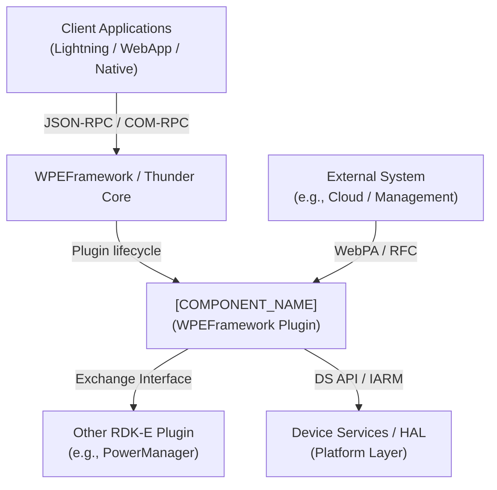
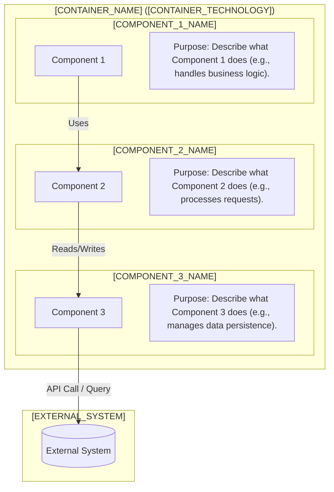
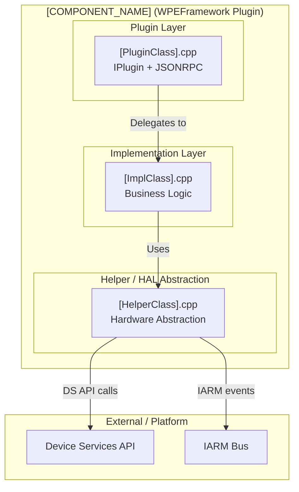
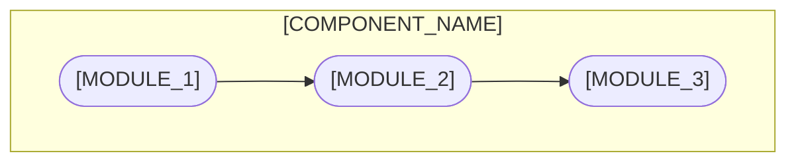
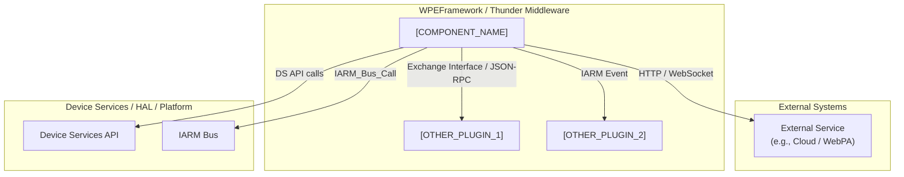
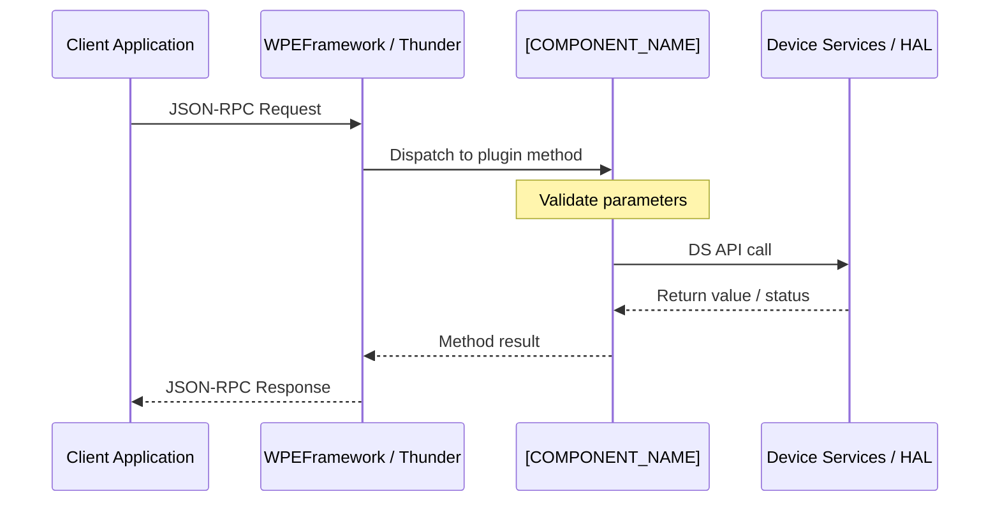
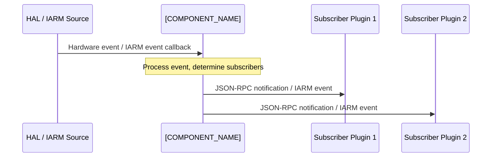
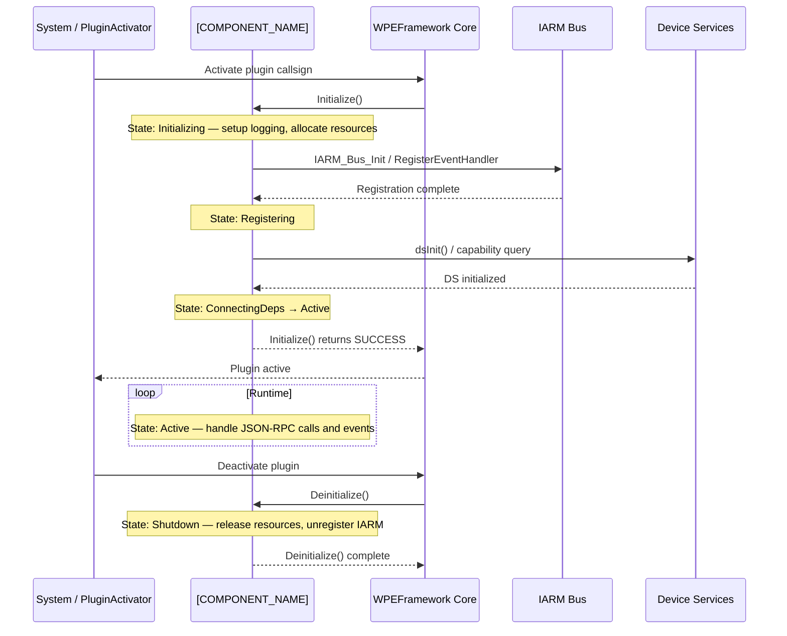
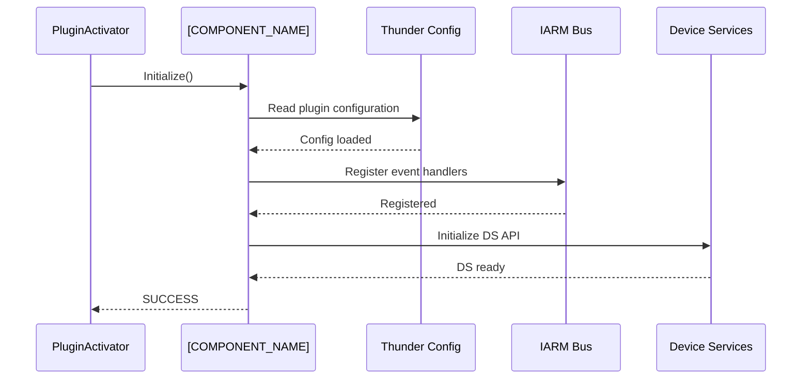
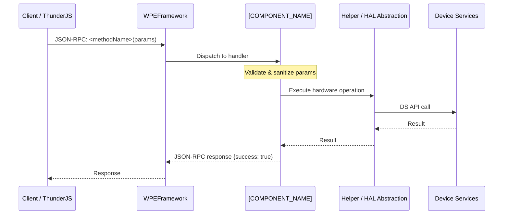

# \<Component Name\>

> **Documentation Best Practices:**
>
> - ✅ **Verify implementation**: Search source code for actual API calls before documenting features.
> - ✅ **Don't assume**: Build dependencies (CMakeLists, includes) ≠ actual runtime usage.
> - ✅ **Explicitly document absence**: If a feature or mechanism is not implemented, state it clearly rather than omitting it.
> - ✅ **Check function calls**: Use `grep -r "function_name"` to confirm APIs are called, not merely declared or linked.
> - ✅ **Example**: DS library linked but no calls present → document as "No Device Services integration implemented."
> - ✅ **Avoid booster words**: Do not include booster words like critical, important, significant, core etc. unless that is really substanciated with evidence

---


## Overview

[Describe in detail of the functionality served by this component in RDK middleware. This information can be split into 3 different sections. The first section can provide an overview on this component, the second section can tell on the services it provides to the end product/stack as a device, and the last section can explain the services provided by this module in a module level]

[Add a C4 System Context diagram showing the component's position relative to external systems (e.g., cloud services, management endpoints), the WPEFramework/Thunder core, other RDK-E plugins, and the HAL/platform layer. ) in the whole RDK-E architecture. Explain the components in high level only w.r.t. to the RDK-E architecture layer ( application layer, firebolt layer, thunder layer, rdk core layer(rdk shell/app manager/westeros,graphics, aamp etc. )]



**Key Features & Responsibilities:**

[List major functions, services provided, and responsibilities. Keep it as a bullet point list. Keep the main point as BOLD text formatting and then explain in a sentence or maximum two on what that point is about]

- **[FEATURE_1]**: [What this feature provides and why it matters.]
- **[FEATURE_2]**: [What this feature provides and why it matters.]
- **[FEATURE_3]**: [What this feature provides and why it matters.]

---

## Architecture

### High-Level Architecture

[Explain the design principles of the component in a detailed way. This can be in two sections. The first section can have an overview of design principles in a paragraph of 5-6 sentences. After that, deep dive into how the design of the system meets the requirements/features in an optimal way.] 
[Explain how the interactions with other layers - the north bound and south bound - are taken care in the design]
[Explain how the IPC mechanisms are integrated in the design - using appropriate IPC methods based on platform capabilities.]
[Explain the data persistence, storage management etc, achieved for this component - either within itself or via other designated RDK-V or RDK-E or system components]

[Add a Component Diagram with a text like – “A Component diagram showing the component's internal structure and dependencies is given below:”. The starting point of this diagram will be the context diagram created above, with the part of this specific component being expanded. The main components will have to cover the message bus registration using appropriate IPC methods, telemetry, persistant data set/get, get/set data from/to HAL, as well as various other components as the case may be]



### Threading Model

Describe the threading model in detail. If the component is single-threaded, state that explicitly. If it uses worker threads, list each thread and its responsibility.

- **Threading Architecture**: [Single-threaded / Multi-threaded / Event-driven]
- **Main Thread**: [Responsibilities — e.g., JSON-RPC dispatch, plugin lifecycle.]
- **Worker Threads** (if applicable):
  - _[Thread name]_: [Purpose and what data or resources it owns.]
  - _[Thread name]_: [Purpose and what data or resources it owns.]
- **Synchronization**: [Mutexes, condition variables, lock-free structures used to protect shared state.]
- **Async / Event Dispatch**: [How callbacks or notifications are posted back to callers without blocking.]

---

## Design

[Explain the design principles of the component in a detailed way. This can be in two sections. The first section can have an overview of design principles in a paragraph of 5-6 sentences. After that, deep dive into  how the design of the system meets the requirements/features in an optimal way.] 
[Explain how the interactions with other layers - the north bound and south bound - are taken care in the design]
[Explain how the IPC mechanisms are integrated in the design - using appropriate IPC methods based on platform capabilities.]
[Explain the data persistance, storage management etc, achieved for this component - either within itself or via other designated RDK-V or RDK-E or system components]

### Component Diagram

A component diagram showing the internal structure and sub-module dependencies is given below. Expand from the context diagram above to show internal sub-modules, their responsibilities, and how they connect to external systems.



---

## Internal Modules

Describe each significant module, class, or file. For modules that receive data from external sources, call that out explicitly.

| Module / Class | Description                                                                    | Key Files                  |
| -------------- | ------------------------------------------------------------------------------ | -------------------------- |
| `[MODULE_1]`   | [Role and responsibilities of this module. Note if it receives external data.] | `[file1.cpp]`, `[file1.h]` |
| `[MODULE_2]`   | [Role and responsibilities of this module.]                                    | `[file2.cpp]`              |
| `[MODULE_3]`   | [Role and responsibilities of this module.]                                    | `[file3.cpp]`              |



---

## Prerequisites & Dependencies

[Explore the files in this workspace - for e.g. systemd service file, yocto recipes, build scripts - to identify component dependencies and requirements]

**Documentation Verification Checklist:**

Before documenting any dependency or integration, verify actual usage in source code:

- [ ] **Thunder / WPEFramework APIs**: Confirm which `IPlugin`, `JSONRPC`, and `Exchange` interfaces are actually implemented.
- [ ] **IARM Bus**: Verify actual `IARM_Bus_RegisterEventHandler` / `IARM_Bus_Call` usages — do not assume based on header includes.
- [ ] **Device Services (DS) APIs**: Confirm which DS functions are called, not just declared.
- [ ] **Persistent store**: Search for actual store read/write calls — do not assume based on linked libraries.
- [ ] **Systemd services**: Verify `After=` / `Requires=` entries in the `.service` file.
- [ ] **Configuration files**: Confirm files are actually opened and parsed by the component.

### RDK-E Platform Requirements

- **WPEFramework Version**: [Minimum WPEFramework / Thunder version required.]
- **Build Dependencies**: [Required Yocto layers, recipes, and build-time libraries.]
- **RDK-E Plugin Dependencies**: [Other Thunder plugins that must be active before this plugin initializes — e.g., `org.rdk.PowerManager`.]
- **Device Services / HAL**: [Required DS interfaces and minimum HAL versions.]
- **IARM Bus**: [IARM namespaces or event groups this component registers with.]
- **Systemd Services**: [System daemons that must be running before this plugin activates.]
- **Configuration Files**: [Mandatory configuration files and their expected filesystem locations.]
- **Startup Order**: [PluginActivator startup dependencies; reference `wpeframework-*.service` ordering if applicable.]

## Quick Start

Provide the minimal working example that gets a developer from zero to a running integration. Include all necessary steps: initialization, a representative API call, and cleanup.

### 1. Include / Import

```c
// C / C++
#include "<component>.h"
```

```js
// JavaScript — ThunderJS
import ThunderJS from "ThunderJS";
const thunderJS = ThunderJS({ host: "192.168.1.100" });
```

### 2. Initialize

```c
// C / C++ — initialize the component
<ComponentHandle> handle = <component>_init(config);
if (!handle) {
    fprintf(stderr, "Initialization failed\n");
    return -1;
}
```

### 3. Use

```js
// JavaScript — invoke a JSON-RPC method
thunderJS.<PluginCallsign>.<methodName>({ param1: "value" })
  .then(result => console.log(result))
  .catch(err  => console.error(err))
```

### 4. Cleanup

```c
<component>_deinit(handle);
```

---

## Configuration

### Configuration Priority

List sources in order from lowest to highest precedence:

1. Built-in defaults (compile-time)
2. Operator / RFC settings
3. Stream-provided or device-provided settings
4. Application-provided settings
5. Developer override file (e.g., `/opt/<component>.cfg`)

### Key Configuration Files

Describe each configuration file the component reads or writes. If no configuration files exist, omit this table.

| Configuration File | Purpose        | Override Mechanism           |
| ------------------ | -------------- | ---------------------------- |
| `<path/to/file>`   | [File purpose] | [Environment var / API call] |

### Configuration Parameters

| Parameter | Type | Default | Description                           |
| --------- | ---- | ------- | ------------------------------------- |
| `<param>` | bool | `true`  | Enable or disable \<feature\>.        |
| `<param>` | int  | `30`    | Timeout in seconds for \<operation\>. |


### Runtime Configuration

If configuration can be changed at runtime (via Thunder API, RFC parameter, or CLI utility), document how:

```bash
# Example: change a parameter at runtime
<ctrl-utility> <module> <parameter> <value>
```

### Configuration Persistence

- If persistence is implemented: state which parameters are persisted, by what mechanism, and where they are stored.
- If **no** persistence is implemented: _"Configuration changes are not persisted across reboots."_

---

## API / Usage

### Interface Type

[Explain the interface types used – like State the interface type(s): JSON-RPC over Thunder WebSocket, COM-RPC Exchange interface, C/C++ library API, IARM events, or a combination.]

### Methods / Functions

For each method document: name, description, parameters, response, and a working example.

#### `<methodName>`

Description of what this method does and when to call it.

**Parameters**

| Name     | Type   | Required | Description     |
| -------- | ------ | -------- | --------------- |
| `param1` | string | Yes      | \<description\> |
| `param2` | int    | No       | \<description\> |

**Response**

```json
{
  "result": "<value>",
  "success": true
}
```

**Example**

```js
thunderJS.<PluginCallsign>.<methodName>({ param1: "value" })
  .then(result => console.log(result))
  .catch(err   => console.error(err))
```

### Events / Notifications

| Event           | Trigger Condition                   | Payload                  | Subscriber Examples  |
| --------------- | ----------------------------------- | ------------------------ | -------------------- |
| `on<EventName>` | \<condition that fires this event\> | `{ "field": "<value>" }` | \<consumer plugins\> |

---

## Component Interactions

Describe all interactions this component has with external modules, including Thunder plugin-to-plugin calls, IARM event publishing/subscribing, DS/HAL API calls, and any external service communications.



### Interaction Matrix

Consolidated view of all component interactions. Include only interactions verified in source code.

| Target Component / Layer  | Interaction Purpose                        | Key APIs / Topics                                |
| ------------------------- | ------------------------------------------ | ------------------------------------------------ |
| **RDK-E Plugins**         |                                            |                                                  |
| `[PLUGIN_1]`              | [e.g., Power state change notifications]   | `Exchange::I<Interface>`, `IARM_<EventName>`     |
| `[PLUGIN_2]`              | [e.g., Persistent settings read/write]     | `<method_name>()`                                |
| **Device Services / HAL** |                                            |                                                  |
| DS API                    | [e.g., Hardware control, capability query] | `<ds_function_1>()`, `<ds_function_2>()`         |
| IARM Bus                  | [e.g., System-wide event distribution]     | `IARM_Bus_RegisterEventHandler`, `IARM_Bus_Call` |
| **External Systems**      |                                            |                                                  |
| [External service]        | [e.g., RFC parameter delivery]             | `[endpoint / parameter path]`                    |

### Events Published

| Event Name  | IARM / JSON-RPC Topic  | Trigger Condition                 | Subscriber Components |
| ----------- | ---------------------- | --------------------------------- | --------------------- |
| `[Event_1]` | `[topic / event name]` | [Condition that fires this event] | [List of subscribers] |
| `[Event_2]` | `[topic / event name]` | [Condition that fires this event] | [List of subscribers] |

### IPC Flow Patterns

**Primary Request / Response Flow:**



**Event Notification Flow:**



---

## Component State Flow

### Initialization to Active State

Describe the component's lifecycle from system startup through full initialization to active operation. Highlight critical milestones such as Thunder plugin `Initialize()`, IARM registration, DS initialization, and readiness signaling.



### Runtime State Changes

Explain state changes that occur during normal operation (e.g., power state transitions, network availability changes, device capability changes).

**State Change Triggers:**

- [Event or condition that triggers a state change and its impact on component behavior.]
- [Describe recovery mechanisms or fallback behavior.]

**Context Switching Scenarios:**

- [Scenarios where the component changes operational mode — e.g., entering standby, losing a dependency plugin, receiving an RFC update.]

---

## Call Flows

### Initialization Call Flow



### Request Processing Call Flow

Document the most critical supported call flow (e.g., a JSON-RPC set/get operation that drives hardware state).



---

## Implementation Details

### HAL / DS API Integration

List every Device Services or HAL function the component actually calls. Verify against source code before populating.

| HAL / DS API        | Purpose               | Implementation File |
| ------------------- | --------------------- | ------------------- |
| `<ds_function_1>()` | [What this call does] | `[source_file.cpp]` |
| `<ds_function_2>()` | [What this call does] | `[source_file.cpp]` |

### Key Implementation Logic

- **State / Lifecycle Management**: Describe how the component tracks internal state (active, standby, error) and the files where state transition logic resides.
  - Core implementation: `[file.cpp]`
  - State transition handlers: `[file.cpp]`

- **Event Processing**: How IARM events or DS callbacks are received, queued, and dispatched to the correct handler.
  - Event queue or dispatch model used.
  - Any prioritization or debounce logic.

- **Error Handling Strategy**: How errors from DS/HAL are mapped, logged, and surfaced to JSON-RPC callers.
  - DS error code → JSON-RPC error mapping.
  - Retry / recovery logic for transient failures.
  - Timeout handling.

- **Logging & Diagnostics**: Logging categories, verbosity levels, and any component-specific debug mechanisms.
  - RDK Logger module name: `LOG.RDK.<COMPONENT>`
  - Key log points: initialization, state transitions, DS API errors.

---

## Data Flow

Provide a step-by-step walkthrough of data through the component for the primary use case in a mermaid flow diagram in below format

```
flowchart TD
    A[External Trigger / Input]
    B[Ingestion / Reception Layer<br/>JSON-RPC handler or IARM callback]
    C[Processing / Business Logic<br/>validation, state update, DS call]
    D[Output / Notification / Storage<br/>JSON-RPC response, IARM event, persistent store]

    A --> B
    B --> C
    C --> D
```

---

## Testing

### Test Levels

| Level            | Scope                                                   | Location            |
| ---------------- | ------------------------------------------------------- | ------------------- |
| L1 – Unit        | Individual classes / functions, all dependencies mocked | `tests/l1/`         |
| L2 – Integration | Real DS / HAL interfaces or hardware stubs              | `tests/l2/`         |
| L3 – System      | End-to-end on a target RDK-E device                     | Manual / device lab |

### Running Tests

```bash
cd build
cmake -DBUILD_TESTS=ON ../
make -j$(nproc)
ctest --output-on-failure
```

### Mock Framework

Describe how Thunder, IARM, and DS/HAL dependencies are mocked for L1 tests. List key mock classes or files.

---