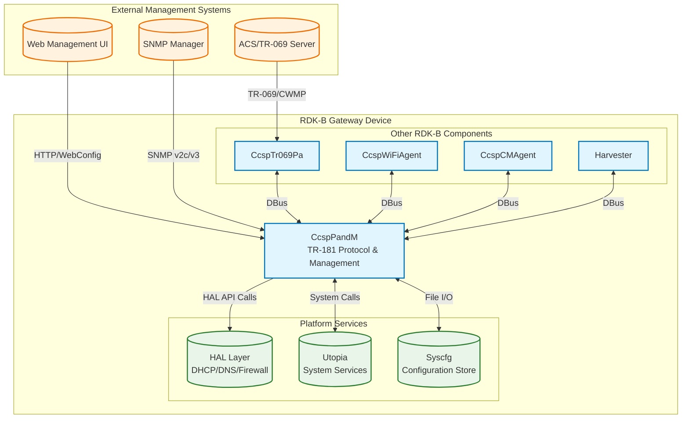
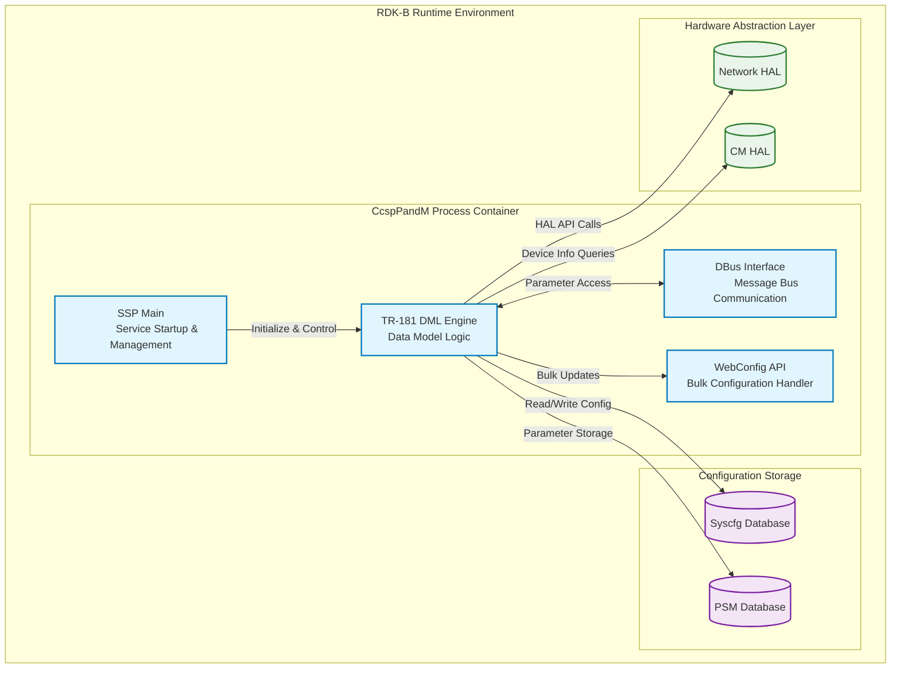
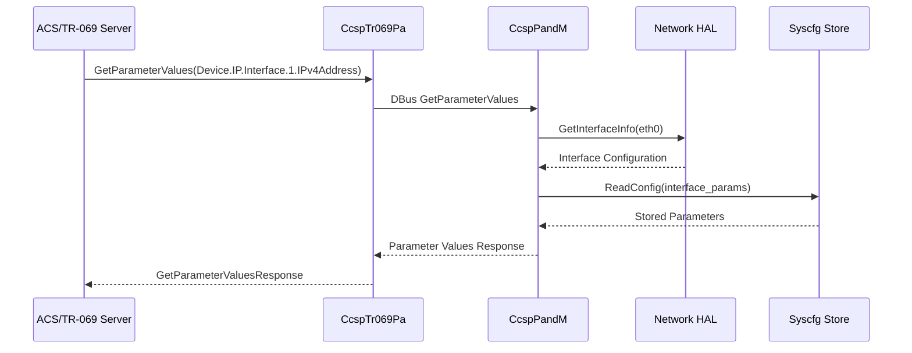
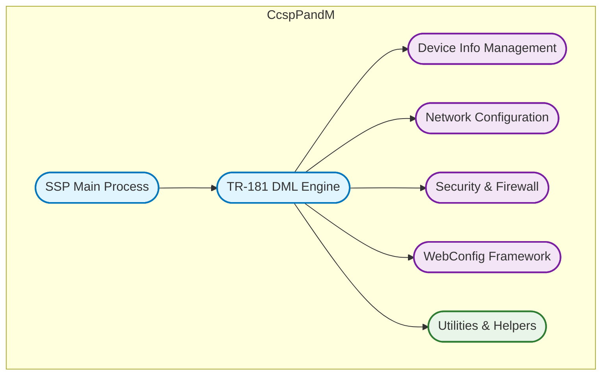
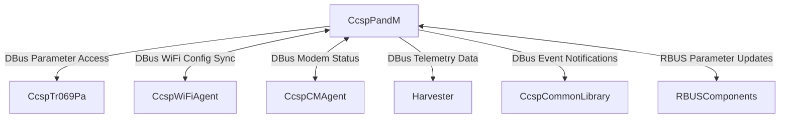
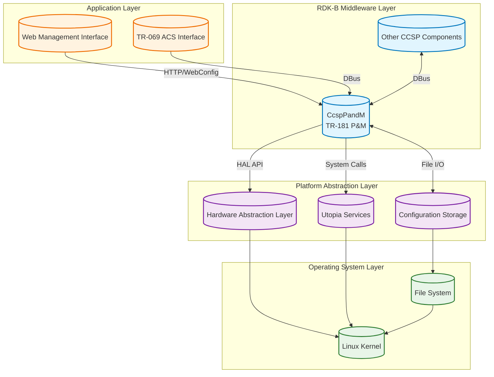
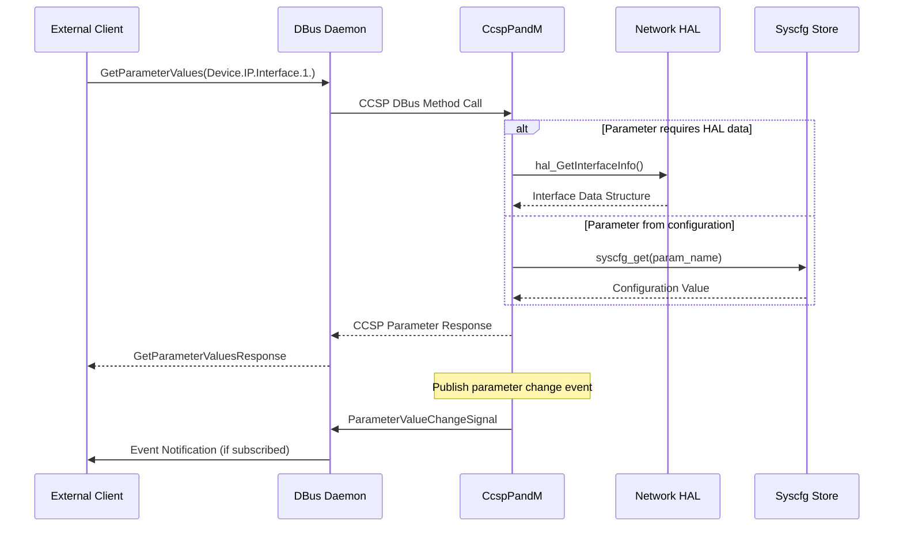
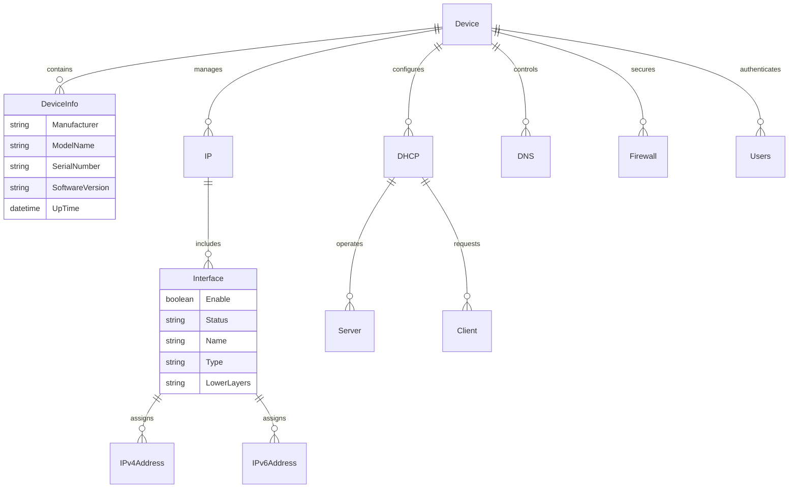

# CcspPandM Documentation

CcspPandM is the RDK-B component that implements the Protocol and Management (P&M) subsystem, serving as the central TR-181 data model manager for residential gateway devices. It acts as the primary interface for device configuration, status monitoring, and protocol management across multiple network services including DHCP, DNS, firewall, routing, and device information management. The component bridges upper-layer management protocols (like TR-069/CWMP) with lower-level HAL implementations and platform services. It provides standardized TR-181 parameter access, WebConfig support for bulk configuration changes, and comprehensive device management capabilities. CcspPandM integrates with other RDK-B components through DBus messaging and serves as the authoritative source for network configuration data within the RDK-B ecosystem.

**Key Features & Responsibilities**

  - **TR-181 Data Model Implementation**: Provides comprehensive TR-181 parameter tree management for device configuration and status reporting including Device.IP, Device.DHCP, Device.DNS, Device.Firewall, Device.Routing, and vendor-specific extensions
  - **DBus Message Bus Integration**: Implements CCSP DBus interface for inter-component communication, parameter get/set operations, and event notifications across the RDK-B middleware stack
  - **WebConfig Framework Support**: Handles bulk configuration updates through WebConfig protocol for efficient mass deployment and configuration management scenarios
  - **Device Information Management**: Manages Device.DeviceInfo parameters including hardware details, software versions, uptime statistics, and system capabilities reporting
  - **Network Services Configuration**: Controls DHCP server/client settings, DNS configuration, firewall rules, NAT policies, routing tables, and interface management
  - **Authentication and User Management**: Implements Device.Users and web UI authentication mechanisms with role-based access control for administrative interfaces

## Design

CcspPandM follows a modular, service-oriented architecture that prioritizes data model abstraction, inter-component messaging, and platform independence. The component separates TR-181 data model logic from underlying platform implementations through well-defined HAL interfaces, ensuring portability across different hardware platforms. It implements a single-threaded event-driven model with DBus integration for scalable message handling and maintains strict separation between configuration management and operational data. The design emphasizes reliability through comprehensive error handling, logging frameworks, and graceful degradation patterns. Security is embedded through parameter access control, input validation, and secure communication channels. Maintainability is achieved through clear module boundaries, standardized coding patterns, and comprehensive unit testing frameworks.

The component enforces clear boundaries with other RDK-B components through standardized DBus interfaces and TR-181 parameter namespaces. CcspPandM is responsible for TR-181 data model integrity, configuration persistence through syscfg integration, and coordinating with platform services for network configuration changes. Other components handle protocol-specific implementations (TR-069, WiFi management) while relying on CcspPandM for centralized configuration storage and retrieval.

A container diagram of the component is given below

**Request Flow Sequence**

The most critical flow is TR-181 parameter access from external management systems. When a TR-069 ACS requests a parameter value, the request flows through CcspTr069Pa via DBus to CcspPandM's DBus interface, which routes to the appropriate DML handler, retrieves data from HAL or configuration stores, and returns the response through the same path.

**Threading Model**

The **CcspPandM** component follows a single-threaded, event-driven architecture with the following thread allocation:

- **Main Thread**: Manages all DBus message processing, TR-181 parameter operations, and system interactions sequentially
- **Asynchronous Messaging**: Leverages the DBus event loop for handling asynchronous messages and callback execution without spawning additional threads
- **HAL and Configuration Operations**: All hardware abstraction layer interactions, configuration file accesses, and inter-component communications are executed synchronously within the main thread context
- **Thread Synchronization**: Not required due to the single-threaded design, which ensures deterministic behavior and simplifies concurrency management

This design benefits from the DBus framework’s built-in queuing and scheduling mechanisms, enabling responsive yet predictable execution without the complexity of multithreading.

## Internal Modules

The component is organized into distinct functional modules that handle specific aspects of TR-181 data model implementation and system integration. Each module encapsulates related functionality while maintaining clear interfaces with other modules.

| Module/Class | Description | Key Files |
|-------------|------------|-----------|
| **SSP (Service Startup Provider)** | Main process initialization, component lifecycle management, and DBus registration | `ssp_main.c`, `ssp_action.c`, `ssp_messagebus_interface.c` |
| **TR-181 DML Engine** | Core data model logic implementation for all TR-181 objects and parameters | `cosa_*_dml.c`, `cosa_*_internal.c` files |
| **Device Info Management** | Hardware and software information reporting, system capabilities | `cosa_deviceinfo_dml.c`, `cosa_deviceinfo_internal.c` |
| **Network Configuration** | IP, DHCP, DNS, routing, and interface management | `cosa_ip_dml.c`, `cosa_dhcpv4_dml.c`, `cosa_dns_dml.c` |
| **Security & Firewall** | Firewall rules, NAT policies, security configuration | `cosa_firewall_dml.c`, `cosa_nat_dml.c`, `cosa_x_cisco_com_security_dml.c` |
| **WebConfig Framework** | Bulk configuration processing and validation | `cosa_webconfig_api.c`, `webcfgparam.c` |
| **Utilities & Helpers** | Common utility functions, API abstractions, and helper modules | `cosa_apis_util.c`, `cosa_apis_busutil.c`, `helpers.h` |

## Interaction with Other Middleware Components

CcspPandM serves as the central configuration hub for the RDK-B ecosystem, providing TR-181 parameter access and coordination services to other middleware components through standardized DBus interfaces.

| Component | Purpose of Interaction | Protocols/Mechanisms |
|-----------|-----------------------|----------------------|
| **CcspTr069Pa** | TR-069 CWMP protocol implementation for ACS communication | DBus parameter get/set, event subscriptions |
| **CcspWiFiAgent** | WiFi configuration synchronization and status reporting | DBus parameter notifications, configuration updates |
| **CcspCMAgent** | Cable modem status monitoring and configuration | DBus status queries, event notifications |
| **Harvester** | Telemetry data collection and reporting | DBus parameter access, periodic data requests |
| **CcspCommonLibrary** | Shared CCSP services and utilities | DBus event publishing, component discovery |
| **RBUSComponents** | Next-generation message bus integration | RBUS parameter subscriptions, event handling |

CCSP P&M publishes several key events that other components can subscribe to for coordination and monitoring purposes:

| Event | Purpose of Event | Reason for trigger |
|-----------|-----------------------|----------------------|
| **ParameterValueChange** | Notify subscribers of TR-181 parameter changes | Configuration updates, status changes, external modifications |
| **ComponentReady** | Signal successful component initialization | Startup completion, service availability |
| **ConfigurationApplied** | Confirm WebConfig bulk update completion | Mass configuration deployment, validation success |
| **InterfaceStatusChange** | Network interface state notifications | Link up/down events, IP address changes |
| **SystemRebootRequired** | System restart requirement notification | Critical configuration changes, firmware updates |

## Interaction with Other Layers

CcspPandM interacts with multiple system layers to provide comprehensive device management capabilities, abstracting platform-specific details through well-defined interfaces while maintaining direct access to configuration persistence mechanisms.

| Layer/Service | Interaction Description | Mechanism |
|---------------|-------------------------|----------|
| **Network HAL** | Interface configuration, DHCP operations, routing table management | Direct HAL API calls, function pointers |
| **Cable Modem HAL** | Device information queries, hardware capabilities, diagnostic data | HAL API calls, shared libraries |
| **Utopia System Services** | System-level network configuration, service management | System calls, file operations, process control |
| **Syscfg Configuration Store** | Persistent parameter storage, configuration backup/restore | File I/O, database transactions |
| **PSM (Persistent Storage Manager)** | Structured parameter persistence, atomic updates | DBus interface, SQL operations |
| **Linux Kernel** | Network interface control, system statistics, hardware access | Netlink sockets, proc/sys filesystem |

## IPC Mechanism

| Type of IPC | Message Format | Mechanism |
|-------------|----------------|-----------|
| **DBus Message Bus** | CCSP parameter structures with JSON encoding for complex data types, binary encoding for simple types | DBus method calls, signals, and property notifications with CCSP message format |
| **RBUS (Next-Gen)** | RBUS data structures with type-safe parameter encoding, event-driven subscriptions | RBUS library calls, event subscriptions, method invocations |
| **HAL Function Calls** | C structure pointers with platform-specific data layouts, return codes | Direct function pointer invocation, shared library loading |
| **File-based IPC** | INI-style configuration files, JSON WebConfig documents | File system operations, atomic writes, file locking |

## Implementation Details

- **Key Algorithms or Logic**: The component implements a hierarchical parameter tree traversal algorithm for TR-181 namespace resolution, utilizing hash maps for efficient parameter lookup and caching mechanisms for frequently accessed values. The main logic resides in `plugin_main.c` for component initialization, `cosa_apis_busutil.c` for DBus parameter routing, and individual DML files for parameter-specific handling. State machines manage configuration validation workflows and WebConfig processing pipelines.

- **Error Handling Strategy**: Comprehensive error handling includes parameter validation at input boundaries, HAL operation failure recovery, DBus communication error handling, and configuration rollback mechanisms. Errors are logged through the RDK Logger framework with categorized severity levels, and critical failures trigger component restart or system recovery procedures.

- **Logging & Debugging**: The component uses RDK Logger (rdklogger) with multiple log categories including PAM (main), WIFI_AGENT, TR69AGENT, and component-specific modules. Debug levels range from FATAL/ERROR for critical issues to DEBUG/TRACE for detailed troubleshooting. Debug hooks include parameter access tracing, DBus message logging, and HAL interaction monitoring through compile-time flags.

## Key Configuration Files

| Configuration File | Purpose | Key Parameters | Default Values | Override Mechanisms |
|--------------------|---------|---------------|----------------|--------------------|
| `CcspPam.cfg` | Component registration and DBus configuration | `ComponentId`, `DbusPath`, `DataModelXmlCfg` | `com.cisco.spvtg.ccsp.pam`, `/com/cisco/spvtg/ccsp/pam` | Environment variables, compile-time flags |
| `CcspDmLib.cfg` | Data model library configuration and TR-181 mapping | `DataModelXml`, `LibraryPath`, `InitFunction` | `TR181-USGv2.XML`, `libtr181` | Build configuration, platform variants |  
| `TR181-USGv2.XML` | Complete TR-181 data model definition and parameter mapping | Object definitions, parameter types, access permissions | Standard TR-181 plus vendor extensions | Custom XML variants, feature flags |
| `syscfg.db` | Persistent parameter storage and configuration backup | Network settings, security policies, device configuration | Platform-specific defaults | Factory reset, configuration restore |
| `/nvram/pamssp_backtrace` | Crash debugging and backtrace information | Stack traces, error contexts, debug symbols | Empty file | Debug builds, crash handlers |

## TR-181 Data Models Supported

CcspPandM implements comprehensive TR-181 data model coverage for residential gateway devices:

### Core Device Management
- **Device.DeviceInfo**: Hardware information, software versions, system uptime
- **Device.UserInterface**: Web UI configuration, language settings, access control  
- **Device.Time**: NTP configuration, timezone settings, system clock management
- **Device.Users**: User account management, authentication, role-based access

### Network Configuration  
- **Device.IP**: Interface configuration, IPv4/IPv6 settings, address management
- **Device.DHCP**: DHCP server/client configuration, lease management, reservations
- **Device.DNS**: DNS server settings, domain configuration, resolution policies
- **Device.Routing**: Static routes, dynamic routing protocols, forwarding tables
- **Device.NAT**: Network address translation rules, port mapping, UPnP

### Security & Access Control
- **Device.Firewall**: Firewall rules, security policies, intrusion detection
- **Device.X_CISCO_COM_Security**: Vendor-specific security enhancements
- **Device.X_Comcast_COM_ParentalControl**: Content filtering, access restrictions

### Advanced Features
- **Device.X_CISCO_COM_Diagnostics**: Network diagnostics, connectivity testing
- **Device.X_CISCO_COM_MultiLAN**: Multi-LAN configuration and management  
- **Device.X_RDK_Features**: RDK-specific feature flags and capabilities

