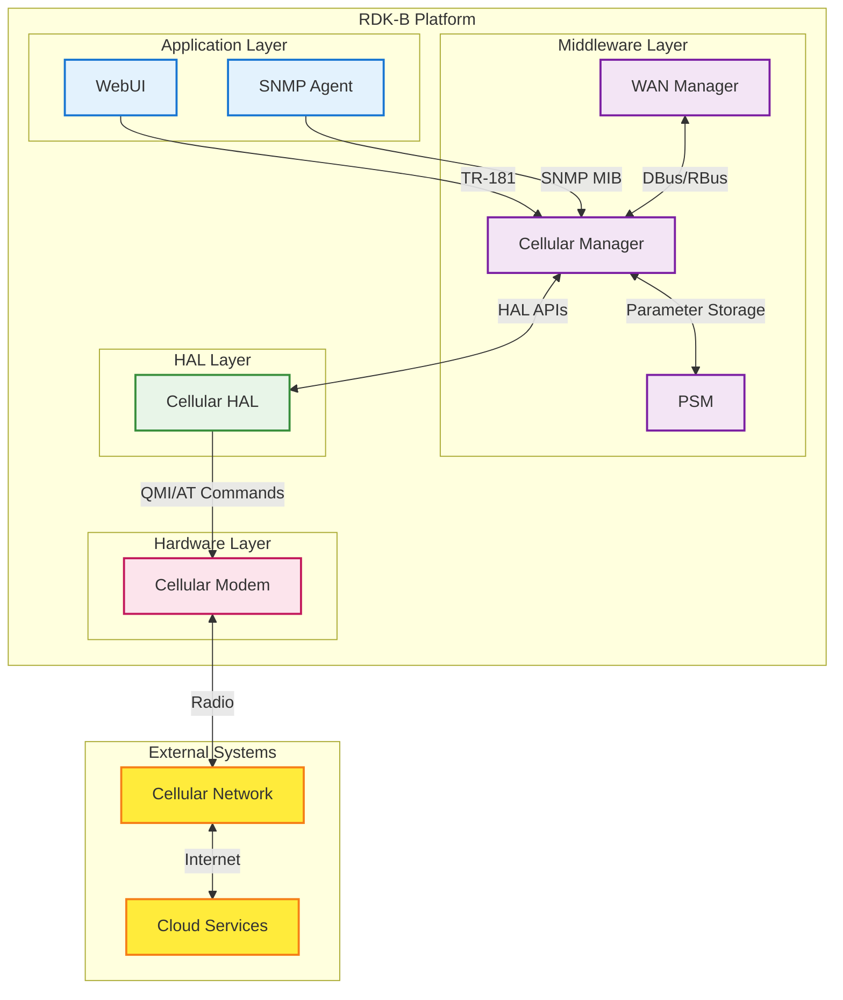
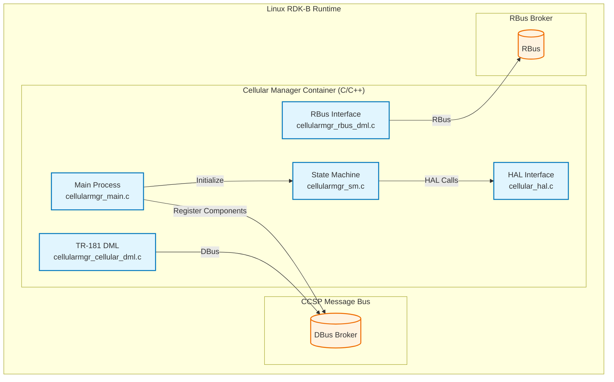
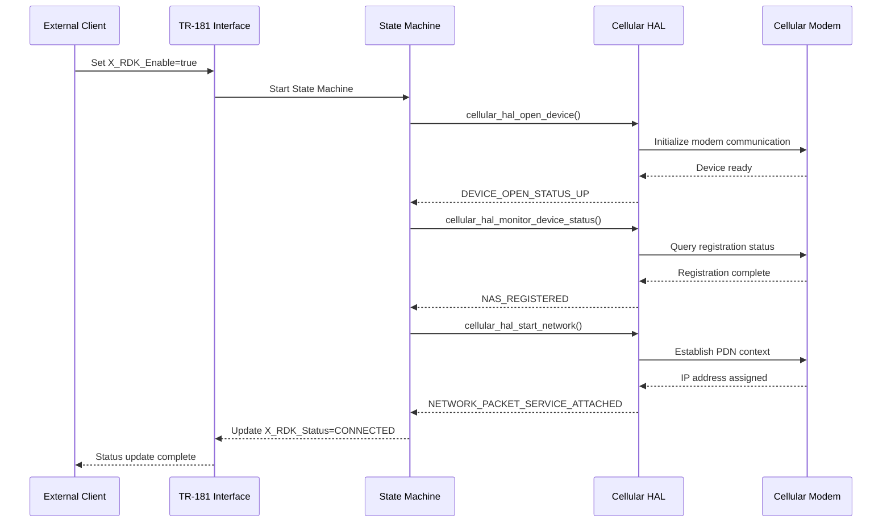
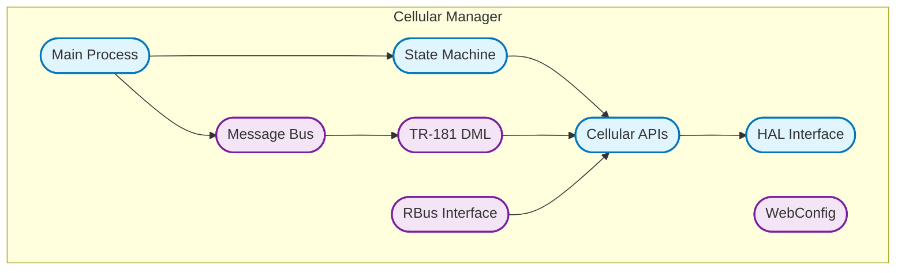
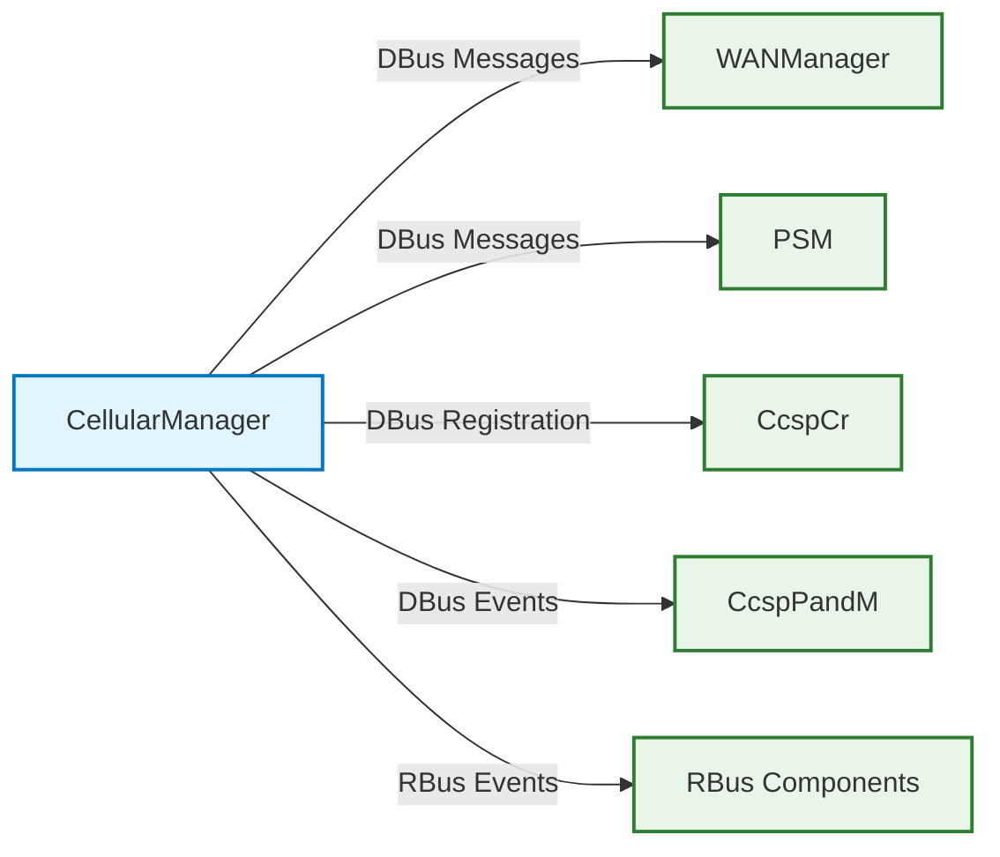
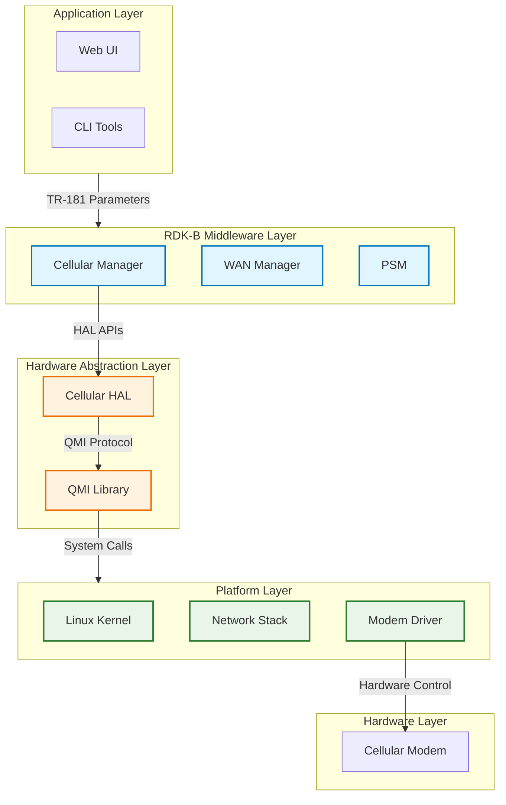
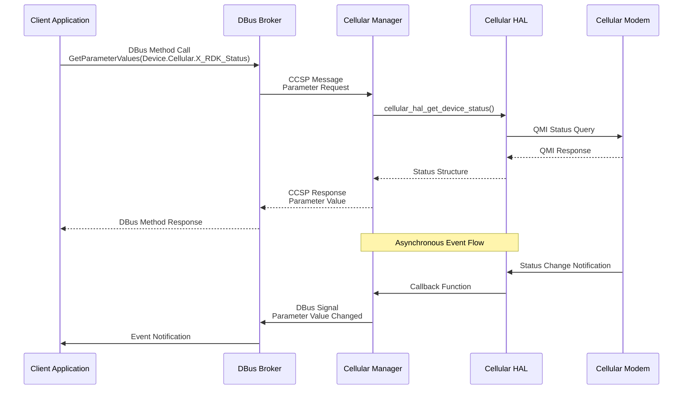

# Cellular Manager Documentation

Cellular Manager component provides cellular/LTE modem management and connectivity services for RDK-B CPEs. It manages cellular modem lifecycle, network registration, data connectivity, and providing standardized TR-181 interfaces for cellular configuration and monitoring. The component integrates with the rest of the RDK-B ecosystem through CCSP message bus communication, HAL abstraction for hardware independence, and supports both DBus and RBus messaging protocols.

**Key Features & Responsibilities**

  - **Cellular Modem Management**: Handles cellular modem initialization, configuration, and lifecycle management including device detection, slot selection, and power management
  - **Network Registration & Connectivity**: Manages network attachment, profile selection, PDN context establishment, and maintains IPv4/IPv6 connectivity status
  - **State Machine Control**: Implements a comprehensive state machine that transitions through DOWN, DEACTIVATED, DEREGISTERED, REGISTERED, and CONNECTED states
  - **TR-181 Data Model Implementation**: Exposes standardized TR-181 Cellular parameters for device management, status monitoring, and configuration through both CCSP and RBus interfaces
  - **HAL Abstraction Layer**: Provides hardware abstraction through cellular HAL APIs, supporting various cellular modems with QMI-based communication
  - **Event Broadcasting**: Publishes cellular status changes, registration events, and connectivity state transitions to other RDK-B components

## Design

The Cellular Manager follows a layered architecture approach with clear separation of concerns between hardware abstraction, business logic, and data model layers. The design emphasizes modularity through well-defined interfaces between the HAL layer, state machine controller, and TR-181 implementation. Reliability is achieved through robust error handling, retry mechanisms, and comprehensive logging throughout the cellular connection lifecycle. The component maintains scalability by supporting multiple cellular profiles, different modem types through HAL abstraction, and extensible configuration mechanisms. Security is implemented through controlled access to cellular parameters, secure credential management for network profiles, and proper validation of configuration changes. Maintainability is ensured through modular code organization, comprehensive unit test coverage, and clear documentation of APIs and state transitions.

The design supports both traditional CCSP DBus messaging and modern RBus communication protocols, allowing for flexible deployment scenarios. Clear boundaries are established between the cellular manager core logic and external dependencies like HAL implementations, ensuring portability across different hardware platforms.

Component responsibilities are clearly defined: the cellular manager handles high-level policy decisions and state management, the HAL layer provides hardware-specific implementations, and the TR-181 layer exposes standardized interfaces for external consumption.

A container diagram of the component is given below

**Request Flow Sequence**

The most critical flow is cellular network connection establishment, starting from cellular enable request through network attachment to active data connectivity.

**Threading Model**

The **Cellular Manager** uses a single-threaded, event-driven model with the following thread responsibilities:

- **Main Thread**: Handles CCSP message bus events, TR-181 parameter requests, and state machine transitions
- **Timer-Based Polling**: Implements background monitoring via periodic polling to query cellular modem status and update internal state
- **HAL-Managed Worker Threads**: HAL layer may internally spawn worker threads for QMI communication and modem interaction, managed transparently from the application layer
- **Callback Mechanism**: Uses asynchronous callbacks from the HAL to receive notifications without blocking main thread operations during network and modem interactions

## Internal Modules

The Cellular Manager is organized into several key modules that handle different aspects of cellular management functionality. The core modules work together to provide comprehensive cellular connectivity services while maintaining clear separation of concerns.

| Module/Class | Description | Key Files |
|-------------|------------|-----------|
| Main Process | Entry point and initialization, handles CCSP component registration and message bus setup | `cellularmgr_main.c`, `cellularmgr_global.h` |
| State Machine | Core cellular connection state management, transitions between DOWN/DEACTIVATED/REGISTERED/CONNECTED states | `cellularmgr_sm.c`, `cellularmgr_sm.h` |
| Cellular APIs | High-level cellular management APIs, profile management, and network control functions | `cellularmgr_cellular_apis.c`, `cellularmgr_cellular_apis.h` |
| HAL Interface | Hardware abstraction layer interface for modem communication and QMI protocol handling | `cellular_hal.c`, `cellular_hal.h`, `cellular_hal_qmi_apis.c` |
| TR-181 DML | TR-181 data model implementation for parameter get/set operations and validation | `cellularmgr_cellular_dml.c`, `cellularmgr_cellular_dml.h` |
| RBus Interface | RBus protocol implementation for modern message bus communication | `cellularmgr_rbus_dml.c`, `cellularmgr_rbus_events.c` |
| Message Bus | CCSP message bus interface for component communication and event handling | `cellularmgr_messagebus_interface.c`, `cellularmgr_bus_utils.c` |

## Interaction with Other Middleware Components

The Cellular Manager integrates with multiple RDK-B components to provide comprehensive cellular connectivity and management services. It communicates with WAN Manager for network interface coordination, PSM for persistent configuration storage, and CcspCr for component registration and discovery.

| Component | Purpose of Interaction | Protocols/Mechanisms |
|-----------|-----------------------|----------------------|
| WAN Manager | Coordinate cellular WAN interface status, notify of connectivity changes, and manage failover scenarios | DBus messages, Event notifications |
| PSM (Persistent Storage Manager) | Store and retrieve cellular configuration parameters, profile settings, and persistent state information | DBus parameter get/set operations |
| CcspCr (Component Registrar) | Register cellular manager component, discover other components, and maintain component health status | DBus component registration and health check |
| CcspPandM (Provisioning and Management) | Report cellular device status, provide telemetry data, and handle factory reset scenarios | DBus events and status reporting |
| RBus Components | Modern RBus-based components for cellular status monitoring and configuration management | RBus publish/subscribe events |

The Cellular Manager publishes several key events that other components can subscribe to for coordination and monitoring purposes:

| Event | Purpose of Event | Reason for trigger |
|-----------|-----------------------|----------------------|
| CellularStatusChange | Notify of cellular connection status transitions | Triggered when state machine transitions between DOWN/DEACTIVATED/REGISTERED/CONNECTED states |
| CellularProfileChange | Notify of cellular profile configuration changes | Triggered when cellular profile is modified through WebConfig or TR-181 parameter updates |
| CellularDeviceDetected | Notify of cellular modem hardware detection | Triggered during component initialization when cellular modem is successfully detected and opened |
| CellularNetworkRegistration | Notify of cellular network registration status | Triggered when modem completes network registration or loses network connectivity |
| CellularDataConnectivity | Notify of data connection establishment or failure | Triggered when PDN context is established or fails, indicating data connectivity status |

## Interaction with Other Layers

The Cellular Manager operates within a layered architecture, interfacing with the Hardware Abstraction Layer (HAL) for cellular modem control, platform-specific services for system integration, and external network services for cellular connectivity.

| Layer/Service | Interaction Description | Mechanism |
|---------------|-------------------------|----------|
| Cellular HAL | Hardware abstraction for cellular modem operations including device control, QMI communication, and status monitoring | Direct API calls to cellular_hal_* functions |
| Platform Services | System-level services for network interface management, routing, and platform-specific cellular configurations | System calls, configuration file updates |
| External Cellular Network | Communication with cellular towers and network infrastructure for registration, authentication, and data services | Cellular modem communication via HAL |
| Linux Network Stack | Integration with Linux networking for interface configuration, IP address assignment, and routing table updates | Network interface APIs, system configuration |

## IPC Mechanism

| Type of IPC | Message Format | Mechanism |
|---------------|-------------------------|----------|
| DBus (CCSP) | XML-structured messages with CCSP-specific headers, parameter names in TR-181 format, and typed value encoding | DBus method calls for parameter get/set, signal emissions for events |
| RBus | JSON-formatted messages with hierarchical parameter paths, typed value encoding, and event subscription capabilities | RBus publish/subscribe for events, method calls for parameter operations |
| HAL Interface | Direct C function calls with structured data types, return codes, and callback mechanisms | Synchronous API calls with callback registration for asynchronous events |

## TR‑181 Data Models

- **Implemented Parameters**: The Cellular Manager implements the Device.Cellular TR-181 object with RDK-specific extensions (X_RDK_*) for enhanced cellular management and monitoring capabilities.
- **Parameter Registration**: Parameters are registered through CCSP component registration using the RdkCellularManager.xml data model definition file, with support for both DBus and RBus access methods.
- **Custom Extensions**: 
    - **X_RDK_Enable**: Custom boolean parameter for enabling/disabling cellular functionality with persistent storage support
    - **X_RDK_Status**: Custom enumerated status parameter providing detailed cellular connection state information beyond standard TR-181
    - **X_RDK_Model/Vendor/HardwareRevision**: Custom device identification parameters for cellular modem hardware information
    - **X_RDK_ControlInterface/DataInterface**: Custom interface identification parameters for managing cellular control and data interfaces
    - **X_RDK_ProfileTable**: Custom cellular profile management for multiple APN configurations and network preferences

| Parameter | Description | Access (R/W) | Default | Notes |
|-----------|-------------|-------------|---------|-------|
| `Device.Cellular.Enable` | Enable/disable cellular functionality | R/W | `false` | Standard TR-181 |
| `Device.Cellular.Status` | Cellular connection status | R | `Down` | Standard TR-181 |
| `Device.Cellular.X_RDK_Enable` | RDK-specific cellular enable control | R/W | `false` | Custom extension |
| `Device.Cellular.X_RDK_Status` | Detailed cellular status enumeration | R | `DOWN` | Custom extension |
| `Device.Cellular.X_RDK_Model` | Cellular modem model information | R | `""` | Custom extension |
| `Device.Cellular.X_RDK_Vendor` | Cellular modem vendor information | R | `""` | Custom extension |
| `Device.Cellular.X_RDK_HardwareRevision` | Cellular modem hardware revision | R | `""` | Custom extension |
| `Device.Cellular.X_RDK_ControlInterface` | Cellular control interface name | R | `""` | Custom extension |
| `Device.Cellular.X_RDK_DataInterface` | Cellular data interface name | R | `""` | Custom extension |
| `Device.Cellular.X_RDK_DataInterfaceLink` | Link status of data interface | R | `Down` | Custom extension |

## Implementation Details

- **Key Algorithms or Logic**: The core algorithm is the cellular state machine (`cellularmgr_sm.c`) that manages transitions between DOWN, DEACTIVATED, DEREGISTERED, REGISTERED, and CONNECTED states based on modem status, network registration, and data connectivity. The QMI communication logic in `cellular_hal_qmi_apis.c` handles Qualcomm Modem Interface protocol for modem control and status monitoring. Profile selection algorithm evaluates available cellular profiles based on network conditions and user preferences.

- **Error Handling Strategy**: Errors are categorized into recoverable and non-recoverable types. Recoverable errors (network timeouts, temporary registration failures) trigger retry mechanisms with exponential backoff. Non-recoverable errors (hardware failures, invalid configurations) transition the state machine to error states and generate appropriate log messages. All error conditions are logged with appropriate severity levels and forwarded to telemetry systems for monitoring.

- **Logging & Debugging**: The component uses RDK Logger (RDK_LOG) with multiple log levels (FATAL, ERROR, WARN, NOTICE, INFO, DEBUG). Logging categories include cellular state transitions, HAL operations, parameter changes, and network events. Debug hooks are available through cellular HAL test APIs and state machine debug interfaces for troubleshooting connectivity issues.

## Key Configuration Files

| Configuration File | Purpose | Key Parameters | Default Values | Override Mechanisms |
|--------------------|---------|---------------|----------------|--------------------|
| `RdkCellularManager.xml` | TR-181 data model definition | Parameter definitions, access rights, data types | N/A | Component compilation |
| `RdkCellularManager.service` | SystemD service configuration | Service dependencies, execution parameters | Standard service settings | SystemD override files |
| `/etc/device.properties` | Device-specific configuration | LOG4C_RCPATH, device capabilities | Device-dependent | Environment variables |
| `/usr/rdk/cellularmanager/` | Runtime configuration directory | Profile definitions, runtime state | Empty directory | WebConfig updates |
| `/tmp/cellularmanager_initialized_bootup` | Initialization marker file | Component initialization status | Not present | Runtime creation |
