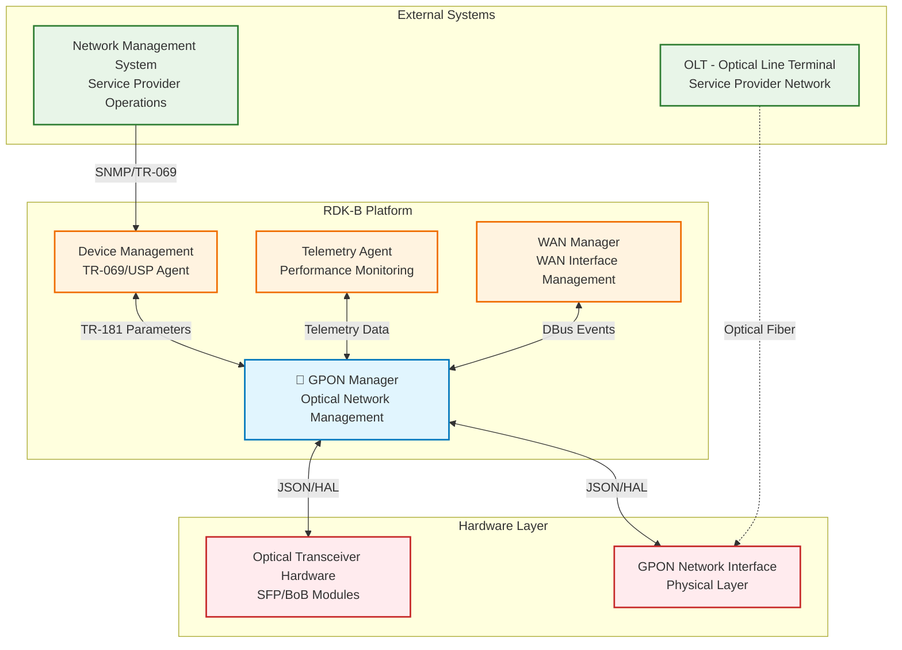
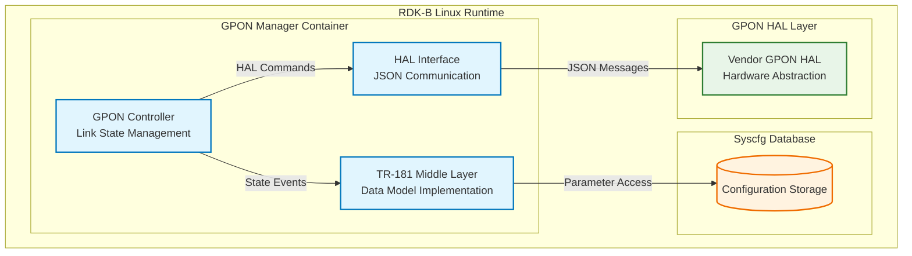
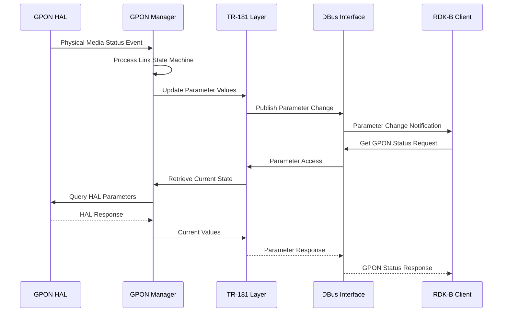
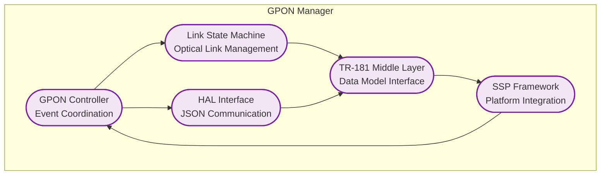
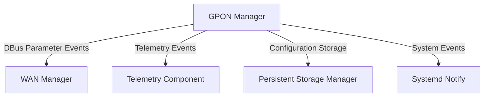
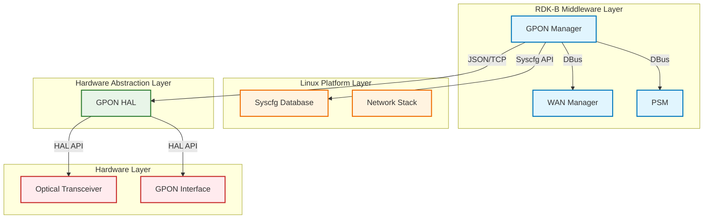
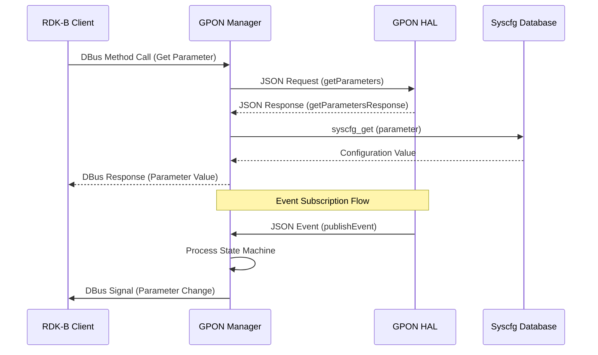

# GPON Manager Documentation

GPON Manager is one of the WAN Management components in the RDK-B stack, responsible for managing GPON interfaces and their associated physical media. It serves as the primary abstraction layer between the rest of the RDK-B ecosystem and the underlying GPON hardware abstraction layer (HAL), providing centralized management of GPON physical interfaces, optical transceivers, and associated network parameters. The component implements TR-181 data models for GPON-specific parameters and maintains real-time monitoring of optical network conditions including power levels, alarms, and link states. It integrates seamlessly with the broader RDK-B platform by exposing standardized DBus interfaces for configuration management and event notifications. The GPON Manager plays a vital role in fiber-optic broadband deployments by ensuring reliable optical network connectivity and providing comprehensive diagnostic capabilities for service providers.

**Key Features & Responsibilities**:

  - **Physical Media Management**: Monitors and manages GPON optical transceivers including SFP modules, power levels, temperature sensors, and optical signal quality metrics
  - **Link State Machine**: Implements sophisticated state machine logic to handle GPON link establishment, maintenance, and failure recovery scenarios
  - **Alarm Monitoring**: Provides comprehensive alarm detection and reporting for Loss of Signal (LOS), Loss of Frame (LOF), and other critical optical network conditions
  - **TR-181 Data Model Implementation**: Exposes standardized GPON parameters through TR-181 interfaces for configuration management and status reporting
  - **HAL Integration**: Communicates with vendor-specific GPON HAL implementations through JSON-based messaging protocols
  - **Event Subscription**: Supports real-time event notifications for GPON state changes, alarms, and operational status updates

## Design

The GPON Manager is architected around modular design principles that separate concerns between GPON hardware abstraction, TR-181 data model implementation, and link state management. The component emphasizes reliability through comprehensive error handling, robust state machine logic, and graceful failure recovery mechanisms. Scalability is achieved through dynamic table management for multiple GPON interfaces and support for various optical transceiver types including SFP and BoB modules. Security is ensured through controlled access to GPON parameters via DBus interfaces and validation of all configuration changes. The design maintains clear boundaries between the TR-181 middle layer, the core GPON management logic, and the HAL interface layer. Data persistence responsibilities are handled through the TR-181 parameter storage mechanisms, while real-time event management is delegated to the HAL interface layer. The component's interface management focuses on providing standardized GPON parameter access while abstracting vendor-specific HAL implementations.

A container diagram of the component is given below

**Request Flow Sequence**

The most critical flow involves GPON physical media status monitoring and link state management. When the GPON Manager receives HAL events indicating changes in optical signal conditions, the component processes these through its link state machine, updates TR-181 parameters, and notifies other RDK-B components of state changes.

**Threading Model**

The **GPON Manager** uses a single-threaded, event-driven model with the following thread responsibilities:

- **Main Thread**: Handles TR-181 parameter requests, HAL event processing, and execution of the link state machine
- **On-Demand Worker Threads**: Spawned for HAL JSON message processing and handling timeout-related tasks
- **Link State Machine**: Operates with a configurable timeout interval (default 500ms) to ensure timely responses to optical network conditions while maintaining overall system responsiveness

## Internal Modules

The GPON Manager consists of several specialized modules that handle different aspects of GPON network management. The GPON Controller module serves as the central orchestrator, managing the overall component lifecycle and coordinating between other modules. The Link State Machine module implements the core logic for GPON link establishment and maintenance, processing optical signal conditions and managing state transitions. The TR-181 Middle Layer provides the standardized data model interface, exposing GPON parameters to other RDK-B components through DBus. The HAL Interface module handles communication with vendor-specific GPON HAL implementations using JSON-based messaging protocols.

| Module/Class | Description | Key Files |
|-------------|------------|-----------|
| GPON Controller | Central management and event coordination for GPON interfaces | `gponmgr_controller.c`, `gponmgr_controller.h` |
| Link State Machine | GPON link state management and optical signal monitoring | `gponmgr_link_state_machine.c`, `gponmgr_link_state_machine.h` |
| TR-181 Middle Layer | Data model implementation and parameter management | `gponmgr_dml_*.c`, `gpon_apis.h` |
| HAL Interface | JSON-based communication with GPON HAL | `gponmgr_dml_hal.c`, `gponmgr_dml_hal.h` |
| SSP Framework | Service Specific Platform framework integration | `ssp_main.c`, `ssp_messagebus_interface.c` |

## Interaction with Other Middleware Components

The GPON Manager interacts with several key RDK-B middleware components to provide comprehensive GPON network management. It communicates with the WAN Manager component through TR-181 parameter notifications to coordinate WAN interface status and configuration changes. The component publishes telemetry events to the Telemetry component for optical network performance monitoring and diagnostic data collection. Integration with the PSM (Persistent Storage Manager) ensures GPON configuration parameters are properly stored and restored across system reboots.

| Component | Purpose of Interaction | Protocols/Mechanisms |
|-----------|-----------------------|----------------------|
| WAN Manager | GPON interface status and configuration coordination | DBus parameter notifications |
| Telemetry Component | Optical network performance data and diagnostics | Event publishing |
| PSM | Configuration parameter persistence and restoration | DBus parameter storage |
| System Manager | Service lifecycle and health monitoring | Systemd notifications |

The GPON Manager publishes various events to notify other components of significant GPON network state changes and operational conditions.

| Event | Purpose of Event | Reason for trigger |
|-----------|-----------------------|----------------------|
| Physical Media Status | Notifies of optical transceiver status changes | Physical media link up/down, module insertion/removal |
| GPON Alarm Events | Reports critical optical network alarms | Loss of Signal, Loss of Frame, temperature thresholds |
| VEIP State Changes | Virtual Ethernet Interface Point status updates | Administrative state changes, operational status transitions |
| PLOAM Registration | GPON registration state notifications | ONT registration with OLT, authentication status |

## Interaction with Other Layers

The GPON Manager serves as a crucial intermediary between the RDK-B middleware layer and the underlying hardware abstraction and platform services. It maintains clear abstraction boundaries while enabling comprehensive GPON network management capabilities.

| Layer/Service | Interaction Description | Mechanism |
|---------------|-------------------------|----------|
| GPON HAL | Hardware abstraction for optical transceivers and GPON interfaces | JSON-based messaging over TCP/IP |
| Linux Platform | System configuration and network interface management | Syscfg API, system calls |
| Hardware Layer | Direct optical transceiver monitoring and control | HAL abstraction |
| RDK-B Middleware | Parameter management and event notifications | DBus interfaces |

## IPC Mechanism

| Type of IPC | Message Format | Mechanism |
|---------------|-------------------------|----------|
| DBus | Standard DBus message format with TR-181 parameter structures | DBus method calls and signals for parameter access |
| JSON over TCP | JSON-structured messages conforming to GPON HAL schema | TCP socket communication on port 40100 |
| Syscfg API | Key-value pairs for configuration storage | Direct API calls to syscfg library |

## TR‑181 Data Models

- **Implemented Parameters**: The GPON Manager implements comprehensive TR-181 parameters under the `Device.X_RDK_ONT` namespace, covering physical media properties, VEIP (Virtual Ethernet Interface Point) configuration, and PLOAM (Physical Layer Operations Administration and Maintenance) parameters. Default values are typically hardware-dependent and retrieved from the GPON HAL.
- **Parameter Registration**: Parameters are registered through the RDK-B TR-181 framework using DBus interfaces, with automatic parameter change notifications and validation mechanisms.
- **Custom Extensions**: The component implements RDK-specific extensions for GPON management including redundancy state control, enhanced alarm monitoring, and optical power management beyond standard TR-181 specifications.

| Parameter | Description | Access (R/W) | Default | Notes |
|-----------|-------------|-------------|---------|-------|
| `Device.X_RDK_ONT.PhysicalMedia.{i}.Cage` | Optical transceiver cage type (BoB/SFP) | R | "SFP" | Hardware dependent |
| `Device.X_RDK_ONT.PhysicalMedia.{i}.ModuleVendor` | Optical module vendor name | R | "" | Retrieved from HAL |
| `Device.X_RDK_ONT.PhysicalMedia.{i}.ModuleName` | Optical module model name | R | "" | Retrieved from HAL |
| `Device.X_RDK_ONT.PhysicalMedia.{i}.PonMode` | PON technology mode (GPON/XG-PON/NG-PON2/XGS-PON2) | R | "GPON" | Hardware dependent |
| `Device.X_RDK_ONT.PhysicalMedia.{i}.Status` | Physical media operational status | R | "Down" | Standard TR-181 |
| `Device.X_RDK_ONT.PhysicalMedia.{i}.Enable` | Administrative enable state | R/W | `false` | WAN unification |
| `Device.X_RDK_ONT.PhysicalMedia.{i}.RedundancyState` | Redundancy state (Active/Standby) | R | "Active" | Custom extension |
| `Device.X_RDK_ONT.PhysicalMedia.{i}.RxPower.SignalLevel` | Received optical power level in dBm | R | `0` | Real-time from HAL |
| `Device.X_RDK_ONT.PhysicalMedia.{i}.TxPower.SignalLevel` | Transmitted optical power level in dBm | R | `0` | Real-time from HAL |
| `Device.X_RDK_ONT.PhysicalMedia.{i}.Temperature.CurrentTemp` | Optical transceiver temperature in Celsius | R | `0` | Real-time from HAL |
| `Device.X_RDK_ONT.PhysicalMedia.{i}.Alarm.LOS` | Loss of Signal alarm status | R | "Inactive" | Critical alarm |
| `Device.X_RDK_ONT.PhysicalMedia.{i}.Alarm.LOF` | Loss of Frame alarm status | R | "Inactive" | Critical alarm |
| `Device.X_RDK_ONT.Gtc.CorrectedFecBytes` | FEC corrected bytes count | R | `0` | Performance metric |
| `Device.X_RDK_ONT.Gtc.HecErrorCount` | Header Error Check error count | R | `0` | Performance metric |
| `Device.X_RDK_ONT.Veip.{i}.AdministrativeState` | VEIP administrative state | R/W | "Unlock" | GPON specific |
| `Device.X_RDK_ONT.Veip.{i}.OperationalState` | VEIP operational state | R | "Disabled" | GPON specific |
| `Device.X_RDK_ONT.Ploam.OnuId` | ONT identifier assigned by OLT | R | `0` | GPON registration |
| `Device.X_RDK_ONT.Ploam.RegistrationState` | ONT registration state with OLT | R | "O1" | GPON specific |
| `Device.X_RDK_ONT.Ploam.VendorId` | ONT vendor identifier | R | "" | GPON registration |
| `Device.X_RDK_ONT.Ploam.SerialNumber` | ONT serial number | R | "" | GPON registration |

## Implementation Details

- **Key Algorithms or Logic**: The core algorithm implements a finite state machine for GPON link management located in `gponmgr_link_state_machine.c`. The state machine handles transitions between link states based on optical signal conditions, VEIP interface status, and PLOAM registration state. The JSON message parsing and HAL communication logic resides in `gponmgr_dml_hal.c` with comprehensive error handling for HAL connectivity issues.
- **Error Handling Strategy**: Errors are detected through return code validation, JSON schema compliance checking, and HAL response timeouts. All errors are logged using CcspTrace macros with appropriate severity levels. Critical errors trigger component restart through the SSP framework, while transient errors are handled through retry mechanisms with exponential backoff.
- **Logging & Debugging**: The component uses RDK-B standard logging categories including CcspTraceInfo, CcspTraceWarning, and CcspTraceError. Debug hooks are available through the DBus interface for runtime diagnostics. HAL communication can be debugged through JSON message logging when enabled.

## Key Configuration Files

| Configuration File | Purpose | Key Parameters | Default Values | Override Mechanisms |
|--------------------|---------|---------------|----------------|--------------------|
| `gpon_manager_conf.json` | Main GPON Manager configuration | `hal_schema_path`, `server_port` | `/etc/rdk/schemas/gpon_hal_schema.json`, `40100` | Environment variables |
| `gpon_manager_wan_unify_conf.json` | WAN unification specific settings | WAN Manager integration parameters | Varies by deployment | Build-time configuration |
| `RdkGponManager.xml` | TR-181 data model definitions | Parameter mappings, function bindings | N/A | Compile-time only |
| `gpon_hal_schema.json` | HAL interface schema definition | JSON message validation rules | Schema version 0.0.1 | HAL vendor updates |