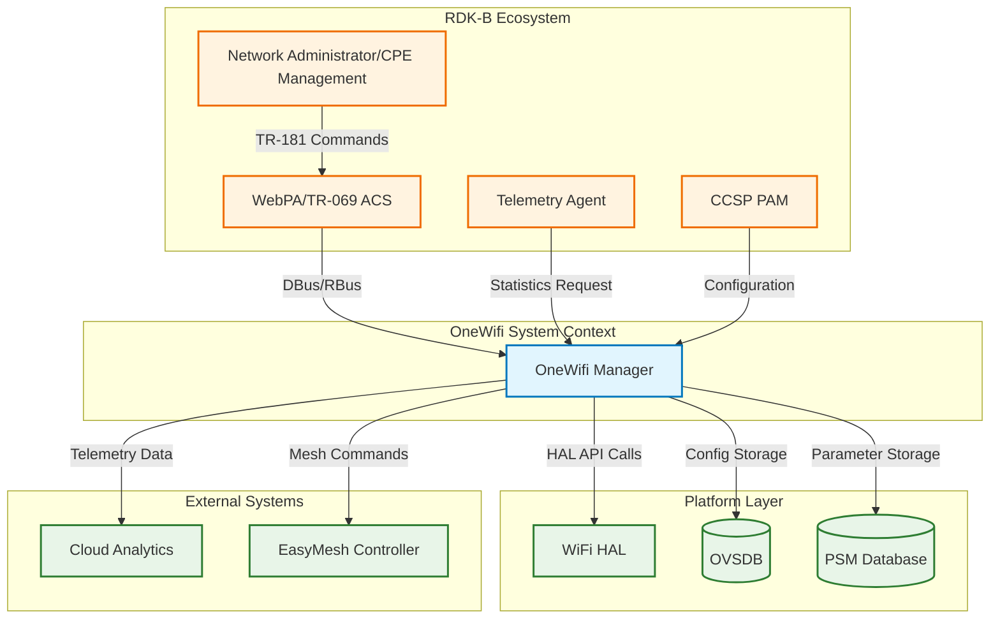
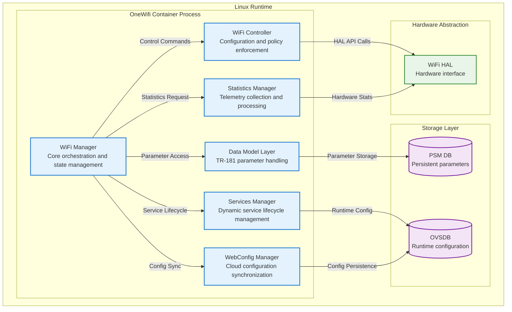
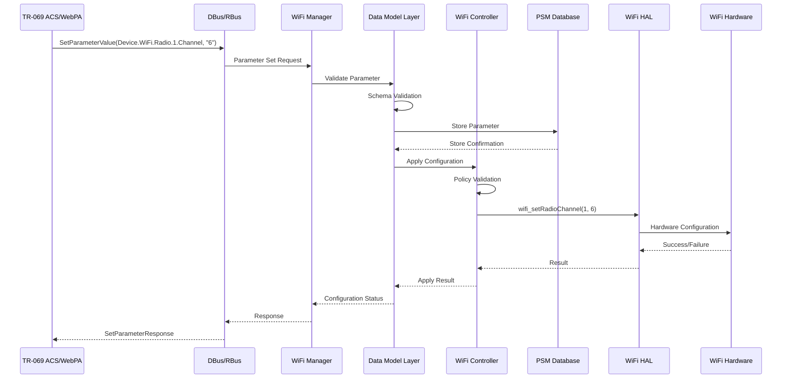
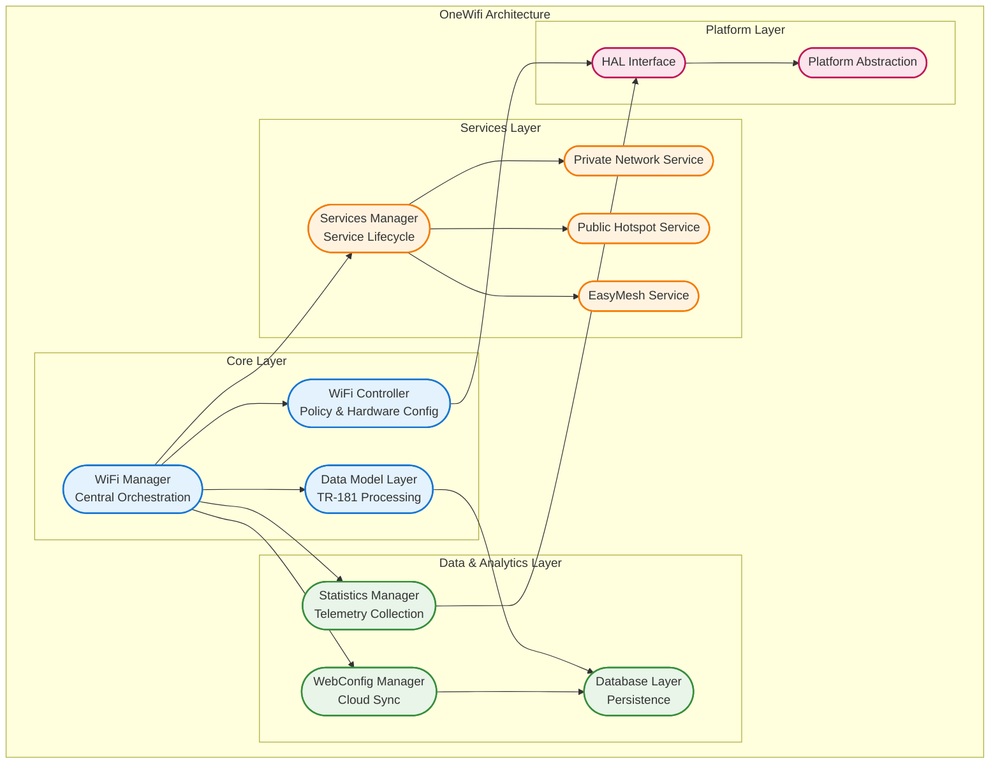
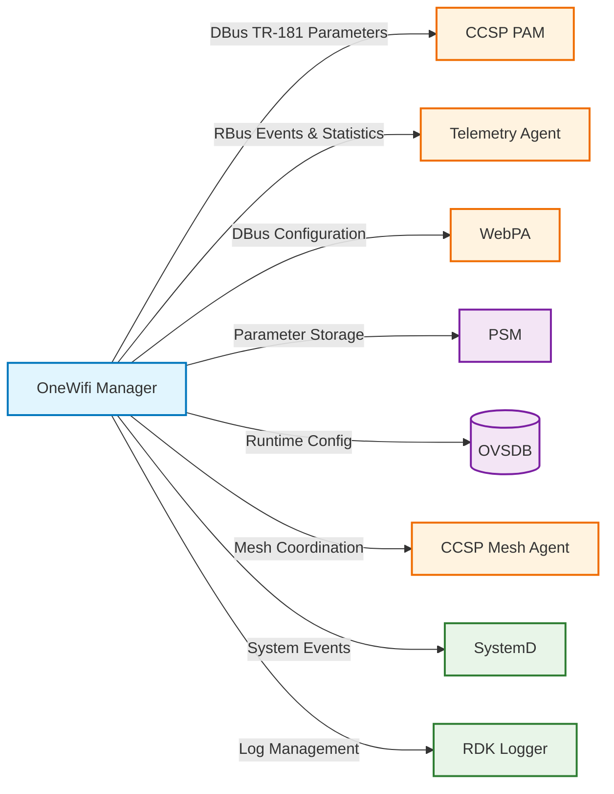
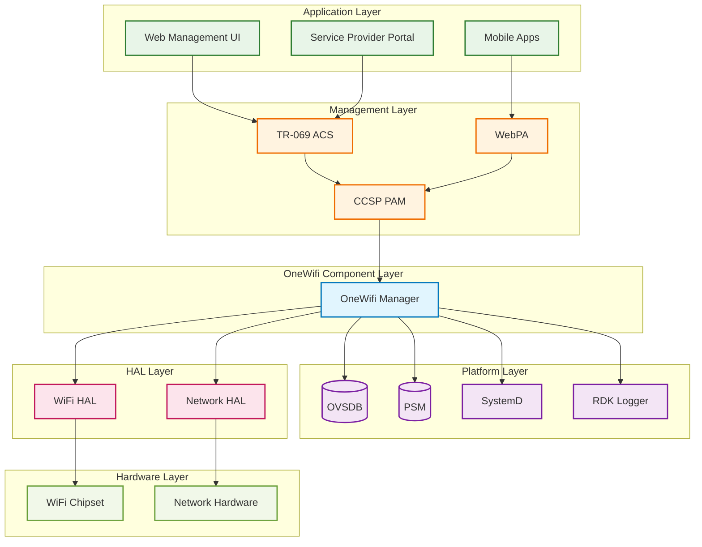
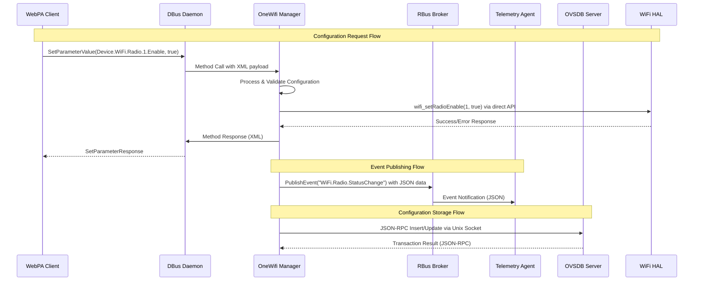

# OneWifi Documentation

OneWifi is a unified component for managing Wi-Fi parameters, statistics, telemetry, steering and optimization in the RDK-B ecosystem. It provides a comprehensive solution capable of running on both Gateways and Extenders, centralizing Wi-Fi management across diverse hardware platforms. The component serves as the primary interface between the RDK-B middleware stack and the underlying Wi-Fi Hardware Abstraction Layer (HAL), implementing TR-181 data models for standardized device management. OneWifi integrates with other RDK-B components through DBus and RBus communication mechanisms, providing configuration management, telemetry collection, and real-time optimization services. It supports advanced Wi-Fi features including EasyMesh, band steering, client management, and security protocols while maintaining backward compatibility with existing RDK-B deployments.

**Key Features & Responsibilities**

  - **Unified Wi-Fi Configuration Management**: Centralizes all Wi-Fi parameter configuration including radio settings, SSID management, security protocols, and access point configurations across multiple interfaces and bands
  - **Real-time Telemetry and Statistics Collection**: Aggregates comprehensive Wi-Fi statistics including client connection data, radio performance metrics, traffic analysis, and network health indicators for cloud analytics and local monitoring
  - **EasyMesh Support and Mesh Management**: Implements IEEE 1905.1 EasyMesh standard for seamless mesh network deployment, including controller and agent functionality for multi-AP coordination
  - **Advanced Security and Client Management**: Provides comprehensive security features including WPA3, 802.1X authentication, client steering, band steering, and access control list management 
  - **Multi-platform Hardware Abstraction**: Abstracts underlying Wi-Fi hardware differences through standardized HAL interface, supporting various chipset vendors and platform configurations 
  - **TR-181 Data Model Implementation**: Complete implementation of TR-181 WiFi data model with custom RDK extensions for standardized device management and remote configuration 

## Design

OneWifi follows a layered, modular architecture that separates concerns between configuration management, data processing, and hardware abstraction. The design emphasizes scalability through service-oriented architecture where different Wi-Fi services (private, public, mesh, managed) can be dynamically loaded and configured based on deployment requirements. Reliability is ensured through robust error handling, state machine implementations, and comprehensive logging across all modules. Security is built-in at every layer with encrypted communication channels, secure credential storage, and comprehensive access control mechanisms. The component maintains clear boundaries with other RDK-B middleware through well-defined IPC interfaces, primarily using DBus and RBus for inter-component communication. Maintainability is achieved through consistent coding standards, comprehensive documentation, and modular design that allows independent updates of individual services without affecting the entire system.

A container diagram of the component is given below

**Request Flow Sequence**

The most critical flow in OneWifi is the TR-181 parameter configuration request from external management systems. When a configuration change arrives via WebPA or TR-069, it follows a structured validation and application process through multiple layers.

**Threading Model**

The **OneWifi** component uses a hybrid threading model with the following thread responsibilities:

- **Main Thread**: Runs an event loop to process messages from DBus/RBus interfaces and internal component communications
- **Dedicated Worker Threads**: Spawned for CPU-intensive tasks such as statistics collection, telemetry processing, and hardware polling
- **Statistics Manager Threads**: Periodically collect data from the WiFi HAL and process it for telemetry reporting
- **WebConfig Synchronization Thread**: Handles cloud communication and configuration sync without blocking the main control flow
- **Thread Synchronization**: Managed using pthread mutexes and condition variables; `data_cache_lock` protects shared configuration data, while individual module locks prevent race conditions during concurrent operations

## Internal Modules

OneWifi is organized into several key modules that handle different aspects of Wi-Fi management. The WiFi Manager serves as the central orchestrator, coordinating between all other modules and maintaining overall system state. The Data Model Layer (DML) handles TR-181 parameter processing and validation, receiving configuration requests from external systems. The WiFi Controller manages policy enforcement and hardware configuration, translating high-level configuration into hardware-specific commands. The Services Manager provides dynamic loading and management of different Wi-Fi service types including private networks, public hotspots, and mesh services. The Statistics Manager collects and processes telemetry data from hardware and other modules for reporting to cloud analytics platforms.

| Module/Class | Description | Key Files |
|-------------|------------|-----------|
| **WiFi Manager** | Central orchestration engine managing overall system state and inter-module coordination | `wifi_mgr.c`, `wifi_mgr.h` |
| **WiFi Controller** | Policy enforcement and hardware configuration management with queue-based message processing | `wifi_ctrl.c`, `wifi_ctrl.h`, `wifi_ctrl_queue_handlers.c` |
| **Data Model Layer** | TR-181 parameter handling, validation, and persistence management | `dml/tr_181/`, `wifi_dml.h` |
| **Services Manager** | Dynamic Wi-Fi service lifecycle management for private, public, mesh, and managed services | `services/wifi_services_mgr.c`, `services/wifi_services_mgr.h` |
| **Statistics Manager** | Telemetry collection, processing, and reporting for cloud analytics | `stats/wifi_monitor.c`, `stats/` |
| **WebConfig Manager** | Cloud configuration synchronization and multi-document WebConfig support | `webconfig/`, `wifi_multidoc_webconfig.c` |
| **Database Layer** | Configuration and runtime data persistence through OVSDB and PSM interfaces | `db/wifi_db_apis.c`, `db/` |
| **Platform Abstraction** | Hardware and platform-specific adaptations for different RDK-B deployments | `platform/`, `stubs/` |

## Interaction with Other Middleware Components

OneWifi integrates extensively with the RDK-B middleware ecosystem through well-defined interfaces and communication protocols. It receives configuration commands from CCSP PAM (Platform and Application Manager) via DBus, processes TR-181 parameter requests from WebPA for remote device management, and provides telemetry data to the Telemetry Agent for cloud analytics. The component also interacts with PSM (Persistent Storage Manager) for parameter persistence and OVSDB for runtime configuration storage.

| Component | Purpose of Interaction | Protocols/Mechanisms |
|-----------|-----------------------|----------------------|
| **CCSP PAM** | Device configuration management and TR-181 parameter coordination | DBus method calls and property access |
| **Telemetry Agent** | WiFi statistics and performance metrics reporting for cloud analytics | RBus events and data publishing |
| **WebPA** | Remote device management and cloud-based configuration updates | DBus parameter get/set operations |
| **PSM (Persistent Storage Manager)** | Long-term storage of WiFi configuration parameters and device settings | Direct API calls for parameter persistence |
| **OVSDB** | Runtime configuration database for OpenFlow and networking state management | OVSDB client API and JSON-RPC protocol |
| **CCSP Mesh Agent** | EasyMesh coordination and multi-AP network management | DBus messaging for mesh topology updates |
| **SystemD** | Service lifecycle management and system integration | SystemD service notifications and dependencies |
| **RDK Logger** | Centralized logging and debug information management | Logging API calls with categorized log levels |

OneWifi publishes several key events to notify other components of important state changes and operational events. These events support the broader RDK-B ecosystem's need for real-time awareness of WiFi network status and performance.

| Event | Purpose of Event | Reason for trigger |
|-----------|-----------------------|----------------------|
| **WiFi.Radio.StatusChange** | Notify radio state transitions (up/down/scanning) | Radio enable/disable, channel changes, or hardware failures |
| **WiFi.AccessPoint.ClientConnect** | Signal new client associations to access points | Client device successfully authenticates and associates |
| **WiFi.AccessPoint.ClientDisconnect** | Signal client disconnections from access points | Client device disconnects, timeout, or security violation |
| **WiFi.Statistics.Update** | Periodic statistics data for telemetry collection | Scheduled telemetry intervals or significant metric changes |
| **WiFi.Configuration.Applied** | Confirm successful configuration changes | TR-181 parameter updates successfully applied to hardware |
| **WiFi.EasyMesh.TopologyChange** | Mesh network topology updates | New mesh nodes join/leave or link quality changes |
| **WiFi.Security.Violation** | Security-related events and policy violations | Authentication failures, intrusion attempts, or policy breaches |

## Interaction with Other Layers

OneWifi interacts with multiple layers in the RDK-B software stack, providing abstraction between high-level management interfaces and low-level hardware control. At the HAL layer, it communicates with the WiFi Hardware Abstraction Layer to control radio parameters, manage client connections, and retrieve hardware statistics. Platform-specific interactions include integration with OpenWrt build systems, systemd service management, and platform-specific configuration files. External service interactions encompass cloud analytics platforms for telemetry reporting, EasyMesh controllers for multi-AP coordination, and remote management systems through TR-069/WebPA protocols.

| Layer/Service | Interaction Description | Mechanism |
|---------------|-------------------------|----------|
| **WiFi HAL** | Hardware control for radio configuration, client management, and statistics collection | Direct C API function calls (wifi_setRadioChannel, wifi_getStats, etc.) |
| **Platform Services** | Integration with systemd, OpenWrt build system, and platform-specific configurations | SystemD service files, platform-specific makefiles, and configuration scripts |
| **OVSDB Platform** | OpenFlow database integration for software-defined networking features | OVSDB client library with JSON-RPC protocol over Unix sockets |
| **Cloud Analytics** | Telemetry data upload and cloud-based WiFi optimization recommendations | HTTPS POST requests with JSON payloads to cloud endpoints |
| **EasyMesh External Controllers** | Multi-AP coordination with external mesh controllers | IEEE 1905.1 protocol over Ethernet with TLV message format |
| **TR-069/WebPA ACS** | Remote device management and configuration from service provider systems | SOAP/HTTP for TR-069, HTTP/JSON for WebPA with TLS encryption |

## IPC Mechanism

OneWifi utilizes multiple IPC mechanisms to communicate with different components in the RDK-B ecosystem, with the choice of mechanism optimized for each specific interaction pattern and performance requirement.

| Type of IPC | Message Format | Mechanism |
|---------------|-------------------------|----------|
| **DBus** | XML-based message format with method calls, signals, and properties following DBus specification | Used for TR-181 parameter access, CCSP component integration, and legacy RDK-B middleware communication |
| **RBus** | JSON-based lightweight messaging with event subscription and property notification | Modern RDK-B communication for telemetry events, statistics publishing, and real-time notifications |
| **Unix Domain Sockets** | Binary protocol with custom message headers containing type, length, and payload data | High-performance communication with OVSDB and direct HAL interactions requiring low latency |
| **Shared Memory** | Structured data formats with semaphore-based synchronization for concurrent access | Large data transfers like statistics buffers and configuration caches between processes |
| **Message Queues** | Priority-based message queuing with typed messages for asynchronous processing | Internal component communication for configuration requests and event processing |

## TR‑181 Data Models

OneWifi implements comprehensive TR-181 WiFi data model support with both standard parameters and RDK-specific extensions. Parameters are registered through the CCSP framework using DBus interfaces, with runtime parameter access handled through the Data Model Layer (DML). The component supports both read-only status parameters and read-write configuration parameters, with automatic validation and persistence through PSM. Custom extensions provide additional functionality specific to RDK-B deployments including advanced statistics, mesh management, and cloud integration features.

| Parameter | Description | Access (R/W) | Default | Notes |
|-----------|-------------|-------------|---------|-------|
| `Device.WiFi.RadioNumberOfEntries` | Number of WiFi radio interfaces | R | Detected from HAL | Standard TR-181 |
| `Device.WiFi.Radio.{i}.Enable` | Enable/disable radio interface | R/W | `true` | Standard TR-181 |
| `Device.WiFi.Radio.{i}.Channel` | Operating channel number | R/W | `Auto` | Standard TR-181 |
| `Device.WiFi.Radio.{i}.TransmitPower` | Transmission power percentage | R/W | `100` | Standard TR-181 |
| `Device.WiFi.SSID.{i}.SSID` | Service Set Identifier name | R/W | `RDK-WiFi` | Standard TR-181 |
| `Device.WiFi.AccessPoint.{i}.Enable` | Enable/disable access point | R/W | `false` | Standard TR-181 |
| `Device.WiFi.AccessPoint.{i}.Security.ModeEnabled` | Security mode (None/WEP/WPA/WPA2/WPA3) | R/W | `WPA2-Personal` | Standard TR-181 |
| `Device.WiFi.X_RDKCENTRAL-COM_vAPStatsEnable` | Enable per-vAP statistics collection | R/W | `false` | RDK Extension |
| `Device.WiFi.X_COMCAST-COM_MacFilter` | MAC address filtering configuration | R/W | `Disabled` | Custom Extension |
| `Device.WiFi.X_RDKCENTRAL-COM_BandSteering.Enable` | Enable band steering functionality | R/W | `false` | RDK Extension |
| `Device.WiFi.X_RDKCENTRAL-COM_PreferPrivate` | Prefer private over public networks | R/W | `true` | RDK Extension |
| `Device.WiFi.Radio.{i}.Stats.BytesSent` | Total bytes transmitted | R | `0` | Standard TR-181 |
| `Device.WiFi.Radio.{i}.X_COMCAST-COM_RadioStatisticsMeasuringRate` | Statistics collection interval | R/W | `15` | Custom Extension |

**Parameter Registration**: Parameters are registered during OneWifi initialization through the CCSP Data Model Library (CcspDmLib). The registration process uses XML configuration files (`TR181-WiFi-USGv2.XML`) to define parameter schemas, access permissions, and callback functions. Runtime parameter access is handled through DBus method calls that route to specific getter/setter functions in the DML layer.

**Custom Extensions**: OneWifi implements several custom TR-181 parameter namespaces to support RDK-specific functionality. The `X_RDKCENTRAL-COM` namespace provides advanced telemetry controls, mesh management parameters, and cloud integration settings. The `X_COMCAST-COM` namespace includes service provider-specific features like advanced statistics collection rates and custom security policies. These extensions maintain backward compatibility while enabling advanced deployment scenarios.

## Implementation Details

- **Key Algorithms or Logic**: OneWifi implements several critical algorithms for WiFi optimization and management. The **band steering algorithm** in `wifi_ctrl.c` uses RSSI thresholds and client capability detection to intelligently move dual-band clients to optimal frequency bands, reducing congestion on 2.4GHz while maximizing 5GHz utilization. The **channel selection algorithm** analyzes interference patterns, DFS requirements, and regulatory constraints to automatically select optimal channels during startup and dynamic optimization events. **Client load balancing logic** distributes new client associations across multiple access points in mesh deployments, considering factors like signal strength, current load, and backhaul capacity. The **statistics aggregation engine** in `wifi_monitor.c` implements time-series data collection with configurable sampling rates and intelligent data compression to minimize storage and transmission overhead.

- **Error Handling Strategy**: OneWifi employs a multi-layered error handling approach with graceful degradation capabilities. **Hardware errors** from the WiFi HAL are logged with detailed context and trigger automatic recovery procedures including radio resets and configuration reapplication. **Configuration validation** occurs at multiple levels - schema validation in the DML layer, policy validation in the controller, and hardware capability validation before HAL calls. **IPC communication failures** implement retry mechanisms with exponential backoff and alternative communication paths where available. **Resource exhaustion** is handled through memory monitoring, connection limits, and emergency cleanup procedures that maintain core functionality even under stress conditions.

- **Logging & Debugging**: OneWifi integrates with the RDK Logger framework providing categorized logging across multiple verbosity levels. **DEBUG level** captures detailed parameter validation, state transitions, and inter-module communications for development troubleshooting. **INFO level** logs configuration changes, client connection events, and operational status updates for normal monitoring. **ERROR level** records failures, security violations, and critical system events requiring immediate attention. **TRACE level** provides detailed function entry/exit information and variable dumps for deep debugging scenarios. Debug tools include runtime log level adjustment via TR-181 parameters, memory usage monitoring, and performance profiling hooks integrated with standard Linux debugging tools.

## Key Configuration Files

OneWifi relies on several configuration files that define its behavior, parameter schemas, and operational characteristics across different deployment scenarios.

| Configuration File | Purpose | Key Parameters | Default Values | Override Mechanisms |
|--------------------|---------|---------------|----------------|--------------------|
| `CcspWifi.cfg` | CCSP component registration and DBus configuration | `Component.ID`, `Component.DbusPath`, `DataModelXmlCfg` | `com.cisco.spvtg.ccsp.wifi`, `/com/cisco/spvtg/ccsp/wifi` | Environment variables, command line parameters |
| `TR181-WiFi-USGv2.XML` | TR-181 parameter schema definitions and callback mappings | Parameter definitions, access permissions, validation rules | Defined per parameter in XML schema | Custom XML overlays, vendor-specific extensions |
| `bus_dml_config.json` | DBus and RBus interface mappings for data model access | Bus interface names, method signatures, event subscriptions | Standard RDK-B bus configuration | JSON configuration overlays |
| `rdkb-wifi.ovsschema` | OVSDB schema for WiFi configuration and state management | Table definitions, column types, constraint rules | OVSDB standard schema with WiFi extensions | Schema version upgrades, custom table additions |
| `home.schema` and `private.schema` | WiFi service configuration schemas for different network types | Service type definitions, security policies, client limits | Service-specific defaults | WebConfig document updates |
| `WifiSingleClient.avsc` | Avro schema for single client telemetry data serialization | Client metric definitions, data types, required fields | Telemetry framework standards | Schema evolution, version compatibility |
| `EasymeshCfg.json` | EasyMesh configuration including controller and agent settings | Mesh roles, topology preferences, coordination protocols | IEEE 1905.1 standard defaults | Runtime mesh configuration updates |
