# PPP Manager Documentation

PPP Manager is the middleware component in the RDK-B stack responsible for managing Point-to-Point Protocol (PPP) connections, including PPPoE (PPP over Ethernet) and PPPoA (PPP over ATM) interfaces. It handles PPP session establishment, authentication, network configuration, and connection monitoring for broadband WAN connections. The component provides a TR-181 compliant interface for configuration and monitoring while integrating with the CCSP framework for inter-component communication. It manages PPP daemon processes, processes connection events through IPC mechanisms, and maintains interface statistics and state information.

**Key Features & Responsibilities**

  - **PPP Session Management**: Handles establishment, maintenance, and teardown of PPP connections including PPPoE and PPPoA link types
  - **Authentication Protocol Support**: Implements PAP, CHAP, MS-CHAP, and AUTO authentication mechanisms for secure connection establishment
  - **Network Configuration Protocol (NCP) Support**: Manages IPCP for IPv4 and IPv6CP for IPv6 address configuration and DNS server assignment
  - **Connection State Monitoring**: Tracks connection status, handles state transitions, and provides real-time connection health monitoring
  - **TR-181 Data Model Implementation**: Exposes standardized TR-181 parameters for Device.PPP hierarchy with custom RDK extensions
  - **IPC Event Processing**: Receives and processes PPP daemon events through Unix domain sockets for real-time status updates
  - **Statistics Collection**: Gathers interface statistics including bytes/packets sent/received and error counters from kernel interfaces
  - **Integration with WAN Manager**: Coordinates with WAN Manager component for WAN interface management and configuration

## Design

The PPP Manager follows a modular, event-driven architecture that separates TR-181 data model management from core PPP functionality. The design emphasizes reliability through robust error handling, state management, and graceful degradation during connection failures. It maintains scalability by supporting multiple PPP interfaces simultaneously while ensuring thread-safe operations. Security is implemented through encrypted authentication protocols and secure credential storage via PSM (Persistent Storage Manager). The component follows RDK-B architectural patterns with clear separation between data model layer, business logic, and platform abstraction layers.

The design supports maintainability through clear module boundaries where TR-181 middle layer handles parameter management, core PPP manager handles connection logic, and IPC layer manages event communication. Connection state is maintained consistently across all modules with proper synchronization mechanisms. The component is designed for extensibility to support additional authentication methods and connection types as needed.

A container diagram of the component is given below

**Request Flow Sequence**

The most critical flow is PPP connection establishment. When a connection request is initiated through TR-181 parameters, the request flows from the data model layer to the SSP main process, which configures and starts the PPP daemon. The daemon establishes the PPP connection and sends status updates via IPC, which are processed by the IPC handler and propagated back to update the data model state.

**Threading Model**

The **PPP Manager** uses a multi-threaded model with the following thread allocation:

- **Main Thread**: Handles DBus communication and TR-181 parameter management
- **Event Handler Thread**: Processes IPC messages from PPP daemon processes to ensure non-blocking event handling
- **On-Demand Worker Threads**: Created for connection establishment and teardown operations to avoid blocking the main control loop
- **Thread Synchronization**: Managed using mutex locks and condition variables to ensure data consistency during concurrent operations

## Internal Modules

The PPP Manager consists of several key modules that work together to provide comprehensive PPP connection management. The TR-181 middle layer receives configuration requests from external clients and manages the standardized data model. The core SSP module handles business logic including connection state management and integration with other RDK-B components. The IPC module provides real-time communication with PPP daemon processes for status monitoring and event handling.

| Module/Class | Description | Key Files |
|-------------|------------|-----------|
| **SSP Main Process** | Core service startup, initialization, and main control loop | `pppmgr_ssp_main.c`, `pppmgr_global.h` |
| **TR-181 Middle Layer** | Data model implementation, parameter validation, and PSM integration | `pppmgr_dml.c`, `pppmgr_dml_ppp_apis.c`, `pppmgr_data.c` |
| **IPC Handler** | Event processing, daemon communication, and state synchronization | `pppmgr_ipc.c` |
| **Message Bus Interface** | DBus communication and CCSP framework integration | `pppmgr_ssp_messagebus_interface.c` |
| **SSP Action Handler** | Connection management, daemon control, and error handling | `pppmgr_ssp_action.c` |

```mermaid
flowchart TD
    subgraph PPPManager ["PPP Manager Component"]
        SSPMain([SSP Main Process<br/>Initialization & Control])
        TR181([TR-181 Middle Layer<br/>Data Model & API])
        IPCHandler([IPC Handler<br/>Event Processing])
        MsgBus([Message Bus Interface<br/>DBus Communication])
        ActionHandler([SSP Action Handler<br/>Connection Management])
    end
    
    SSPMain --> TR181
    SSPMain --> IPCHandler
    SSPMain --> MsgBus
    TR181 --> ActionHandler
    IPCHandler --> ActionHandler
    
    classDef module fill:#e1f5fe,stroke:#0277bd,stroke-width:2px;
    class SSPMain,TR181,IPCHandler,MsgBus,ActionHandler module;
```

## Interaction with Other Middleware Components

The PPP Manager integrates closely with several RDK-B middleware components to provide comprehensive WAN connectivity management. It communicates with the WAN Manager for coordinated WAN interface management and receives configuration updates through standardized DBus interfaces. The component interacts with PSM for persistent configuration storage and retrieval, ensuring settings survive system reboots.

| Component | Purpose of Interaction | Protocols/Mechanisms |
|-----------|-----------------------|----------------------|
| **WAN Manager** | Coordinate WAN interface management and share connection status | DBus API calls, Event notifications |
| **PSM (Persistent Storage Manager)** | Store and retrieve PPP configuration parameters and credentials | PSM API calls over DBus |
| **CCSP Component Registry** | Register component capabilities and subscribe to system events | DBus registration and event subscription |
| **System Logging** | Log connection events, errors, and diagnostic information | Syslog protocol, Local logging |

The PPP Manager publishes several key events that other components can subscribe to for coordination and monitoring purposes:

| Event | Purpose of Event | Reason for trigger |
|-----------|-----------------------|----------------------|
| **PPP_INTERFACE_UP** | Notify successful PPP connection establishment | PPP daemon reports successful link negotiation and IP configuration |
| **PPP_INTERFACE_DOWN** | Notify PPP connection termination | Connection loss, authentication failure, or manual disconnection |
| **PPP_IPCP_COMPLETED** | Notify successful IPv4 configuration | IPCP negotiation completed with IP address assignment |
| **PPP_IPv6CP_COMPLETED** | Notify successful IPv6 configuration | IPv6CP negotiation completed with interface identifier assignment |
| **PPP_AUTH_FAILED** | Notify authentication failure | Invalid credentials or authentication protocol mismatch |

## Interaction with Other Layers

The PPP Manager operates at the middleware layer and interacts with both lower-level platform services and higher-level management interfaces. It abstracts PPP daemon management from upper layers while providing standardized TR-181 interfaces for configuration and monitoring.

| Layer/Service | Interaction Description | Mechanism |
|---------------|-------------------------|----------|
| **Platform HAL** | System network interface management and statistics retrieval | HAL API calls for interface operations |
| **Linux Kernel** | Network interface statistics and routing table management | Proc filesystem reads (/proc/net/dev) |
| **PPP Daemon (pppd)** | PPP protocol implementation and connection establishment | Unix domain sockets, Process control |
| **System Services** | Process management, logging, and system event handling | System calls, Syslog |

## IPC Mechanism

The PPP Manager uses multiple IPC mechanisms for different types of communication, with Unix domain sockets being the primary mechanism for real-time PPP daemon communication.

| Type of IPC | Message Format | Mechanism |
|---------------|-------------------------|----------|
| **Unix Domain Sockets** | Binary structured messages with event type, instance number, and connection parameters in C struct format | Unix socket server listening on `/tmp/pppmgr_socket` for PPP daemon events |
| **DBus** | XML-encoded method calls and signals following CCSP message bus protocol | DBus system bus for TR-181 parameter access and component communication |
| **PSM API** | Key-value pairs with parameter names and values encoded as strings | DBus-based PSM interface for persistent configuration storage |

## TR‑181 Data Models

The PPP Manager implements comprehensive TR-181 Device.PPP data model hierarchy with both standard parameters and custom RDK extensions for enhanced functionality.

- **Implemented Parameters**: The component implements the complete Device.PPP object hierarchy including supported NCPs, interface management, authentication, and statistics collection. Parameters support both IPv4 (IPCP) and IPv6 (IPv6CP) network configuration protocols.
- **Parameter Registration**: Parameters are registered through the CCSP message bus framework with automatic discovery and validation. The component uses PSM for persistent storage of configuration parameters.
- **Custom Extensions**: Several custom parameters are implemented including X_RDK_LinkType for PPPoA/PPPoE distinction, X_T_ONLINE_DE_SRU/SRD for carrier-specific extensions, and enhanced error reporting capabilities.

### Core PPP Parameters

| Parameter | Description | Access (R/W) | Default | Notes |
|-----------|-------------|-------------|---------|-------|
| `Device.PPP.SupportedNCPs` | Supported Network Control Protocols | R | "IPCP,IPv6CP" | Standard |
| `Device.PPP.InterfaceNumberOfEntries` | Number of PPP interface instances | R | `0` | Standard |

### PPP Interface Parameters  

| Parameter | Description | Access (R/W) | Default | Notes |
|-----------|-------------|-------------|---------|-------|
| `Device.PPP.Interface.{i}.Enable` | Enable/disable PPP interface | R/W | `false` | Standard |
| `Device.PPP.Interface.{i}.Status` | Interface operational status | R | "Down" | Standard |
| `Device.PPP.Interface.{i}.Name` | Interface name (e.g., ppp0) | R | "" | Standard |
| `Device.PPP.Interface.{i}.ConnectionStatus` | PPP connection state | R | "Disconnected" | Standard |
| `Device.PPP.Interface.{i}.LastConnectionError` | Last connection error code | R | "ERROR_NONE" | Standard |
| `Device.PPP.Interface.{i}.Username` | Authentication username | R/W | "" | Standard |
| `Device.PPP.Interface.{i}.Password` | Authentication password | R/W | "" | Standard |
| `Device.PPP.Interface.{i}.AuthenticationProtocol` | Auth protocol (PAP/CHAP/MS-CHAP/AUTO) | R/W | "AUTO" | Standard |
| `Device.PPP.Interface.{i}.MaxMRUSize` | Maximum Receive Unit size | R/W | `1500` | Standard |
| `Device.PPP.Interface.{i}.X_RDK_LinkType` | Link type specification | R/W | "PPPoE" | Custom |

### PPPoE Specific Parameters

| Parameter | Description | Access (R/W) | Default | Notes |
|-----------|-------------|-------------|---------|-------|
| `Device.PPP.Interface.{i}.PPPoE.SessionID` | PPPoE session identifier | R | `0` | Standard |
| `Device.PPP.Interface.{i}.PPPoE.ACName` | Access Concentrator name | R/W | "" | Standard |
| `Device.PPP.Interface.{i}.PPPoE.ServiceName` | PPPoE service name | R/W | "" | Standard |

### IPCP Parameters

| Parameter | Description | Access (R/W) | Default | Notes |
|-----------|-------------|-------------|---------|-------|
| `Device.PPP.Interface.{i}.IPCP.LocalIPAddress` | Local IP address assigned | R | "0.0.0.0" | Standard |
| `Device.PPP.Interface.{i}.IPCP.RemoteIPAddress` | Remote peer IP address | R | "0.0.0.0" | Standard |
| `Device.PPP.Interface.{i}.IPCP.DNSServers` | DNS server addresses | R | "" | Standard |
| `Device.PPP.Interface.{i}.IPCP.PassthroughEnable` | Enable IP passthrough | R/W | `false` | Standard |

### Statistics Parameters

| Parameter | Description | Access (R/W) | Default | Notes |
|-----------|-------------|-------------|---------|-------|
| `Device.PPP.Interface.{i}.Stats.BytesSent` | Total bytes transmitted | R | `0` | Standard |
| `Device.PPP.Interface.{i}.Stats.BytesReceived` | Total bytes received | R | `0` | Standard |
| `Device.PPP.Interface.{i}.Stats.PacketsSent` | Total packets transmitted | R | `0` | Standard |
| `Device.PPP.Interface.{i}.Stats.PacketsReceived` | Total packets received | R | `0` | Standard |
| `Device.PPP.Interface.{i}.Stats.ErrorsSent` | Transmission errors | R | `0` | Standard |
| `Device.PPP.Interface.{i}.Stats.ErrorsReceived` | Reception errors | R | `0` | Standard |

## Implementation Details

- **Key Algorithms or Logic**: The core connection state machine manages PPP interface lifecycle through defined states (Unconfigured, Connecting, Authenticating, Connected, Disconnected). Authentication logic supports multiple protocols with automatic fallback mechanisms. The main implementation resides in `pppmgr_ipc.c` for event processing and `pppmgr_dml_ppp_apis.c` for TR-181 parameter management. Statistics collection uses periodic polling of `/proc/net/dev` and `/proc/net/dev_extstats` for comprehensive interface metrics.

- **Error Handling Strategy**: Errors are categorized into connection errors, authentication failures, and system errors with specific error codes mapped to TR-181 standard values. All errors are logged through the CCSP trace system with appropriate severity levels. Connection failures trigger automatic retry mechanisms with exponential backoff. Critical errors result in component restart through systemd integration.

- **Logging & Debugging**: The component uses CCSP trace macros with configurable verbosity levels (ERROR, WARNING, INFO, DEBUG). Debug logging can be enabled through `/etc/debug.ini` configuration. Key connection events, state transitions, and error conditions are logged with contextual information including interface names, error codes, and timestamps.

## Key Configuration Files

The PPP Manager relies on several configuration files for proper operation and parameter management.

| Configuration File | Purpose | Key Parameters | Default Values | Override Mechanisms |
|--------------------|---------|---------------|----------------|--------------------|
| `RdkPppManager.xml` | TR-181 data model definition | Object hierarchy, parameter types, function mappings | N/A | Compile-time only |
| `/etc/debug.ini` | Debug logging configuration | `LOG_LEVEL`, `TRACE_ENABLE` | `INFO`, `false` | Runtime modification |
| `PSM Database` | Persistent parameter storage | Interface configs, credentials, connection settings | Component defaults | TR-181 parameter sets |
| `/tmp/pppmgr_socket` | IPC socket endpoint | Socket permissions, buffer sizes | System defaults | Environment variables |
| `pppd configuration` | PPP daemon settings | Plugin paths, authentication options | `/usr/lib/pppd/2.4.9/` | Runtime parameters |
