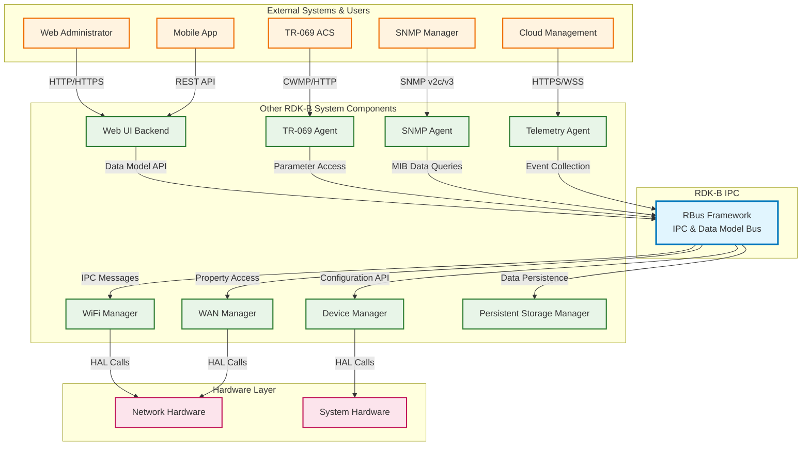
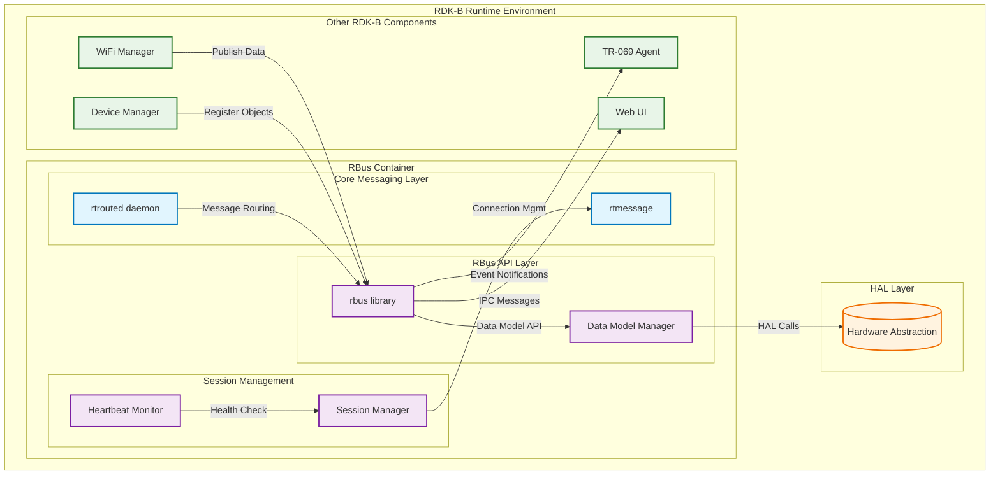
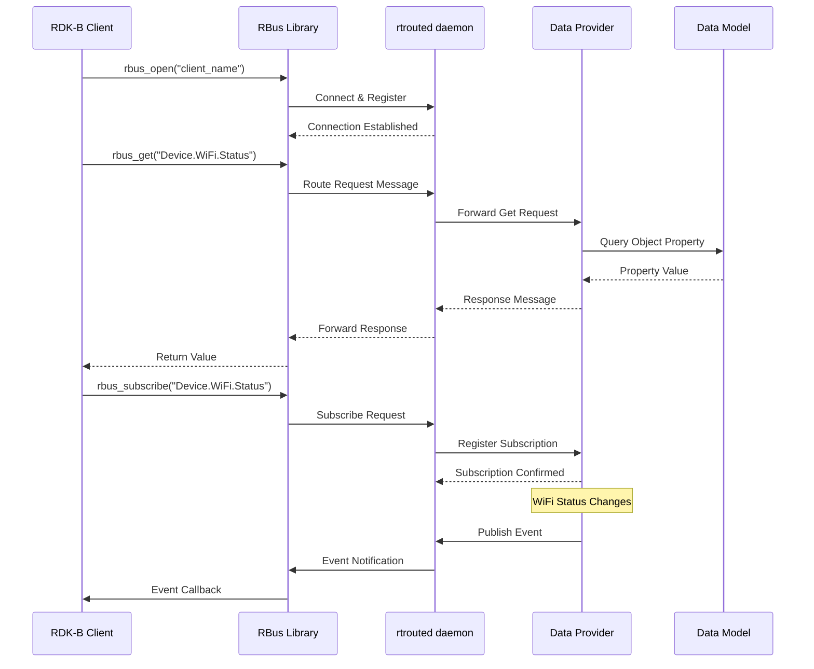
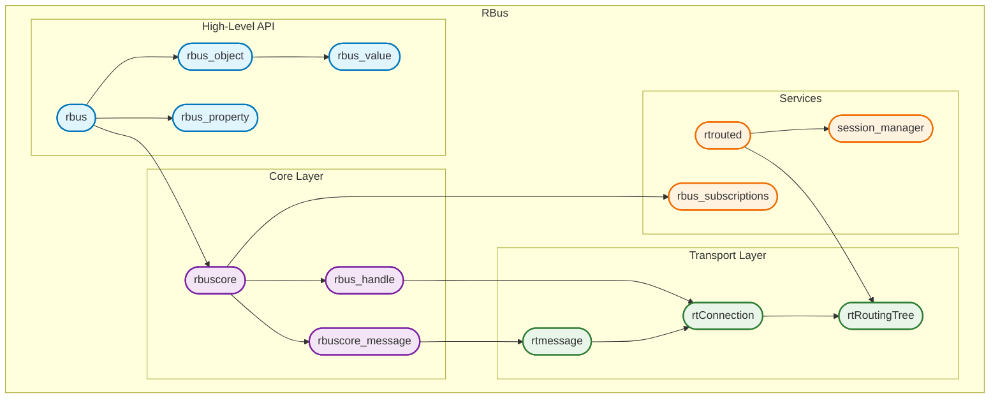
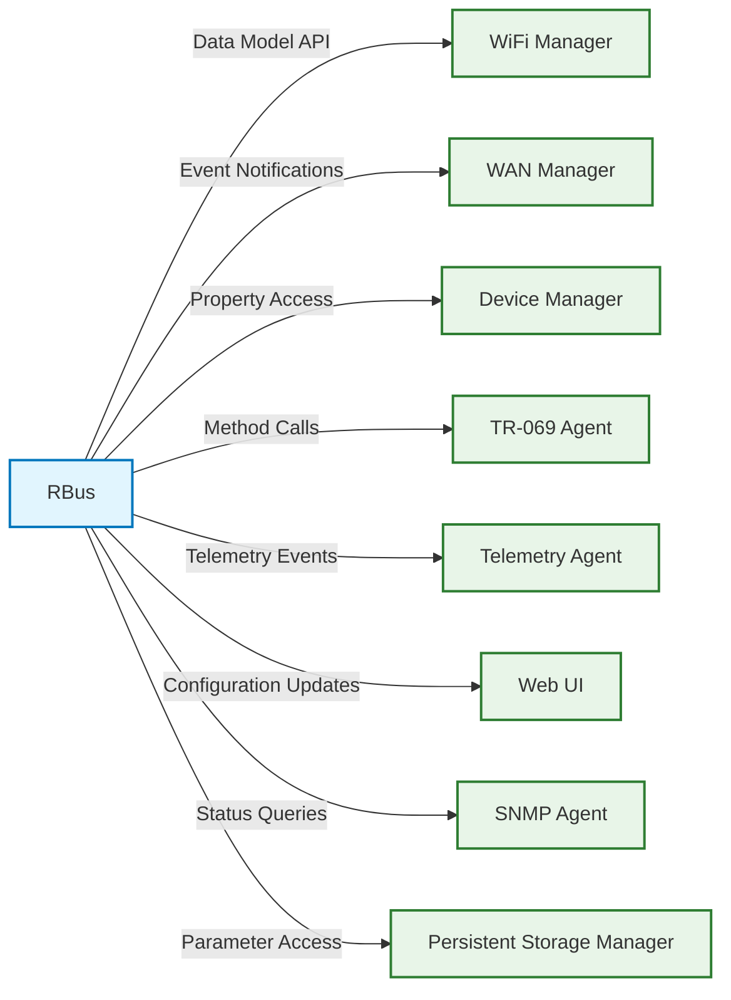
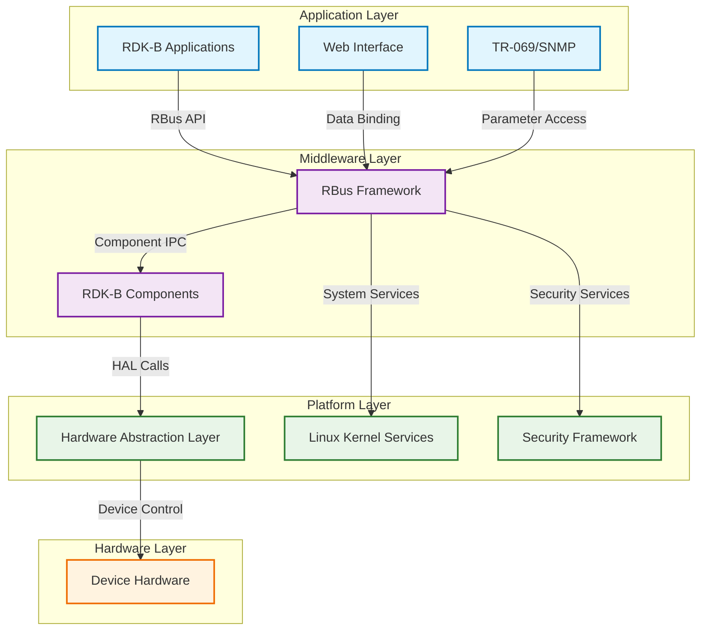
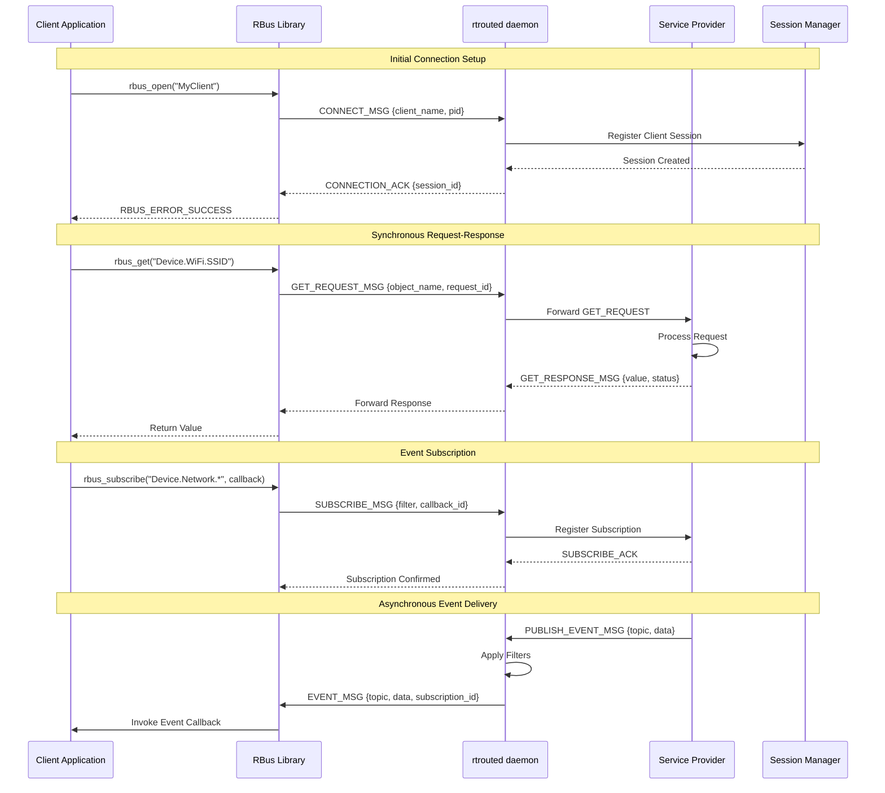

# RBus Documentation

RBus (RDK Bus) is a lightweight, fast and efficient bus messaging system that enables IPC and RPC between multiple processes running on RDK-B devices. It provides a hierarchical data model framework with named objects containing properties, events, and methods, serving as the primary IPC backbone for RDK-B middleware components. RBus abstracts complex IPC mechanisms and provides a unified interface for component communication, data model management, and event distribution. It supports both synchronous and asynchronous communication patterns with built-in discovery, routing, and session management capabilities. The framework is designed for high-performance, low-latency communication in embedded device environments.

**Key Features & Responsibilities**

- **Interprocess Communication Framework**: Provides lightweight IPC and RPC mechanisms for process communication across the RDK-B stack with support for both local and remote procedure calls.
- **Hierarchical Data Model Management**: Implements a tree-structured data model with named objects, properties, events, and methods that can be dynamically registered and discovered by other components.
- **Event-Driven Architecture**: Supports publish-subscribe event model with filtering capabilities, enabling real-time notifications and data change propagation across components.
- **Session Management**: Provides connection lifecycle management, client registration, heartbeat monitoring, and automatic cleanup of disconnected clients.
- **Message Routing & Discovery**: Includes rtrouted daemon for intelligent message routing, service discovery, and load balancing across distributed processes.
- **Asynchronous Operations**: Supports non-blocking operations with callback mechanisms for improved performance and responsiveness in embedded environments.

## Design

RBus follows a modular, event-driven architecture designed for embedded systems with strict performance and memory constraints. The design emphasizes separation of concerns through distinct layers: core messaging (rtmessage), high-level API (rbus), and routing infrastructure (rtrouted). Modularity is achieved through well-defined interfaces between components, allowing independent development and testing of messaging, data model, and routing subsystems. Scalability is ensured through efficient message routing algorithms and connection pooling that can handle hundreds of concurrent clients. Reliability is built-in through automatic reconnection, heartbeat monitoring, session recovery, and graceful degradation when components become unavailable. Security is implemented through configurable access controls, message encryption capabilities, and process isolation. Maintainability is supported through comprehensive logging, debugging hooks, and clean separation between platform-specific and generic code.

The design supports loose coupling between components through the data model abstraction, where producers and consumers interact via named objects rather than direct references. Clear boundaries exist between the core messaging layer (handles transport), the RBus API layer (manages data model), and application components (implement business logic). The rtrouted daemon serves as the central message broker, handling routing decisions and connection management independently of client applications.

A container diagram of the component is given below

**Request Flow Sequence**

The most critical flow is the data model operation where a client requests data from a provider. The sequence starts with client discovery of available objects, followed by connection establishment, request routing through rtrouted, provider processing, and response delivery with optional event subscriptions.

**Threading Model**

The **RBus** system employs a hybrid threading model tailored for embedded environments, with the following thread allocation:

* **Core Daemon (`rtrouted`)**: Operates as a single-threaded event loop using `select()` for I/O multiplexing, ensuring low resource usage and predictable performance
* **Client Libraries**: Support both single-threaded and multi-threaded modes:

  * *Single-Threaded Mode*: All RBus operations execute synchronously on the calling thread
  * *Multi-Threaded Mode*: A dedicated worker thread processes incoming messages and event callbacks, allowing the main thread to focus on application logic
* **Thread Pools**: Spawned on demand to manage concurrent subscriptions; configurable based on available system resources
* **Session Manager**: Runs in a separate thread to independently monitor connection health, decoupled from core message processing

## Internal Modules

RBus is organized into several key modules that handle different aspects of the messaging framework. The core rtmessage module provides low-level transport and serialization. The high-level rbus module implements the data model API and manages object registration. The rtrouted daemon handles message routing and service discovery across the system.

| Module/Class | Description | Key Files |
|-------------|------------|-----------|
| **rtmessage** | Core messaging transport layer providing socket communication, message serialization, and connection management | `rtMessage.c`, `rtConnection.c`, `rtMessageHeader.c` |
| **rbus** | High-level API layer implementing data model objects, properties, events, and method invocation | `rbus.c`, `rbus_object.c`, `rbus_property.c`, `rbus_value.c` |
| **rbuscore** | Core RBus functionality including handle management, callback routing, and message processing | `rbuscore.c`, `rbuscore_message.c` |
| **rtrouted** | Message routing daemon providing service discovery, connection brokering, and message forwarding | `rtrouted.c`, `rtRoutingTree.c` |
| **session_manager** | Connection lifecycle management including client registration, heartbeat monitoring, and cleanup | Session manager source files |
| **Subscriptions** | Event subscription management with filtering, interval-based updates, and asynchronous notifications | `rbus_subscriptions.c`, `rbus_asyncsubscribe.c`, `rbus_intervalsubscription.c` |
| **Data Serialization** | Message encoding/decoding, buffer management, and data type conversion | `rbus_buffer.c`, `rbus_message.c`, `rtEncoder.c` |

## Interaction with Other Middleware Components

RBus serves as the central IPC backbone for RDK-B middleware, enabling communication between various components through standardized data model interfaces. Components register their data objects with RBus and can be discovered and accessed by other components through hierarchical naming conventions.

| Component | Purpose of Interaction | Protocols/Mechanisms |
|-----------|-----------------------|----------------------|
| **WiFi Manager** | WiFi configuration management, status reporting, and client connection events | RBus Data Model API, Event Subscriptions |
| **WAN Manager** | WAN interface status, IP configuration, and connectivity state management | RBus Property Access, Method Invocation |
| **Device Manager** | Device information, system status, and hardware configuration management | RBus Object Registration, Property Publishing |
| **TR-069 Agent** | Remote management parameter access and configuration synchronization | RBus Get/Set Operations, Bulk Data Transfer |
| **Telemetry Agent** | System metrics collection and telemetry data aggregation | RBus Event Publishing, Periodic Data Collection |
| **Web UI** | User interface data binding and real-time status updates | RBus Subscriptions, Asynchronous Notifications |
| **SNMP Agent** | SNMP MIB data access and trap generation | RBus Query Interface, Event-to-Trap Mapping |
| **PSM** | Configuration persistence and parameter storage | RBus Configuration API, Data Validation |

RBus publishes various system-wide events that enable reactive programming and real-time updates across components:

| Event | Purpose of Event | Reason for trigger |
|-----------|-----------------------|----------------------|
| **Component.Ready** | Indicates component initialization completion | Published when component successfully registers all data objects and is ready to serve requests |
| **ValueChange** | Property value modification notification | Triggered when any registered property value changes, enabling real-time UI updates and dependent component reactions |
| **Connection.Lost** | Client disconnection notification | Published when rtrouted detects client connection failure, enabling cleanup and failover procedures |
| **Discovery.NewComponent** | New component registration | Triggered when a new component registers with RBus, enabling dynamic service discovery |
| **SystemInfo.Update** | System status change notification | Published on significant system state changes like interface up/down, memory pressure, or configuration updates |

## Interaction with Other Layers

RBus operates primarily in the middleware layer but interacts with both lower HAL layers and upper application layers through well-defined interfaces. It abstracts the complexity of inter-component communication while providing efficient access to hardware resources.

| Layer/Service | Interaction Description | Mechanism |
|---------------|-------------------------|----------|
| **HAL Layer** | Hardware abstraction for device-specific operations and status reporting | Direct function calls, shared libraries |
| **Linux Kernel** | System services including networking, process management, and IPC primitives | System calls, netlink sockets, signal handling |
| **Configuration Management** | Persistent storage and configuration file management | File I/O, configuration parsing, validation callbacks |
| **Logging Framework** | System-wide logging and debugging support | RDK Logger integration, syslog interface |
| **Security Framework** | Authentication, authorization, and secure communication | Access control lists, certificate validation |
| **External Management** | TR-069, SNMP, and other external management protocols | Protocol adaptation layers, data transformation |

## IPC Mechanism

RBus implements a sophisticated IPC framework that supports multiple communication patterns and message formats optimized for embedded systems.

| Type of IPC | Message Format | Mechanism |
|---------------|-------------------------|----------|
| **Request-Response** | Binary encoded messages with msgpack serialization containing method name, parameters, and request ID | Unix domain sockets with rtrouted message routing |
| **Publish-Subscribe** | Event messages with topic hierarchies, filter expressions, and typed payloads | Broadcast distribution through rtrouted with subscriber filtering |
| **Asynchronous Callbacks** | Callback registration messages with function pointers and user data contexts | Thread-safe callback queues with event loop integration |
| **Bulk Data Transfer** | Chunked message protocol for large data transfers with flow control | Streaming message protocol with acknowledgment and retry logic |

## Implementation Details

- **Key Algorithms or Logic**: RBus implements several critical algorithms including hierarchical object lookup using Patricia trees for O(log n) performance, event filtering with compiled filter expressions, and adaptive message routing with load balancing. The main routing logic resides in `rtrouted.c` and `rtRoutingTree.c`. Message serialization uses msgpack for efficient binary encoding implemented in `rtEncoder.c`. Connection management uses epoll-based event loops for scalable I/O handling in `rtConnection.c`.

- **Error Handling Strategy**: Errors are detected at multiple layers with standardized error codes defined in `rbuscore_types.h`. Critical errors trigger automatic reconnection attempts with exponential backoff. Component failures are isolated through process boundaries and graceful degradation. All errors are logged with contextual information including component name, operation type, and stack traces where applicable.

- **Logging & Debugging**: RBus integrates with RDK Logger providing configurable log levels (FATAL, ERROR, WARN, INFO, DEBUG). Debug categories include RBUS_CORE, RBUS_MESSAGE, RBUS_ROUTING for granular control. Memory leak detection and performance profiling hooks are available in debug builds. The framework provides runtime diagnostic tools including connection status, message statistics, and object registry inspection.

## Key Configuration Files

RBus configuration is managed through multiple files that control daemon behavior, client settings, and system integration.

| Configuration File | Purpose | Key Parameters | Default Values | Override Mechanisms |
|--------------------|---------|---------------|----------------|--------------------|
| `rbus_rdkv.conf` | RDK-V platform configuration | `RTROUTER_OPTIONAL_ARGS`, `RBUS_ROOT` | `-f -l DEBUG`, `/tmp` | Environment variables |
| `rbus_client_rdkc.conf` | RDK-C client configuration | `CLIENT_TIMEOUT`, `MAX_CONNECTIONS` | `30000ms`, `256` | Command line arguments |
| `rbus.service` | SystemD service definition | `ExecStart`, `Restart`, `TimeoutSec` | `rtrouted`, `no`, `300` | SystemD overrides |
| `rbus_heartbeat.service` | Heartbeat monitoring service | `HEARTBEAT_INTERVAL`, `DEAD_CLIENT_TIMEOUT` | `5s`, `30s` | Service configuration |
| `rbus_session_mgr.service` | Session management service | `SESSION_CLEANUP_INTERVAL` | `60s` | Runtime parameters |