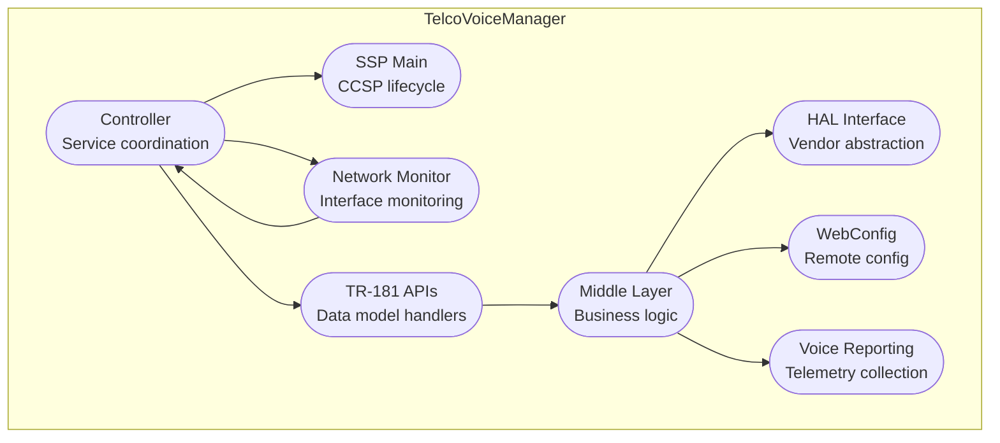

# Telco Voice Manager Documentation

RDK Telco Voice Manager is the middleware component designed to manage vendor voice stacks through TR-104 configuration and provides a standardized interface for voice services in RDK-B platforms. It acts as a bridge between the RDK-B framework and vendor-specific voice implementations, enabling voice service management, configuration, and monitoring capabilities. The component supports both TR-104 v1 and v2 data models and integrates with HAL layers to abstract vendor-specific voice stack implementations. It manages voice profiles, lines, physical interfaces, and provides telemetry reporting capabilities while maintaining compatibility with CCSP (Common Component Software Platform) architecture.

**Key Features & Responsibilities**: 

  - **Voice Service Management**: Manages voice services including SIP configuration, voice profiles, and line management with support for multiple voice service instances
  - **TR-104 Data Model Implementation**: Implements TR-104 v1 and v2 specifications for voice service parameters with comprehensive parameter validation and persistence
  - **HAL Abstraction Layer**: Provides JSON-based HAL interface to abstract vendor voice stack implementations and enable cross-platform compatibility
  - **Network Monitoring**: Monitors network interface changes and firewall rule configurations to ensure voice service connectivity and security
  - **Telemetry & Reporting**: Collects and reports voice service statistics, call logs, and diagnostic information through RDK telemetry framework
  - **WebConfig Integration**: Supports remote configuration management through WebConfig protocol for dynamic voice service provisioning

## Design

The Telco Voice Manager follows a layered architecture approach that separates concerns between TR-181 data model management, business logic, and hardware abstraction. The design emphasizes modularity through clear separation of TR-104 v1/v2 implementations, ensuring backward compatibility while supporting newer specifications. The component maintains reliability through comprehensive error handling, parameter validation, and graceful degradation when voice services are unavailable. Security is implemented through proper access controls, encrypted credential storage, and secure communication channels with vendor voice stacks. The architecture supports scalability by allowing multiple voice service instances and dynamic configuration changes without service interruption.

The design establishes clear boundaries between the TR-181 data model layer (responsible for CCSP integration), the middle layer (handling business logic and data transformation), and the HAL layer (abstracting vendor implementations). Data persistence responsibilities are handled through CCSP's PSM (Parameter Storage Management) system, while interface management is centralized in the controller module for consistent event handling and service coordination.

A container diagram of the component is given below

**Request Flow Sequence**

The most critical flow is TR-181 parameter configuration which starts from CCSP clients, flows through the TR-181 layer for validation, gets processed by the middle layer for business logic, and finally reaches the vendor voice stack through the HAL interface.

**Threading Model**

The **Telco Voice Manager** uses a multi-threaded model with the following thread allocation:

- **Main Thread**: Handles CCSP message bus operations, TR-181 parameter processing, and component lifecycle management
- **Network Monitor Thread**: Dedicated thread for monitoring network interface changes and sysevent notifications
- **HAL Communication Thread**: Manages asynchronous communication with vendor voice stack through JSON HAL client
- **Event Handler Thread**: Processes voice service events and publishes telemetry data to the RDK telemetry framework
- **WebConfig Thread**: Handles remote configuration updates and applies them to the voice service configuration

## Internal Modules

The component is organized into distinct modules that handle specific aspects of voice service management. The Controller module receives external events and coordinates responses across other modules. The TR-181 layer modules handle CCSP integration and data model compliance. The Middle layer contains the core business logic and parameter validation. The HAL interface module abstracts vendor-specific implementations.

| Module/Class | Description | Key Files |
|-------------|------------|-----------|
| Controller | Main service controller handling initialization, event subscription, and coordination | `telcovoicemgr_controller.c`, `telcovoicemgr_controller.h` |
| SSP Main | CCSP Service Support Point main entry and lifecycle management | `telcovoicemgr_ssp_main.c`, `telcovoicemgr_ssp_global.h` |
| Network Monitor | Network interface and firewall rule monitoring for voice connectivity | `telcovoicemgr_nw_monitor.c`, `telcovoicemgr_nw_monitor.h` |
| TR-181 APIs | CCSP TR-181 data model implementation and parameter handlers | `telcovoicemgr_dml_apis.c`, `telcovoicemgr_dml_apis.h` |
| Middle Layer | Business logic, parameter validation, and data transformation | `telcovoicemgr_dml_data.c`, `telcovoicemgr_dml_backendmgr.c` |
| HAL Interface | JSON-based communication with vendor voice stack | `telcovoicemgr_dml_hal.c`, `telcovoicemgr_dml_hal.h` |
| WebConfig Module | Remote configuration management and WebPA integration | `telcovoicemgr_webconfig.c`, `telcovoicemgr_webconfig.h` |
| Voice Reporting | Telemetry data collection and reporting functionality | `voice_report.c`, `voice_report.h` |

## Interaction with Other Middleware Components

The component integrates with various RDK-B middleware components to provide comprehensive voice service functionality. It communicates with the CCSP framework for parameter management and with telemetry services for reporting. Network-related interactions include coordination with WAN Manager for interface status and with firewall services for security rule management.

| Component | Purpose of Interaction | Protocols/Mechanisms |
|-----------|-----------------------|----------------------|
| CCSP Message Bus | TR-181 parameter operations, component registration, and inter-component communication | DBus |
| Parameter Storage Manager | Persistent storage of voice configuration parameters and settings | DBus |
| Telemetry Agent | Voice service statistics and diagnostic data reporting | HTTP POST |
| Network Manager | Network interface status monitoring and connectivity events | Sysevent |
| WebConfig Agent | Remote configuration management and bulk parameter updates | WebPA/HTTP |
| Vendor Voice Stack | Voice service control, configuration, and status monitoring | JSON over TCP |

Telco Voice Manager publishes several key events that other components can subscribe to for coordination and monitoring purposes

| Event | Purpose of Event | Reason for trigger |
|-----------|-----------------------|----------------------|
| VoiceServiceStatusChange | Voice service operational status update | Service initialization complete, service failure detected |
| LineRegistrationStatus | Voice line registration state change | SIP registration success/failure, network connectivity change |
| CallLogUpdate | New call record available | Call completed, call statistics updated |
| FirewallRuleChange | Voice service firewall rule modification | Network interface change, security policy update |
| ConfigurationChange | Voice configuration parameter update | WebConfig update received, parameter modified via TR-181 |

## Interaction with Other Layers

The component interacts with multiple layers in the RDK-B software stack, from HAL abstraction to platform services and external systems. The HAL layer interaction enables vendor-agnostic voice stack management, while platform layer integration provides system-level services like network monitoring and storage.

| Layer/Service | Interaction Description | Mechanism |
|---------------|-------------------------|----------|
| Voice HAL | Voice service control, parameter configuration, and status monitoring | JSON over TCP |
| Platform Services | System event monitoring, network interface management, file system access | Sysevent, syscfg |
| CCSP Framework | Component registration, parameter management, message bus communication | DBus |
| Telemetry Service | Voice statistics reporting, diagnostic data collection | HTTP POST |
| WebConfig Service | Remote configuration updates, bulk parameter provisioning | WebPA/HTTP |

## IPC Mechanism

| Type of IPC | Message Format | Mechanism |
|---------------|-------------------------|----------|
| DBus | CCSP standard message format with parameter names, values, and types encoded as DBus variants | CCSP Message Bus for TR-181 parameter operations and component communication |
| JSON over TCP | JSON-RPC style messages with action, parameters, and response fields defined by HAL schema | Voice HAL interface for vendor voice stack communication |
| HTTP POST | JSON payload with telemetry data, timestamps, and metadata following RDK telemetry schema | Telemetry reporting to collection services |
| Sysevent | Key-value pairs for network events with interface names and status information | Network interface and firewall rule monitoring |

## TR‑181 Data Models

- **Implemented Parameters**: The component implements TR-104 voice service parameters under the Services.VoiceService hierarchy, including voice profiles, lines, physical interfaces, and capabilities. It also provides custom RDK extensions for enhanced voice management and reporting.

- **Parameter Registration**: Parameters are registered through CCSP's component registration mechanism using XML data model definitions. Access is provided via DBus interface with proper validation and access control.

- **Custom Extensions**: X_RDK_TelcoVoice namespace for vendor-agnostic configuration, X_RDK_Report.Voice for telemetry reporting, X_RDK_Debug for diagnostic controls, and X_RDK_BoundIfName for interface binding specifications.

| Parameter | Description | Access (R/W) | Default | Notes |
|-----------|-------------|-------------|---------|-------|
| `Services.VoiceService.{i}.Enable` | Enable/disable voice service instance | R/W | `false` | TR-104 standard |
| `Services.VoiceService.{i}.VoiceProfile.{i}.Line.{i}.Enable` | Enable/disable voice line | R/W | `Disabled` | TR-104 standard |
| `Services.VoiceService.{i}.VoiceProfile.{i}.Line.{i}.DirectoryNumber` | Phone number assignment | R/W | `""` | TR-104 standard |
| `Services.VoiceService.{i}.VoiceProfile.{i}.Line.{i}.SIP.AuthUserName` | SIP authentication username | R/W | `""` | TR-104 standard |
| `Services.VoiceService.{i}.PhyInterface.{i}.Description` | Physical interface description | R | Platform-specific | TR-104 standard |
| `Services.VoiceService.{i}.Capabilities.MaxLineCount` | Maximum supported lines | R | Platform-specific | TR-104 standard |
| `X_RDK_TelcoVoice.Data` | Bulk configuration data in JSON format | R/W | `""` | RDK custom |
| `X_RDK_TelcoVoice.DatamodelVersion` | Supported TR-104 version | R | `"1.0"` or `"2.0"` | RDK custom |
| `Services.X_RDK_Report.Voice.Enabled` | Enable voice telemetry reporting | R/W | `false` | RDK custom |
| `Services.X_RDK_Report.Voice.ReportingPeriod` | Telemetry reporting interval in seconds | R/W | `300` | RDK custom |

## Implementation Details

- **Key Algorithms or Logic**: The component implements a state machine for voice service lifecycle management, with states including Uninitialized, Initializing, Enabled, and Disabled. Configuration validation algorithms ensure TR-104 compliance and parameter consistency. The HAL communication layer uses JSON-RPC style messaging with retry logic and timeout handling. Main implementation resides in `telcovoicemgr_controller.c`, `telcovoicemgr_dml_hal.c`, and version-specific files under middle_layer_src.

- **Error Handling Strategy**: Errors are detected through parameter validation, HAL communication timeouts, and service health monitoring. All errors are logged using CCSP tracing with appropriate severity levels. Critical errors trigger service restart through CCSP's watchdog mechanism, while recoverable errors are handled through retry logic and graceful degradation.

- **Logging & Debugging**: Logging uses CCSP trace categories including CCSP_TRACE_LEVEL_INFO, CCSP_TRACE_LEVEL_WARNING, and CCSP_TRACE_LEVEL_ERROR. Debug controls are available through X_RDK_Debug parameters for module-specific log levels. Voice call debugging is supported through CCTKTraceGroup and CCTKTraceLevel parameters.

## Key Configuration Files

| Configuration File | Purpose | Key Parameters | Default Values | Override Mechanisms |
|--------------------|---------|---------------|----------------|--------------------|
| `telcovoice_config_default.json` | Default voice service configuration | `VoiceServiceIndex`, `VoiceProfile`, `Line` settings | Service disabled, no lines configured | WebConfig, TR-181 parameters |
| `telcovoice_config_default_v2.json` | TR-104 v2 default configuration | Enhanced VoIP profiles, codec settings | Advanced codec support enabled | WebConfig, TR-181 parameters |
| `telcovoice_manager_conf.json` | HAL client configuration | HAL server endpoint, timeout values | localhost:8080, 30s timeout | Environment variables, build flags |
| `RdkTelcoVoiceManager_v1.xml` | TR-181 data model definition for v1 | Parameter definitions, access controls | Standard TR-104 v1 parameters | Build-time configuration |
| `RdkTelcoVoiceManager_v2.xml` | TR-181 data model definition for v2 | Enhanced parameter set, new objects | Standard TR-104 v2 parameters | Build-time configuration |
| `telcovoice_hal_schema_v1.json` | HAL interface schema validation | JSON message format, parameter types | Schema version 0.0.1 | HAL server implementation |
