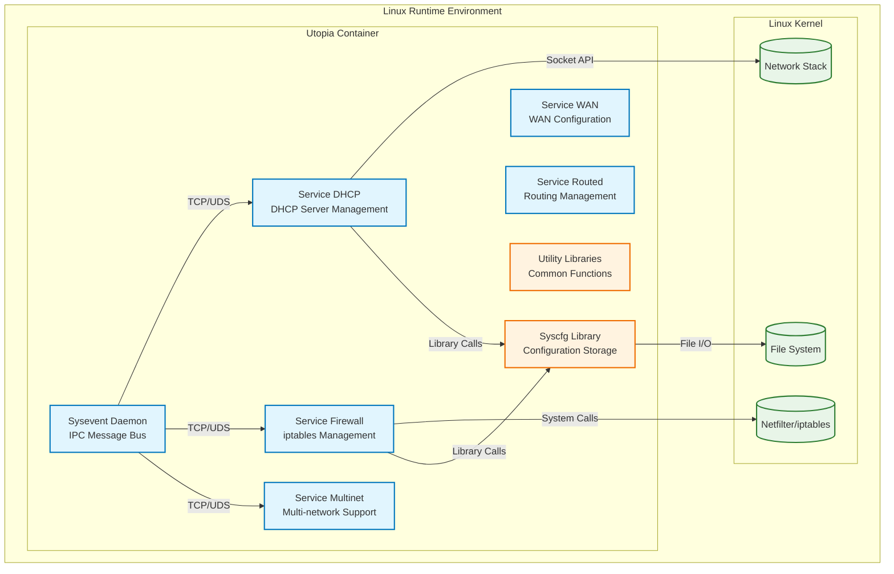
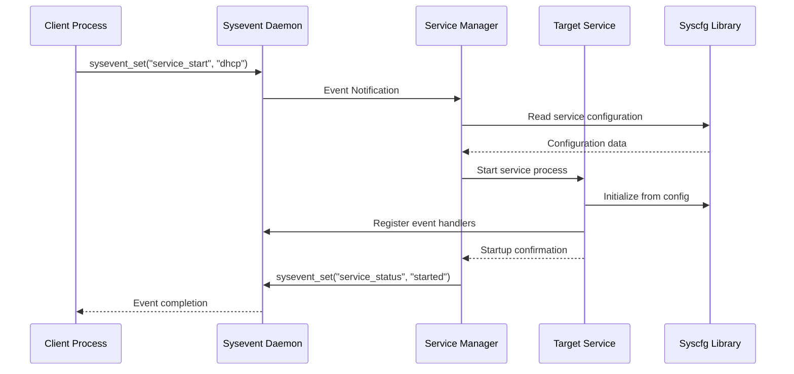
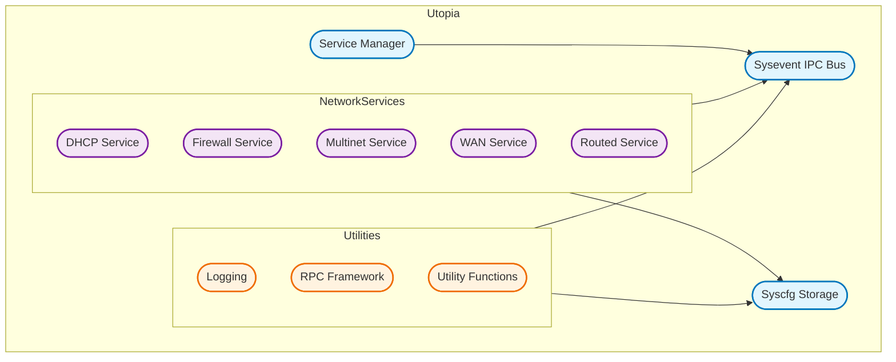
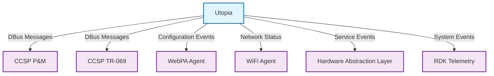
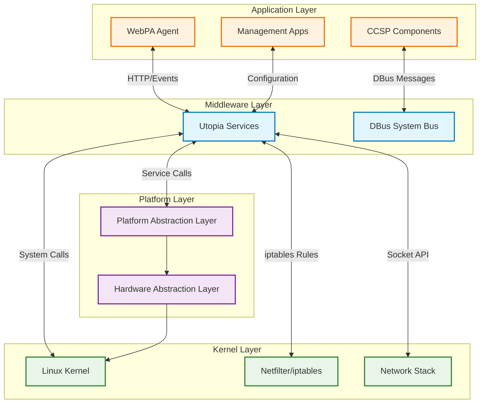
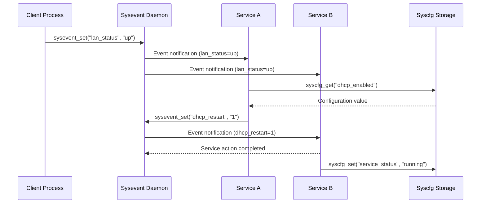

# Utopia Documentation

Utopia is a foundational middleware component in the RDK-B stack that provides essential network services and configuration management for broadband gateway devices. It serves as the core infrastructure layer that manages network services, firewall operations, system events, and device configuration through a unified framework. Utopia acts as the bridge between higher-level CCSP components and the underlying Linux system, providing standardized APIs and event-driven service management. The component integrates tightly with the RDK-B ecosystem by offering system configuration storage (syscfg), inter-process communication via system events (sysevent), and orchestrating various network services like DHCP, firewall, routing, and multi-network management.

**Key Features & Responsibilities**

- **System Configuration Management**: Provides persistent configuration storage and retrieval through the syscfg subsystem with key-value pair storage and transaction support
- **Event-Driven Service Orchestration**: Manages inter-process communication and service coordination through the sysevent messaging system with publish-subscribe patterns
- **Network Service Management**: Orchestrates core networking services including DHCP server/client, IPv4/IPv6 configuration, and multi-network interface management
- **Firewall and Security Services**: Implements comprehensive iptables-based firewall management with rule generation, port forwarding, and security policy enforcement
- **Service Lifecycle Management**: Provides unified service management with start/stop/restart capabilities, dependency tracking, and health monitoring
- **Platform Abstraction Layer**: Offers hardware abstraction through PAL (Platform Abstraction Layer) for device-specific implementations

## Design

Utopia follows a modular, event-driven architecture that emphasizes separation of concerns and service autonomy. The design is built around three core principles: configuration management through syscfg for persistent storage, event coordination through sysevent for inter-process communication, and service management for orchestrating network operations. The architecture promotes loose coupling between services through well-defined APIs and message passing, enabling independent service lifecycle management and fault isolation. Modularity is achieved through separate service executables that can be started, stopped, and restarted independently without affecting the entire system. Reliability is ensured through persistent configuration storage, service health monitoring, and automatic service recovery mechanisms. The design emphasizes maintainability through clear service boundaries, standardized configuration interfaces, and comprehensive logging throughout all subsystems.

Each service in utopia operates as an independent process that communicates through the sysevent bus, allowing for horizontal scaling and fault tolerance. Configuration data is centralized in syscfg but accessed through well-defined APIs that abstract storage implementation details. Security is integrated at multiple layers including firewall rule management, access control through service boundaries, and secure configuration handling.

A container diagram of the component is given below

**Request Flow Sequence**

When a service needs to be started, the request flows through sysevent messaging where the service manager receives the start event, validates dependencies through syscfg configuration, initializes the target service process, and updates service status through sysevent notifications.

**Threading Model**

The **Utopia** framework utilizes a multi-process architecture, with the following threading and concurrency model:

- **Independent Services**: Each service runs as a separate single-threaded process, enabling process isolation and fault containment
- **Sysevent Daemon**: Operates as an event-driven loop using `select()` or `poll()` to handle multiple client connections concurrently
- **Service Processes**: Typically single-threaded and event-driven, responding to `sysevent` notifications and dynamic configuration changes
- **On-Demand Worker Threads**: Spawned for specific tasks such as file I/O in `syscfg` or network operations within services; these threads are short-lived and used sparingly
- **Firewall Service**: May fork temporary worker processes to handle complex iptables rule generation for improved parallelism and reliability

**Thread Synchronization**: Generally unnecessary due to the isolated, single-threaded design of most processes. Concurrency is managed at the process level, ensuring robustness and responsiveness without shared-state complexity.

## Internal Modules

Utopia is organized into several key subsystems that provide different aspects of system and network management functionality. The sysevent subsystem handles all inter-process communication and event coordination. The syscfg subsystem manages persistent configuration storage and retrieval. Network services handle protocol-specific operations like DHCP, routing, and firewall management.

| Module/Class | Description | Key Files |
|-------------|------------|-----------|
| Sysevent | Inter-process communication bus for event messaging and service coordination | `source/sysevent/lib/libsysevent.c`, `source/sysevent/server/syseventd.c` |
| Syscfg | Persistent configuration management with key-value storage and transaction support | `source/syscfg/lib/syscfg.c`, `source/syscfg/cmd/syscfg_cmd.c` |
| Service DHCP | DHCP server and client management with lease tracking and configuration | `source/service_dhcp/service_dhcp.c`, `source/service_dhcp/dhcp_server_functions.c` |
| Service Firewall | iptables-based firewall management with rule generation and policy enforcement | `source/firewall/firewall.c`, `source/firewall/firewall_ext.c` |
| Service Multinet | Multi-network interface management for complex network topologies | `source/service_multinet/service_multinet_lib.c`, `source/service_multinet/service_multinet_handler.c` |
| Service Manager | Central service lifecycle management and dependency coordination | `source/services/lib/srvmgr.c` |
| Utility Libraries | Common functions for logging, RPC, and system utilities | `source/util/utils/util.c`, `source/ulog/ulog.c` |

## Interaction with Other Middleware Components

Utopia integrates extensively with other RDK-B components through well-defined interfaces and protocols. It provides foundational services that higher-level components depend on for network configuration and system event handling.

| Component | Purpose of Interaction | Protocols/Mechanisms |
|-----------|-----------------------|----------------------|
| CCSP P&M | Device configuration management and TR-181 parameter access | DBus method calls, sysevent notifications |
| CCSP TR-069 | Remote management and configuration synchronization | DBus messages, syscfg parameter updates |
| WebPA Agent | Real-time configuration updates and device management | HTTP notifications, sysevent triggers |
| WiFi Agent | Network interface coordination and wireless configuration | Sysevent messages, shared configuration |
| Hardware Abstraction Layer | Platform-specific network and system operations | Function calls, configuration files |
| RDK Telemetry | System health monitoring and performance metrics | Event notifications, log messages |

Utopia publishes several key events that other components can subscribe to for coordination and monitoring purposes:

| Event | Purpose of Event | Reason for trigger |
|-----------|-----------------------|----------------------|
| `service_start` | Service lifecycle management | Request to start a specific system service |
| `service_stop` | Service lifecycle management | Request to stop a running system service |
| `firewall-restart` | Firewall rule updates | Configuration changes requiring rule regeneration |
| `dhcp_client_restart` | DHCP client renewal | WAN configuration changes or lease expiration |
| `lan_status_change` | Network interface updates | LAN interface up/down state changes |
| `wan_status_change` | WAN connectivity updates | Internet connection status changes |
| `syscfg_commit` | Configuration persistence | Commit pending configuration changes to storage |

## Interaction with Other Layers

Utopia interfaces with multiple system layers to provide comprehensive network and system management functionality. It abstracts hardware-specific operations through the PAL layer while interfacing directly with Linux kernel services.

| Layer/Service | Interaction Description | Mechanism |
|---------------|-------------------------|----------|
| PAL (Platform Abstraction Layer) | Hardware-specific network and system operations | Function calls, shared libraries |
| Linux Kernel | Network stack operations, netfilter rules, file system access | System calls, proc/sys filesystem |
| DBus System | Inter-component communication with CCSP stack | DBus method calls, signal broadcasts |
| External Services | Integration with upstream providers and cloud services | HTTP/HTTPS, TCP/UDP sockets |

## IPC Mechanism

| Type of IPC | Message Format | Mechanism |
|---------------|-------------------------|----------|
| Sysevent Messaging | Text-based key-value pairs with event names and data payloads. Format: "event_name key=value key2=value2" | TCP sockets on localhost:18667 or Unix domain sockets for local communication |
| DBus Integration | DBus XML introspection format with method calls, properties, and signals for CCSP integration | Standard DBus system bus with registered service names and object paths |
| Syscfg Storage | Key-value pairs stored in binary format with transaction logs and atomic updates | Direct file I/O with locking mechanisms and backup/recovery support |

## Implementation Details

- **Key Algorithms or Logic**: The sysevent system uses a publish-subscribe pattern with event registration and notification queues implemented in `source/sysevent/lib/libsysevent.c`. The firewall service employs rule generation algorithms that parse configuration data and generate iptables commands in `source/firewall/firewall.c`. Service dependency management uses a state machine approach in `source/services/lib/srvmgr.c` for orchestrating service startup sequences.
- **Error Handling Strategy**: Errors are detected through return code checking, logged via the ulog subsystem, and propagated through sysevent error notifications. Critical errors trigger service restart mechanisms while configuration errors are logged and reported to management interfaces.
- **Logging & Debugging**: The ulog subsystem provides categorized logging with levels (ERROR, WARN, INFO, DEBUG) and module-specific tags. Debug information is available through runtime flags and can be enabled per service or globally through syscfg configuration.

## Key Configuration Files

| Configuration File | Purpose | Key Parameters | Default Values | Override Mechanisms |
|--------------------|---------|---------------|----------------|--------------------|
| `/etc/utopia/system_defaults` | System default configuration parameters | `device_mode`, `lan_ifname`, `wan_proto` | `router`, `brlan0`, `dhcp` | Environment variables, command line |
| `/etc/syscfg.db` | Persistent configuration storage | `dhcp_start`, `dhcp_num`, `firewall_enabled` | `100`, `50`, `1` | Syscfg API, web interface |
| `/var/lib/utopia/service.conf` | Service configuration and state | Service definitions, dependencies, startup order | Service-specific | Sysevent messages |
| `/etc/utopia/registration.d/` | Service registration scripts | Service handlers, event mappings | Per-service scripts | Manual script updates |