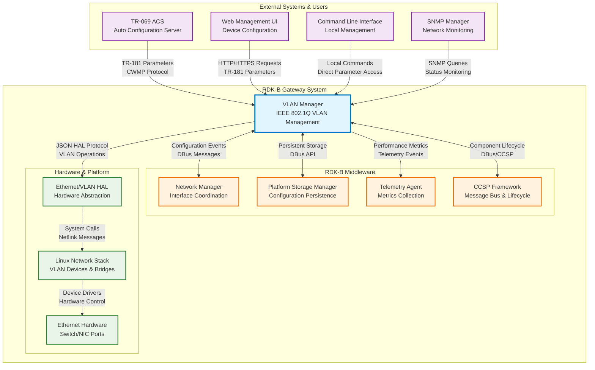
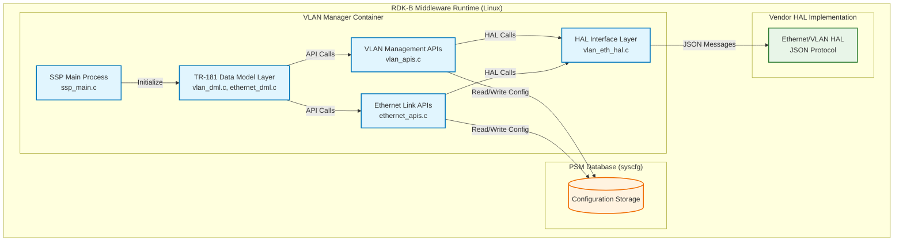
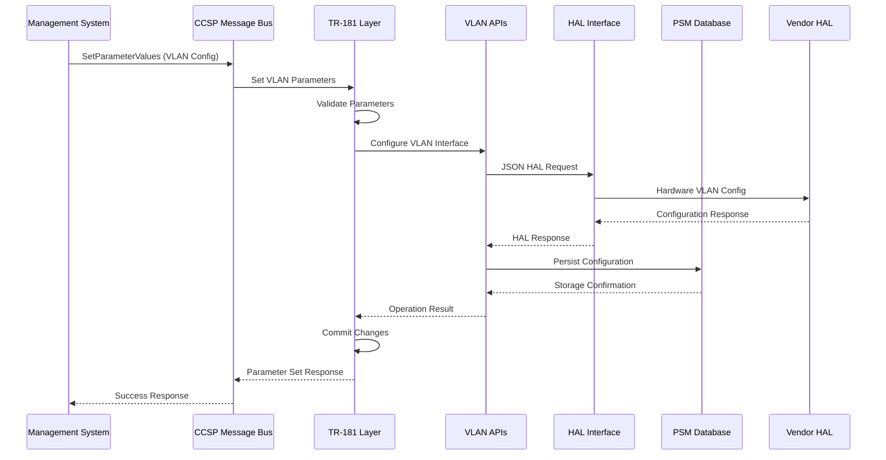
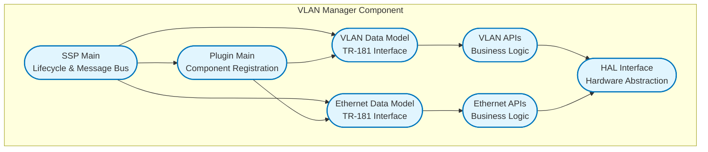
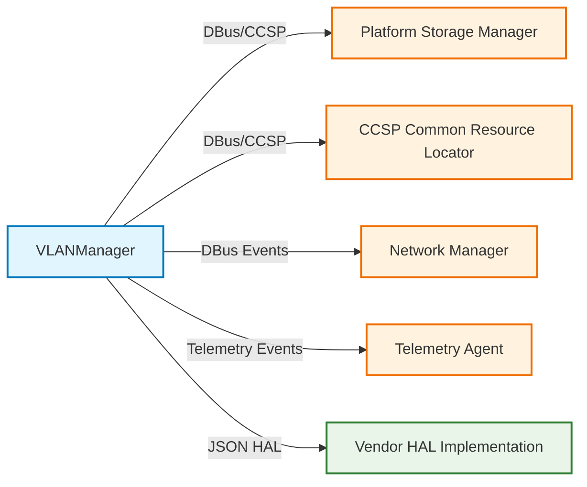
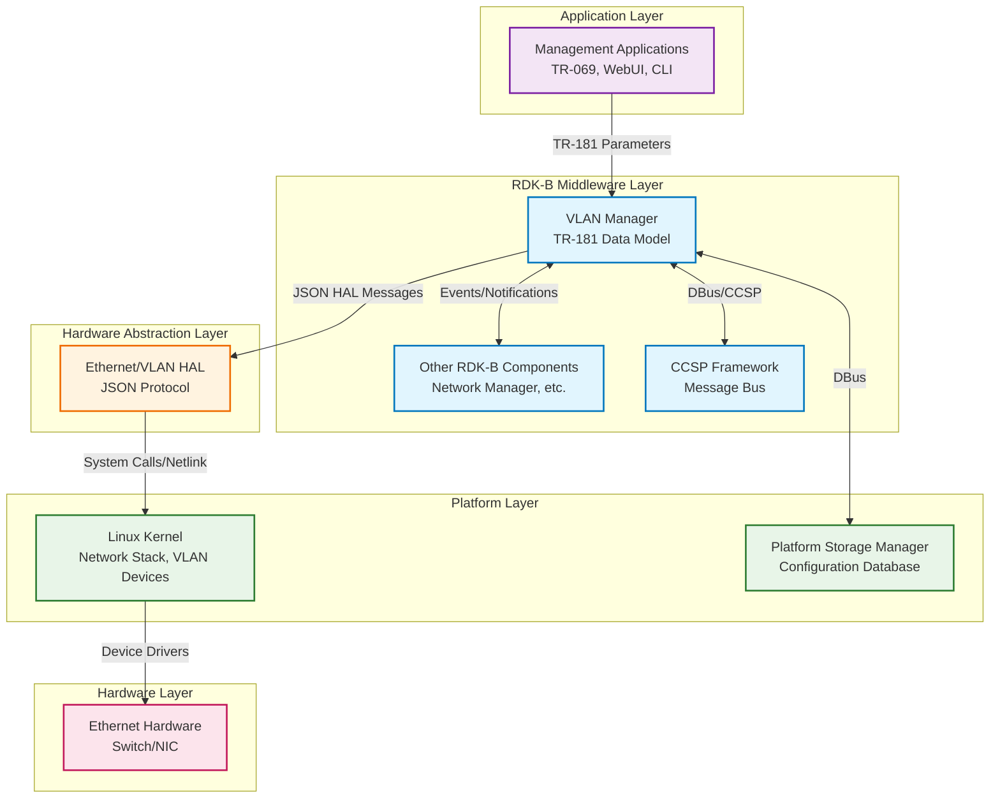
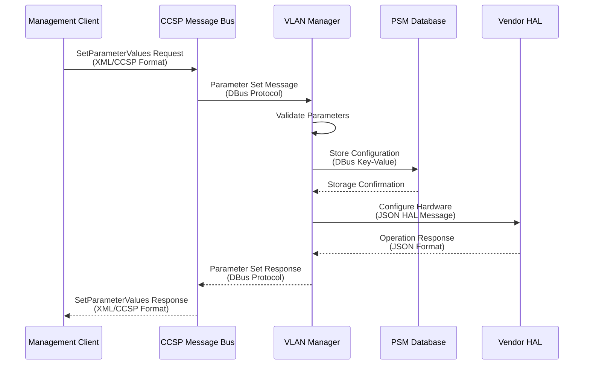

# VLAN Manager Documentation

The VLAN Manager is the RDK-B component responsible for managing VLAN termination and Ethernet link configuration. It provides comprehensive VLAN bridging capabilities, enabling network segmentation and traffic isolation through IEEE 802.1Q VLAN tagging. The component serves as the central management point for all VLAN-related operations, including VLAN interface creation, configuration, and monitoring. It integrates seamlessly with the RDK-B TR-181 data model to expose VLAN parameters for external management and configuration. The VLAN Manager abstracts underlying hardware-specific VLAN implementations through a standardized HAL interface, ensuring portability across different hardware platforms.

**Key Features & Responsibilities**

- **VLAN Termination Management**: Creates, configures, and manages VLAN interfaces with IEEE 802.1Q tagging support, including VLAN ID assignment and TPID configuration
- **Ethernet Link Configuration**: Manages Ethernet link properties including enable/disable states, MAC address configuration, priority tagging, and lower layer associations
- **TR-181 Data Model Integration**: Implements X_RDK_Ethernet.Link and X_RDK_Ethernet.VLANTermination objects providing standardized parameter access for external management systems
- **HAL Abstraction**: Provides hardware-independent VLAN operations through JSON-based HAL communication protocol with vendor-specific implementations
- **PSM Database Integration**: Maintains persistent storage of VLAN configurations using Platform Storage Manager (PSM) for configuration persistence across reboots
- **Telemetry and Monitoring**: Generates telemetry events for VLAN interface lifecycle operations and provides real-time status monitoring capabilities

## Design

The VLAN Manager follows a layered architecture approach with clear separation between the TR-181 data model interface, business logic, and hardware abstraction layers. The design emphasizes modularity by separating Ethernet link management from VLAN termination logic, allowing independent operation and configuration of each component. Scalability is achieved through dynamic table management supporting up to 128 VLAN interfaces and Ethernet links per the TR-181 specification. The component ensures reliability through atomic parameter operations following TR-69 specifications, where all parameter changes are validated before commitment. Security is maintained through controlled access to VLAN operations via the CCSP message bus, ensuring only authorized components can modify network configurations. Maintainability is supported through clear API boundaries, comprehensive logging, and standardized HAL interfaces that facilitate hardware vendor integration.

The design establishes clear boundaries between the VLAN Manager and other RDK-B components through well-defined interfaces. The TR-181 interface boundary handles all external parameter access and management operations. The HAL boundary provides hardware abstraction for VLAN and Ethernet operations. The PSM boundary manages persistent configuration storage and retrieval. Each boundary has specific responsibilities: the TR-181 boundary validates parameters and maintains data model consistency, the HAL boundary translates generic operations to hardware-specific commands, and the PSM boundary ensures configuration persistence and backup/restore capabilities.

A container diagram of the component is given below

**Request Flow Sequence**

The most critical flow involves VLAN interface creation and configuration. External management systems send TR-181 parameter set requests through the CCSP message bus to the VLAN Manager. The TR-181 layer validates parameters and calls the appropriate VLAN APIs. The VLAN APIs interact with the HAL interface to configure hardware-specific VLAN settings. Configuration changes are persisted to PSM database. Status updates and telemetry events are generated to inform other components of the changes.

**Threading Model**

The **VLAN Manager** uses a single-threaded model with the following thread allocation:

* **Main Thread**: Handles all TR-181 parameter operations, HAL communications, and PSM database interactions sequentially
* **Inter-Component Communication**: Utilizes the CCSP message bus for asynchronous messaging with other RDK-B components, while maintaining all internal processing within the main thread
* **Thread Synchronization**: Not required due to the single-threaded design, which ensures atomicity and consistency during VLAN configuration changes

## Internal Modules

The VLAN Manager is organized into distinct modules, each handling specific aspects of VLAN and Ethernet management. The SSP (Service Support Platform) module manages component lifecycle and message bus integration. The TR-181 modules implement the standardized data model interfaces for external access. The API modules contain the core business logic for VLAN and Ethernet operations. The HAL interface module provides hardware abstraction capabilities.

| Module/Class | Description | Key Files |
|-------------|------------|-----------|
| SSP Main | Component initialization, message bus integration, and lifecycle management | `ssp_main.c`, `ssp_global.h`, `ssp_messagebus_interface.c` |
| VLAN Data Model | TR-181 VLANTermination object implementation with parameter validation and commit/rollback | `vlan_dml.c`, `vlan_dml.h` |
| Ethernet Data Model | TR-181 Ethernet Link object implementation with link management and marking support | `ethernet_dml.c`, `ethernet_dml.h` |
| VLAN APIs | Core VLAN management logic, interface creation/deletion, and configuration persistence | `vlan_apis.c`, `vlan_apis.h`, `vlan_internal.c` |
| Ethernet APIs | Ethernet link management, MAC address handling, and priority tagging operations | `ethernet_apis.c`, `ethernet_apis.h`, `ethernet_internal.c` |
| HAL Interface | Hardware abstraction layer for VLAN and Ethernet operations using JSON protocol | `vlan_eth_hal.c`, `vlan_eth_hal.h` |
| Plugin Main | Component registration and plugin initialization for TR-181 integration | `plugin_main.c`, `plugin_main_apis.c` |

## Interaction with Other Middleware Components

The VLAN Manager interacts with several RDK-B middleware components to provide comprehensive VLAN management capabilities. It communicates with the Platform Storage Manager (PSM) for configuration persistence, the CCSP Common Resource Locator (CRL) for component discovery, and various network management components for coordinated network operations.

| Component | Purpose of Interaction | Protocols/Mechanisms |
|-----------|-----------------------|----------------------|
| Platform Storage Manager (PSM) | Persistent storage of VLAN configurations, backup and restore operations | DBus/CCSP message bus |
| CCSP Common Resource Locator (CRL) | Component discovery and registration within the CCSP framework | DBus/CCSP message bus |
| Network Manager | Coordination of network interface operations and status updates | DBus events and notifications |
| Telemetry Agent | Collection of VLAN operation metrics and performance data | Telemetry event publishing |
| Vendor HAL Implementation | Hardware-specific VLAN and Ethernet operations | JSON-based HAL protocol |

The VLAN Manager publishes several events to notify other components of significant VLAN operations and state changes. These events enable coordinated network management and monitoring across the RDK-B stack.

| Event | Purpose of Event | Reason for trigger |
|-----------|-----------------------|----------------------|
| RDKB_VLAN_CREATE | VLAN interface creation notification | Triggered when a new VLAN interface is successfully created and configured |
| RDKB_VLAN_DELETE | VLAN interface deletion notification | Triggered when a VLAN interface is removed from the system |
| VLAN_STATUS_CHANGE | VLAN interface status update | Triggered when VLAN interface status changes (Up/Down/Error states) |
| ETHERNET_LINK_STATE | Ethernet link state change notification | Triggered when underlying Ethernet link status changes affecting VLAN operations |

## Interaction with Other Layers

The VLAN Manager operates within a layered architecture, interacting with multiple system layers to provide comprehensive VLAN management capabilities. It abstracts hardware-specific operations through the HAL layer while integrating with platform services for persistence and system-level operations.

| Layer/Service | Interaction Description | Mechanism |
|---------------|-------------------------|----------|
| HAL (Hardware Abstraction Layer) | Hardware-specific VLAN and Ethernet operations including interface creation, VLAN tagging, and status monitoring | JSON-based message protocol over sockets |
| Platform Layer (Linux Kernel) | Network interface management, VLAN device creation, and system-level network operations | System calls and netlink sockets via HAL |
| Storage Layer (PSM/syscfg) | Persistent configuration storage, backup/restore operations, and default value management | DBus API calls to PSM daemon |
| CCSP Framework | Component lifecycle management, message bus communication, and inter-component coordination | DBus/CCSP message bus protocol |

## IPC Mechanism

| Type of IPC | Message Format | Mechanism |
|---------------|-------------------------|----------|
| DBus/CCSP Message Bus | XML-encoded messages with parameter names, values, and types following CCSP protocol specification | DBus API calls for inter-component communication within RDK-B middleware |
| JSON HAL Protocol | JSON-formatted messages containing action types, parameters, and responses defined by HAL schema | TCP sockets or Unix domain sockets for HAL communication with vendor implementations |
| PSM Database Access | Key-value pairs with hierarchical naming convention (dmsb.vlanmanager.*) for configuration parameters | DBus API calls to PSM daemon for persistent storage operations |

## TR‑181 Data Models

- **Implemented Parameters**: The VLAN Manager implements the X_RDK_Ethernet object tree including Link and VLANTermination sub-objects. The Link object manages Ethernet interface properties while VLANTermination handles VLAN-specific configurations. Parameters include interface enable/disable states, VLAN ID assignment, TPID configuration, MAC address settings, and priority tagging options.

- **Parameter Registration**: Parameters are registered through the CCSP framework using TR-181 XML definitions. The component registers with the CCSP Common Resource Locator (CRL) and exposes parameters via DBus interface. Parameter access is controlled through the CCSP message bus with appropriate access permissions.

- **Custom Extensions**: X_RDK_BaseInterface parameter provides hardware-specific interface mapping for vendor implementations. X_RDK_Marking object enables traffic marking and quality of service configurations. X_RDK_Refresh parameter triggers interface state synchronization with underlying hardware.

| Parameter | Description | Access (R/W) | Default | Notes |
|-----------|-------------|-------------|---------|-------|
| `Device.X_RDK_Ethernet.Link.{i}.Enable` | Enable/disable Ethernet link interface | R/W | `false` | Controls interface operational state |
| `Device.X_RDK_Ethernet.Link.{i}.Status` | Current operational status of the link | R | `Down` | Up/Down/Unknown/Dormant/NotPresent/LowerLayerDown/Error |
| `Device.X_RDK_Ethernet.Link.{i}.Alias` | User-friendly name for the interface | R/W | `""` | Maximum 64 characters |
| `Device.X_RDK_Ethernet.Link.{i}.Name` | System name of the interface | R/W | `""` | Maximum 64 characters |
| `Device.X_RDK_Ethernet.Link.{i}.LowerLayers` | Lower layer interface references | R/W | `""` | Comma-separated list of interface paths |
| `Device.X_RDK_Ethernet.Link.{i}.MACAddress` | MAC address of the interface | R | `""` | Read-only hardware address |
| `Device.X_RDK_Ethernet.Link.{i}.MACAddrOffSet` | MAC address offset for multi-instance | R | `0` | Offset value for MAC address calculation |
| `Device.X_RDK_Ethernet.Link.{i}.PriorityTagging` | Enable IEEE 802.1p priority tagging | R/W | `false` | VLAN priority tagging support |
| `Device.X_RDK_Ethernet.Link.{i}.X_RDK_BaseInterface` | Hardware base interface name | R/W | `""` | Vendor-specific interface mapping |
| `Device.X_RDK_Ethernet.Link.{i}.X_RDK_Refresh` | Trigger interface state refresh | R/W | `false` | Write `true` to refresh interface state |
| `Device.X_RDK_Ethernet.VLANTermination.{i}.Enable` | Enable/disable VLAN termination | R/W | `false` | Controls VLAN interface operational state |
| `Device.X_RDK_Ethernet.VLANTermination.{i}.Status` | Current VLAN interface status | R | `Down` | Up/Down/Unknown/Dormant/NotPresent/LowerLayerDown/Error |
| `Device.X_RDK_Ethernet.VLANTermination.{i}.Alias` | User-friendly name for VLAN interface | R/W | `""` | Maximum 64 characters |
| `Device.X_RDK_Ethernet.VLANTermination.{i}.Name` | System name of VLAN interface | R/W | `""` | Maximum 64 characters |
| `Device.X_RDK_Ethernet.VLANTermination.{i}.LastChange` | Time of last status change | R | `0` | Seconds since last change |
| `Device.X_RDK_Ethernet.VLANTermination.{i}.LowerLayers` | Lower layer interface references | R/W | `""` | Parent interface for VLAN termination |
| `Device.X_RDK_Ethernet.VLANTermination.{i}.VLANID` | IEEE 802.1Q VLAN identifier | R/W | `0` | VLAN ID (1-4094) |
| `Device.X_RDK_Ethernet.VLANTermination.{i}.TPID` | Tag Protocol Identifier | R/W | `0x8100` | Ethernet type for VLAN tagging |
| `Device.X_RDK_Ethernet.VLANTermination.{i}.X_RDK_BaseInterface` | Hardware base interface for VLAN | R/W | `""` | Vendor-specific base interface |
| `Device.X_RDK_Ethernet.Link.{i}.X_RDK_Marking.{j}.SKBPort` | Socket buffer port identifier | R | `0` | Network stack port mapping |
| `Device.X_RDK_Ethernet.Link.{i}.X_RDK_Marking.{j}.EthernetPriorityMark` | IEEE 802.1p priority value | R/W | `0` | Priority marking (0-7) |

| Parameter | Description | Access | Default | Notes |
|-----------|-------------|--------|---------|-------|
| `Device.X_RDK_Ethernet.Link.{i}.Enable` | Enable/disable Ethernet link interface | R/W | `false` | Controls interface operational state |
| `Device.X_RDK_Ethernet.Link.{i}.Status` | Current operational status of the link | R | `Down` | Up/Down/Unknown/Dormant/NotPresent/LowerLayerDown/Error |
| `Device.X_RDK_Ethernet.Link.{i}.Alias` | User-friendly name for the interface | R/W | `""` | Max 64 chars |
| `Device.X_RDK_Ethernet.Link.{i}.Name` | System name of the interface | R/W | `""` | Max 64 chars |
| `Device.X_RDK_Ethernet.Link.{i}.LowerLayers` | Lower layer interface references | R/W | `""` | Comma-separated list |
| `Device.X_RDK_Ethernet.Link.{i}.MACAddress` | MAC address of the interface | R | `""` | Read-only |
| `Device.X_RDK_Ethernet.Link.{i}.MACAddrOffSet` | MAC address offset for multi-instance | R | `0` | Offset for MAC calc |
| `Device.X_RDK_Ethernet.Link.{i}.PriorityTagging` | Enable IEEE 802.1p priority tagging | R/W | `false` | VLAN priority tagging |
| `Device.X_RDK_Ethernet.Link.{i}.X_RDK_BaseInterface` | Hardware base interface name | R/W | `""` | Vendor-specific |
| `Device.X_RDK_Ethernet.Link.{i}.X_RDK_Refresh` | Trigger interface state refresh | R/W | `false` | Write `true` to refresh |
| `Device.X_RDK_Ethernet.VLANTermination.{i}.Enable` | Enable/disable VLAN termination | R/W | `false` | Controls VLAN state |
| `Device.X_RDK_Ethernet.VLANTermination.{i}.Status` | Current VLAN interface status | R | `Down` | Up/Down/Unknown/... |
| `Device.X_RDK_Ethernet.VLANTermination.{i}.Alias` | User-friendly VLAN name | R/W | `""` | Max 64 chars |
| `Device.X_RDK_Ethernet.VLANTermination.{i}.Name` | System VLAN name | R/W | `""` | Max 64 chars |
| `Device.X_RDK_Ethernet.VLANTermination.{i}.LastChange` | Time of last status change | R | `0` | Seconds since change |
| `Device.X_RDK_Ethernet.VLANTermination.{i}.LowerLayers` | Parent interface reference | R/W | `""` | Interface for VLAN termination |
| `Device.X_RDK_Ethernet.VLANTermination.{i}.VLANID` | VLAN identifier | R/W | `0` | Range: 1–4094 |
| `Device.X_RDK_Ethernet.VLANTermination.{i}.TPID` | Tag Protocol Identifier | R/W | `0x8100` | VLAN tagging type |
| `Device.X_RDK_Ethernet.VLANTermination.{i}.X_RDK_BaseInterface` | VLAN base interface | R/W | `""` | Vendor-specific |
| `Device.X_RDK_Ethernet.Link.{i}.X_RDK_Marking.{j}.SKBPort` | Socket buffer port identifier | R | `0` | Stack port mapping |
| `Device.X_RDK_Ethernet.Link.{i}.X_RDK_Marking.{j}.EthernetPriorityMark` | IEEE 802.1p priority value | R/W | `0` | Range: 0–7 |

## Implementation Details

- **Key Algorithms or Logic**: The core VLAN management logic implements IEEE 802.1Q VLAN tagging with support for configurable TPID values and VLAN ID ranges (1-4094). The component uses atomic parameter operations following TR-69 specifications with validate-commit-rollback patterns implemented in `vlan_dml.c` and `ethernet_dml.c`. State machine logic manages interface lifecycle transitions between Up/Down/Error states with proper dependency handling for lower layer interfaces. The HAL communication protocol implements JSON-based message exchange with retry mechanisms and error handling located in `vlan_eth_hal.c`.

- **Error Handling Strategy**: Errors are categorized into validation errors (parameter range/format issues), HAL operation errors (hardware communication failures), and system errors (resource allocation failures). All errors are logged with appropriate severity levels using CcspTraceError/CcspTraceWarning macros. Parameter validation errors return CCSP fault codes to management clients. HAL errors trigger retry mechanisms with exponential backoff. Critical errors are reported through telemetry events for monitoring and diagnostics.

- **Logging & Debugging**: The component uses CCSP logging framework with configurable verbosity levels controlled via `/etc/debug.ini`. Log categories include VLAN operations (VLAN_CREATE/DELETE), parameter operations (PARAM_SET/GET), HAL communication (HAL_REQUEST/RESPONSE), and error conditions (ERROR/WARNING). Debug mode enables detailed parameter validation traces and HAL message logging. Telemetry markers provide operational metrics for VLAN interface lifecycle events.

## Key Configuration Files

The VLAN Manager uses several configuration files to control its operation and define system-specific parameters. These files provide default values, HAL schema definitions, and runtime configuration options.

| Configuration File | Purpose | Key Parameters | Default Values | Override Mechanisms |
|--------------------|---------|---------------|----------------|--------------------|
| `vlan_manager_conf.json` | Main runtime configuration | `hal_schema_path`, `server_port` | `/etc/rdk/schemas/ethlinkvlanterm_hal_schema.json`, `4096` | Environment variables, command line arguments |
| `RdkVlanManager.xml` | TR-181 data model definitions | Object definitions, parameter types, function mappings | N/A | Not user-configurable, defines data model structure |
| `ethlinkvlanterm_hal_schema.json` | HAL protocol schema definitions | JSON message formats, parameter validation rules | Schema version `0.0.1` | HAL vendor implementations must comply with schema |
| `/etc/debug.ini` | Debug and logging configuration | Log levels, trace categories | Standard CCSP logging defaults | Runtime modification supported |
| PSM Database Keys | Persistent parameter storage | `dmsb.vlanmanager.*` hierarchy | Component-specific defaults | TR-181 parameter operations, factory reset |