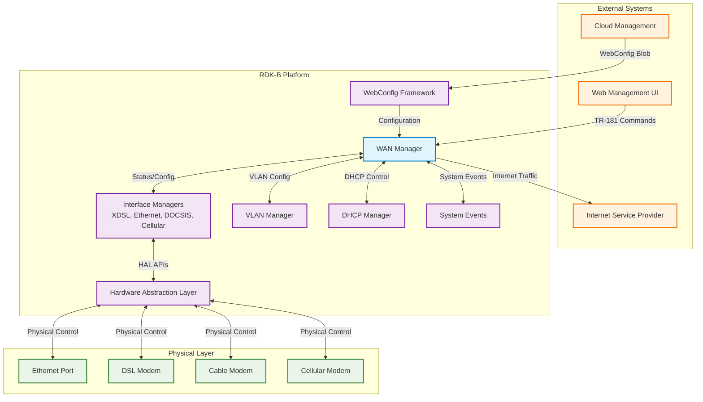
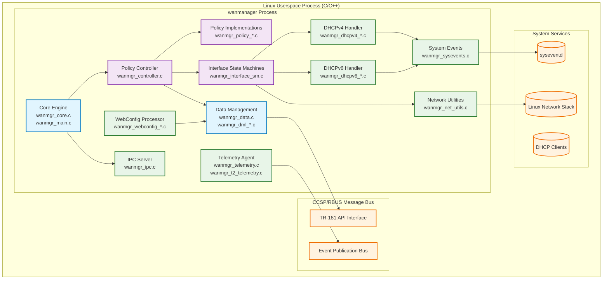
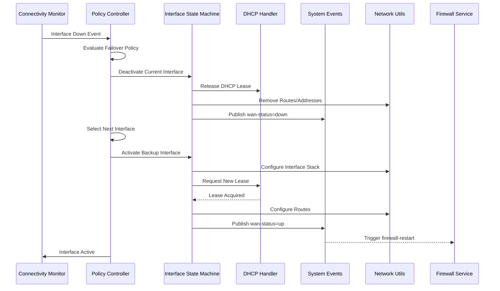
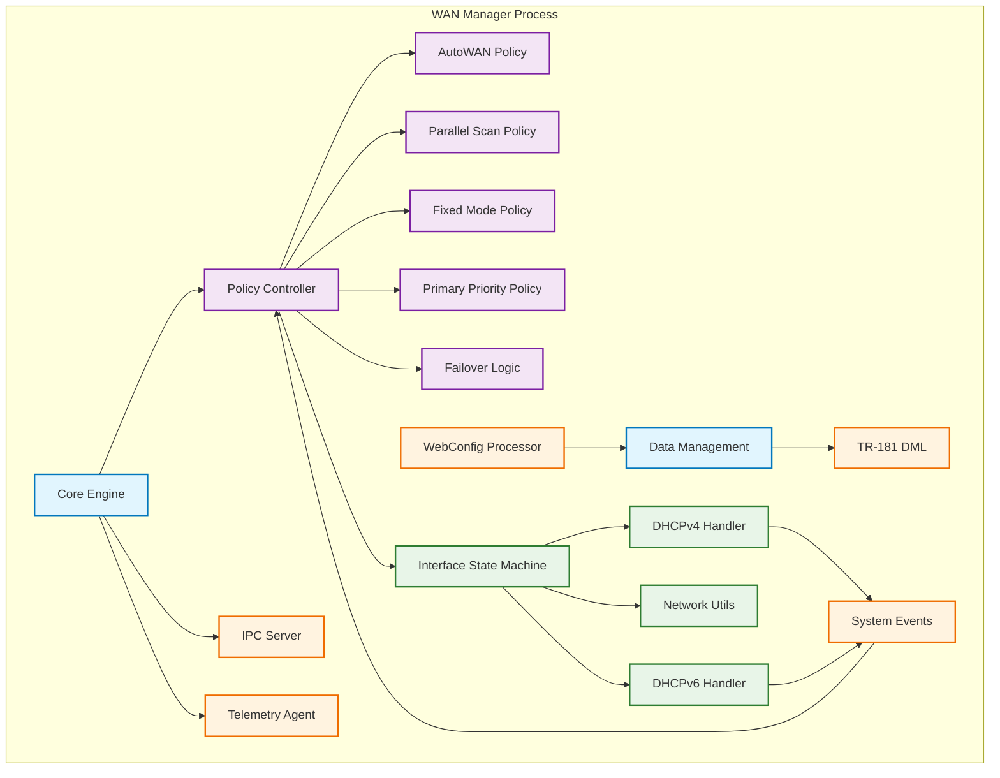
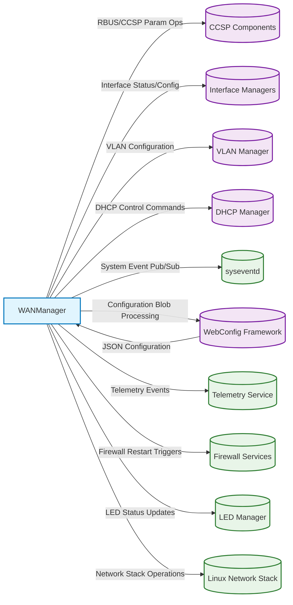
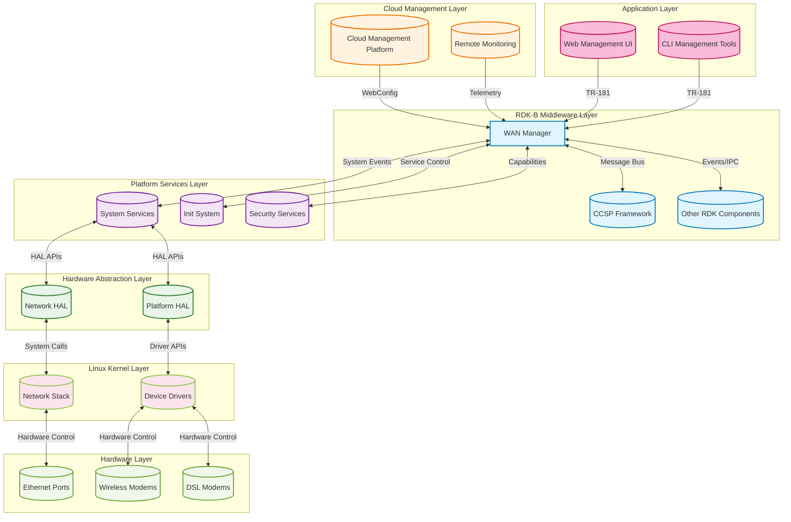
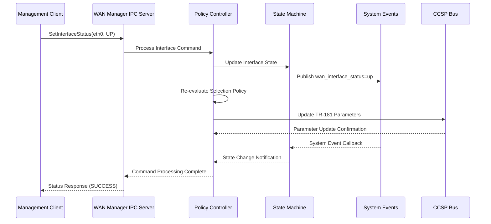

# WAN Manager Documentation

WAN Manager is the centralized orchestrator for WAN interface selection, configuration, and failover management within the RDK-B stack. It abstracts multiple physical WAN interfaces (Ethernet, DSL, DOCSIS, Cellular, GPON) into a unified policy-driven framework while handling link-layer and IP-layer configuration through integration with other RDK components. The component implements intelligent failover policies, manages DHCP/PPP sessions, exposes TR-181 data models, and provides runtime configuration via RBUS. WAN Manager sits between Interface Managers (which handle physical layer) and system services, coordinating interface selection based on availability, priority, and connectivity validation. It ensures seamless Internet connectivity by automatically switching between available WAN interfaces according to configured policies and monitoring interface health.

**Key Features & Responsibilities**

  - **Centralized WAN Orchestration**: Manages multiple physical WAN interfaces through a unified policy engine that handles interface selection, failover, and configuration coordination with other RDK-B components.
  - **Policy-Driven Interface Selection**: Implements multiple selection policies (AutoWAN, Parallel Scan, Fixed Mode, Primary Priority) with configurable failover logic and group-based interface management.
  - **Multi-Interface Failover Management**: Provides automatic failover between interface groups with configurable restoration delays, health monitoring, and seamless connectivity transitions.
  - **TR-181 Data Model Implementation**: Exposes comprehensive WAN configuration and status through X_RDK_WanManager TR-181 objects including interface tables, PHY status, IP configuration, and PPP parameters.
  - **DHCP/PPP Lifecycle Management**: Coordinates DHCPv4/v6 client operations, PPP session management, and IP address assignment while updating system events and TR-181 status parameters.
  - **System Integration & Event Management**: Publishes system events for WAN status, coordinates with firewall/routing services, manages LED indicators, and integrates with telemetry systems.
  - **Virtual Interface Management**: Supports complex interface stacks with VLAN tagging, marking tables for QoS, and virtual interface state machines for proper bring-up sequencing.

## Design

WAN Manager follows a modular architecture with clear separation between policy logic, interface state management, data modeling, and system integration. The design emphasizes configurability through multiple selection policies that can be applied to interface groups, enabling flexible deployment scenarios from simple failover to complex multi-WAN configurations. Modularity is achieved through distinct controllers for failover policy, selection policies per group, and interface state machines per virtual interface, allowing independent scaling and customization. Scalability is supported through dynamic interface tables, group-based policy management, and support for up to 32 WAN interfaces with unlimited virtual interfaces per base interface. Reliability is ensured through proper initialization sequencing, rollback mechanisms for configuration changes, health monitoring with DNS connectivity checks, and graceful error handling with comprehensive logging. Security is maintained through capability dropping after initialization, input validation for all TR-181 parameters, and secure IPC mechanisms. Maintainability is achieved through consistent APIs, comprehensive debugging support, and clear module boundaries with well-defined interfaces.

The design supports multiple concurrent policies operating on different interface groups, enabling scenarios like AutoWAN selection between primary interfaces (DOCSIS/Ethernet) while maintaining cellular backup in a separate group. Each interface group can have its own selection policy, timeout configuration, and priority settings, providing maximum flexibility for diverse deployment requirements.

Clear boundaries exist between the core policy engine (handles high-level decisions), interface state machines (manage individual interface lifecycle), data layer (maintains configuration and runtime state), and integration layer (handles external communications with other RDK components and system services).

Responsibilities are distributed with the data layer handling persistent storage and TR-181 mapping, policy controllers managing interface selection and failover decisions, state machines coordinating interface bring-up/tear-down sequences, and integration modules providing system event publishing and external component communication.

A container diagram of the component is given below

**Request Flow Sequence**

The most critical flow is interface failover triggered by connectivity loss, involving policy re-evaluation, state machine transitions, and system reconfiguration. This sequence demonstrates the coordination between policy engine, state machines, and system integration components.

**Threading Model**

WAN Manager operates primarily as a single-threaded daemon with event-driven architecture. The main thread runs the core policy loop via `WanMgr_Core_Start()` which continuously evaluates interface states and policy decisions. Additional concurrency comes from:

- **Asynchronous Event Handlers**: CCSP/RBUS message bus callbacks execute in separate contexts for TR-181 parameter operations and event subscriptions
- **System Event Callbacks**: syseventd notifications arrive asynchronously for interface state changes, DHCP events, and system status updates  
- **Signal Handlers**: Registered for graceful shutdown (SIGTERM, SIGINT) and diagnostic functions (SIGUSR1/2) that execute in signal context
- **DHCP Client Integration**: External DHCP client processes communicate via system events and file-based IPC, handled asynchronously
- **Capability Management**: Early initialization includes capability dropping and privilege reduction before entering the main event loop

The threading model avoids explicit thread pools, instead relying on the message bus framework and system event infrastructure to provide necessary concurrency for handling multiple interface operations and external communications simultaneously.

## Internal Modules

The WAN Manager comprises several specialized modules that work together to provide comprehensive WAN interface management. The Core Engine initializes the system and runs the main control loop, while Policy Controllers implement different selection strategies. Interface State Machines handle the lifecycle of individual interfaces, and various handlers manage DHCP, system integration, and external communications.

| Module/Class | Description | Key Files |
|-------------|------------|-----------|
| Core Engine | Main initialization, control loop, and module coordination | `wanmgr_main.c`, `wanmgr_core.c` |
| Policy Controller | Manages interface selection policies and failover decisions | `wanmgr_controller.c`, `wanmgr_controller.h` |
| AutoWAN Policy | Implements sequential interface testing with connectivity validation | `wanmgr_policy_autowan_impl.c`, `wanmgr_policy_auto_impl.c` |
| Parallel Scan Policy | Attempts multiple interfaces simultaneously for fastest connection | `wanmgr_policy_parallel_scan_impl.c` |
| Fixed Mode Policies | Provides static interface selection with optional failover | `wanmgr_policy_fm_impl.c`, `wanmgr_policy_fmob_impl.c` |
| Primary Priority Policies | Priority-based selection with primary/secondary hierarchy | `wanmgr_policy_pp_impl.c`, `wanmgr_policy_ppob_impl.c` |
| Data Management Layer | Handles interface data structures, locking, and persistence | `wanmgr_data.c`, `wanmgr_data.h` |
| Interface State Machine | Manages interface lifecycle, link state, and protocol stack | `wanmgr_interface_sm.c`, `wanmgr_interface_sm.h` |
| DHCPv4 Management | Handles DHCPv4 client operations, lease management, and events | `wanmgr_dhcpv4_apis.c`, `wanmgr_dhcpv4_internal.c` |
| DHCPv6 Management | Manages DHCPv6 client operations, prefix delegation, and IPv6 setup | `wanmgr_dhcpv6_apis.c`, `wanmgr_dhcpv6_internal.c` |
| WebConfig Integration | Processes configuration blobs and manages runtime updates | `wanmgr_webconfig_apis.c`, `wanmgr_webconfig.c` |
| System Events Manager | Publishes and subscribes to system-wide event notifications | `wanmgr_sysevents.c`, `wanmgr_sysevents.h` |
| IPC Server | Handles inter-process communication for management commands | `wanmgr_ipc.c`, `wanmgr_ipc.h` |
| TR-181 DML Layer | Implements TR-181 data model APIs and parameter validation | `TR-181/middle_layer_src/wanmgr_dml_*.c` |
| Network Utilities | Provides network configuration helpers and system integration | `wanmgr_net_utils.c`, `wanmgr_utils.c` |
| Telemetry Integration | Manages telemetry data collection and reporting | `wanmgr_telemetry.c`, `wanmgr_t2_telemetry.c` |
| Failover Orchestration | Coordinates complex failover scenarios and restoration logic | `wanmgr_wan_failover.c`, `wanmgr_wan_failover.h` |

## Interaction with Other Middleware Components

WAN Manager integrates extensively with the RDK-B middleware ecosystem through various protocols and mechanisms. It coordinates with Interface Managers for physical layer status, communicates with VLAN and DHCP managers for network stack configuration, and integrates with system services for event publication and telemetry reporting.

| Component | Purpose of Interaction | Protocols/Mechanisms |
|-----------|-----------------------|----------------------|
| Interface Managers (XDSL, Ethernet, DOCSIS, Cellular) | Physical layer status reporting and configuration | RBUS events and parameter operations |
| CCSP/TR-181 Framework | Data model parameter get/set operations and validation | CCSP Message Bus with DML APIs |
| VLAN Manager | VLAN interface creation and configuration for tagged traffic | System calls and configuration APIs |
| DHCP Manager | DHCP server configuration and lease management coordination | System events and configuration files |
| WebConfig Framework | Dynamic configuration updates via cloud management | JSON blob processing with callback APIs |
| syseventd | System-wide event publication and subscription | sysevent API with key-value notifications |
| Telemetry Service | Operational metrics and performance data reporting | Telemetry 2.0 bus with structured events |
| Firewall Services | Network security rule updates on interface changes | System event triggers for service restart |
| LED Manager | Hardware status indication for user feedback | System events for LED state control |
| Linux Network Stack | Direct network interface and routing configuration | Netlink sockets and system utilities |

The WAN Manager publishes several key events that other components can subscribe to for coordination and monitoring purposes:

| Event | Purpose of Event | Reason for trigger |
|-----------|-----------------------|----------------------|
| `wan-status` | Overall WAN connectivity state notification | Interface up/down transitions, policy changes |
| `ipv4-up` / `ipv6-up` | IP stack availability notification | DHCP lease acquisition, static IP configuration |
| `wan-restart` | WAN subsystem restart notification | Configuration changes requiring full restart |
| `firewall-restart` | Security rule update notification | Interface IP address changes, routing updates |
| `routed-status` | Routing table status notification | Default route changes, multi-homing updates |
| `rdkb_wan_status` | LED status update for hardware indication | Link state changes, connectivity validation |
| `dhcp_server-restart` | DHCP server reconfiguration notification | WAN IP changes affecting LAN DHCP pool |
| `lan-prefix_set` / `lan-prefix_clear` | IPv6 prefix delegation events | DHCPv6 prefix acquisition/loss |
| `radvd_restart` | Router advertisement daemon restart | IPv6 prefix or configuration changes |

## Interaction with Other Layers

WAN Manager operates primarily at the middleware layer but interfaces with both lower hardware abstraction layers and higher-level system services. The abstraction boundaries are well-defined to maintain modularity and enable platform portability across different RDK-B deployments.

| Layer/Service | Interaction Description | Mechanism |
|---------------|-------------------------|----------|
| HAL (Hardware Abstraction Layer) | Indirect access to hardware interface status and capabilities | TR-181 middle layer APIs and CCSP message bus |
| Platform Services (System Scripts, Init System) | System service coordination, startup sequencing, and event propagation | System events, service dependencies, capability management |
| External Services (Cloud Management, Monitoring) | Configuration distribution, status reporting, and remote management | WebConfig framework, telemetry APIs, TR-181 remote access |
| Linux Kernel (Network Stack) | Direct network interface configuration and routing management | Netlink sockets, ioctl calls, sysfs interfaces |
| RDK-B Middleware (CCSP Framework) | Component communication, data model exposure, and event distribution | CCSP message bus, RBUS, shared libraries |

## IPC Mechanism

WAN Manager employs multiple IPC mechanisms to communicate with different components in the system. Each mechanism is optimized for its specific use case, from high-performance local communication to standardized middleware integration.

| Type of IPC | Message Format | Mechanism |
|---------------|-------------------------|----------|
| Internal Management IPC | Structured command messages with interface identifiers and operation parameters | Custom IPC server (`wanmgr_ipc.c`) using Unix domain sockets |
| System Event Communication | Key-value pairs with event names and string/numeric values | syseventd API with publish/subscribe pattern |
| TR-181 Parameter Operations | CCSP message format with parameter paths, values, and transaction IDs | CCSP Message Bus / RBUS with standardized RPC calls |
| WebConfig Blob Processing | JSON-formatted configuration data with structured object hierarchy | WebConfig framework callbacks with parsed data structures |
| Telemetry Data Reporting | Key-value telemetry events with timestamps and metadata | Telemetry 2.0 bus with structured event publishing |
| DHCP Client Integration | File-based state sharing and process signals | Filesystem monitoring and signal-based notifications |

## TR‑181 Data Models

WAN Manager implements a comprehensive TR-181 data model under the `X_RDK_WanManager` object hierarchy, providing standardized access to WAN configuration and status information. The implementation supports dynamic table operations, parameter validation, and atomic commit/rollback semantics for configuration changes.

- **Implemented Parameters**: The WAN Manager exposes over 50 TR-181 parameters covering global WAN settings, per-interface configuration, PHY status, IP configuration, PPP settings, and QoS marking tables. All parameters support proper validation, range checking, and dependency enforcement.
- **Parameter Registration**: Parameters are registered through the CCSP framework using function handlers defined in `RdkWanManager.xml`. Each parameter type (string, boolean, integer) has dedicated getter/setter functions with validation and commit handlers for transactional updates.
- **Custom Extensions**: WAN Manager extends standard TR-181 with RDK-specific objects for advanced multi-WAN scenarios, interface grouping, policy configuration, and vendor-specific interface types not covered in standard specifications.

| Parameter | Description | Access (R/W) | Default | Notes |
|-----------|-------------|-------------|---------|-------|
| `X_RDK_WanManager.Enable` | Global WAN Manager enable flag | R/W | `true` | Master control for WAN operations |
| `X_RDK_WanManager.Policy` | Active interface selection policy | R/W | `AUTOWAN_MODE` | Enum: FIXED_MODE, PRIMARY_PRIORITY, AUTOWAN_MODE, etc. |
| `X_RDK_WanManager.AllowRemoteInterfaces` | Enable remote CPE interface support | R/W | `false` | For distributed WAN configurations |
| `X_RDK_WanManager.ResetActiveInterface` | Trigger active interface reset | R/W | `false` | Write-only trigger parameter |
| `X_RDK_WanManager.RestorationDelay` | Failover restoration delay in seconds | R/W | `30` | Range: 0-3600 seconds |
| `X_RDK_WanManager.WanFailoverData` | Failover configuration data | R/W | `""` | JSON-formatted configuration |
| `X_RDK_WanManager.DnsConnectivityCheck.Enable` | DNS connectivity validation enable | R/W | `true` | Health monitoring feature |
| `X_RDK_WanManager.CPEInterface.{i}.Name` | Interface name identifier | R/W | `""` | Physical interface name (e.g., eth0) |
| `X_RDK_WanManager.CPEInterface.{i}.DisplayName` | Human-readable interface name | R/W | `""` | UI display name |
| `X_RDK_WanManager.CPEInterface.{i}.Wan.Enable` | Interface enable flag | R/W | `false` | Per-interface enable control |
| `X_RDK_WanManager.CPEInterface.{i}.Wan.SelectionTimeout` | Interface selection timeout | R/W | `120` | Range: 20-65535 seconds |
| `X_RDK_WanManager.CPEInterface.{i}.Wan.Type` | Interface type classification | R/W | `Unconfigured` | Enum: Primary, Secondary, Unconfigured |
| `X_RDK_WanManager.CPEInterface.{i}.Wan.Priority` | Interface selection priority | R/W | `1` | Lower values = higher priority |
| `X_RDK_WanManager.CPEInterface.{i}.Wan.Group` | Interface group assignment | R/W | `1` | Group ID for policy application |
| `X_RDK_WanManager.CPEInterface.{i}.Wan.Status` | Current interface status | R | `Disabled` | Enum: Disabled, Up, Down, etc. |
| `X_RDK_WanManager.CPEInterface.{i}.Wan.ActiveLink` | Active link indicator | R | `false` | True if currently active |
| `X_RDK_WanManager.CPEInterface.{i}.IP.IPv4Status` | IPv4 connectivity status | R/W | `Down` | Current IPv4 state |
| `X_RDK_WanManager.CPEInterface.{i}.IP.IPv6Status` | IPv6 connectivity status | R/W | `Down` | Current IPv6 state |
| `X_RDK_WanManager.CPEInterface.{i}.PPP.Enable` | PPP session enable | R/W | `false` | For PPPoE/PPPoA interfaces |
| `X_RDK_WanManager.CPEInterface.{i}.PPP.IPCPEnable` | IPCP negotiation enable | R/W | `true` | IPv4 over PPP control |
| `X_RDK_WanManager.CPEInterface.{i}.PPP.IPv6CPEnable` | IPv6CP negotiation enable | R/W | `false` | IPv6 over PPP control |

## Implementation Details

- **Key Algorithms or Logic**: 

    - **Policy Selection Algorithm**: The AutoWAN policy (`wanmgr_policy_autowan_impl.c`) implements a sequential interface testing algorithm that validates connectivity using DNS queries, ping tests, and HTTP connectivity checks before selecting an interface as active. The algorithm maintains state machines for each interface group and implements timeout-based selection with configurable validation criteria.
    - **Interface State Machine**: Located in `wanmgr_interface_sm.c`, this implements a comprehensive state machine handling interface lifecycle from physical detection through IP configuration. States include STANDBY, INITIALIZING, VALIDATING, UP, and DOWN with proper transition handling and rollback capabilities.
    - **Failover Decision Engine**: The failover logic in `wanmgr_wan_failover.c` and `wanmgr_controller.c` monitors interface health, implements restoration timers, and coordinates seamless failover between interface groups. It considers interface priority, group membership, connectivity validation results, and configured policies.
    - **WebConfig Processing**: The blob processing logic in `wanmgr_webconfig_apis.c` implements atomic configuration updates with validation, rollback capabilities, and dependency checking for interface marking, QoS configuration, and failover parameters.

- **Error Handling Strategy**: WAN Manager implements comprehensive error handling with multiple layers of validation and recovery. Function return codes use `ANSC_STATUS` enumeration for consistent error reporting. Critical errors trigger automatic rollback of configuration changes, while transient errors are handled with retry mechanisms and exponential backoff. All errors are logged through the CCSP trace system with appropriate severity levels, and telemetry events are generated for monitoring systems.

- **Logging & Debugging**: The component uses CCSP trace macros (`CcspTraceError`, `CcspTraceWarning`, `CcspTraceInfo`, `CcspTraceDebug`) with configurable log levels controlled via `/etc/debug.ini`. Debug output includes interface state transitions, policy decisions, DHCP events, and system integration points. Runtime debugging is supported through signal handlers (SIGUSR1/2) that dump internal state, and the process maintains a PID file at `/var/tmp/wanmanager.pid` for external monitoring.

## Key Configuration Files

WAN Manager uses multiple configuration sources ranging from compile-time XML definitions to runtime configuration blobs and system event state storage. The configuration system supports atomic updates, validation, and rollback capabilities for operational reliability.

| Configuration File | Purpose | Key Parameters | Default Values | Override Mechanisms |
|--------------------|---------|---------------|----------------|--------------------|
| `config/RdkWanManager.xml` | TR-181 data model definition and function mapping | Object hierarchy, parameter types, access permissions, validation rules | Schema-defined defaults | Build-time compilation, runtime TR-181 sets |
| `config/RdkWanManager_v2.xml` | Enhanced data model with additional features | Extended interface types, advanced policies, enhanced monitoring | Version 2 defaults | Conditional compilation flags |
| WebConfig WAN Blob | Runtime interface and QoS configuration | Interface markings, priority settings, failover configuration, group assignments | Cloud-managed defaults | WebConfig framework distribution |
| `/etc/debug.ini` | Logging and debug configuration | Trace levels, component logging, debug flags | Platform-specific defaults | Direct file editing, service restart |
| System Events | Dynamic runtime state storage | Interface status, IP configuration, connectivity state, system flags | Runtime-determined | WAN Manager and system service updates |
| `/tmp/wanmanager_initialized` | Service initialization marker | Crash detection, restart behavior | N/A (presence-based) | Service lifecycle management |
| Linux Capabilities | Security and privilege configuration | Network administration, system control, file access | Minimal required set | Build configuration, runtime dropping |

---