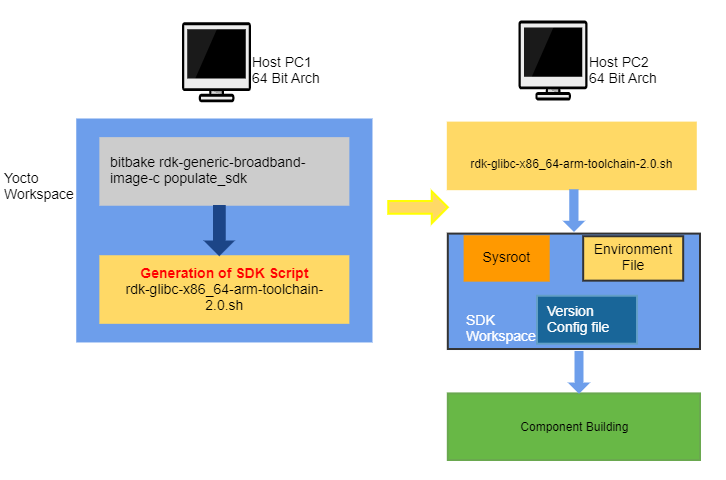

# Creating Yocto SDK

## Introduction

Welcome to the Yocto Software Development Kit (SDK) Guide. SDK allows developers in quick development and testing during development stage. It eliminates the need of downloading & setting-up of full repository environments.

Setting a full RDK stack is also quite time consuming and requires a high end machine having good disk space and CPU power for the build process. In the other hand SDK supports following features to overcome above challenges.

-   A minimal collection of tool chain, development binaries, supporting headers & libraries are shipped in the form of a self extracting script.
-   Allows to build any component using generic auto tool or similar build approach.
-   Supports packaging so as to install the modified software in target in a easy manner while taking care of the dependencies.

This page provides information that explains how to use both the Yocto SDK to develop images and components using the Yocto Project. A SDK consists of the following:

-   **Cross-Development Toolchain**
    : This toolchain contains a compiler, debugger, and various miscellaneous tools.
-   **Libraries, Headers, and Symbols**
    : The libraries, headers, and symbols are specific to the image (i.e. they match the image).
-   **Environment Setup Script**
    : This \*.sh file, once run, sets up the cross-development environment by defining variables and preparing for SDK use.

We can use the standard SDK to independently develop and test code that is destined to run on some target machine.

SDKs are completely self-contained. The binaries are linked against their own copy of libc, which results in no dependencies on the target system. To achieve this, the pointer to the dynamic loader is configured at install time since that path cannot be dynamically altered. This is the reason for a wrapper around the populate_sdk and populate_sdk_ext archives.

Another feature for the SDKs is that only one set of cross-compiler toolchain binaries are produced per architecture. This feature takes advantage of the fact that the target hardware can be passed to gcc as a set of compiler options. Those options are set up by the environment script and contained in variables such as CC and LD. This reduces the space needed for the tools. Understand, however, that a sysroot is still needed for every target since those binaries are target-specific.

The SDK development environment consists of the following:

-   The self-contained SDK, which is an architecture-specific cross-toolchain and matching sysroots (target and native) all built by the OpenEmbedded build system (e.g. the SDK). The toolchain and sysroots are based on a Metadata configuration and extensions, which allows you to cross-develop on the host machine for the target hardware. 
      
-   Various user-space tools that greatly enhance your application development experience. These tools are also separate from the actual SDK but can be independently obtained and used in the development process.

### The Cross-Development Toolchain

The Cross-Development Toolchain consists of a cross-compiler, cross-linker, and cross-debugger that are used to develop user-space applications for targeted hardware. This toolchain is created by running a toolchain installer script or through a Build Directory that is based on your Metadata configuration or extension for your targeted device. The cross-toolchain works with a matching target sysroot.

### Sysroots

The native and target sysroots contain needed headers and libraries for generating binaries that run on the target architecture. The target sysroot is based on the target root filesystem image that is built by the OpenEmbedded build system and uses the same Metadata configuration used to build the cross-toolchain.

### User-Space Tools

User-space tools, which are available as part of the SDK development environment, can be helpful. The tools include LatencyTOP, PowerTOP, Perf, SystemTap, and Lttng-ust. These tools are common development tools for the Linux platform.

-   *LatencyTOP:*
     LatencyTOP focuses on latency that causes skips in audio, stutters in your desktop experience, or situations that overload your server even when you have plenty of CPU power left.

-   *PowerTOP:*
     Helps you determine what software is using the most power. 

-   *Perf:*
     Performance counters for Linux used to keep track of certain types of hardware and software events. 

-   *SystemTap:*
     A free software infrastructure that simplifies information gathering about a running Linux system. This information helps you diagnose performance or functional problems. l.

-   *Lttng-ust:*
     A User-space Tracer designed to provide detailed information on user-space activity. 

## SDK Development Model

Fundamentally, the SDK fits into the development process as follows:


The SDK is installed on any machine and can be used to develop applications, images, and kernels. An SDK can even be used by a QA Engineer or Release Engineer. The fundamental concept is that the machine that has the SDK installed does not have to be associated with the machine that has the Yocto Project installed. A developer can independently compile and test an object on their machine and then, when the object is ready for integration into an image, they can simply make it available to the machine that has the Yocto Project. Once the object is available, the image can be rebuilt using the Yocto Project to produce the modified image.

You just need to follow these general steps:

1.  *Install the SDK for your target hardware:*
For information on how to install the SDK, see the "Installing the SDK" section.

2.  *Download the Target Image:*
The Yocto Project supports several target architectures and has many pre-built kernel images and root filesystem images. If you are going to develop your application on hardware, go to the machines download area and choose a target machine area from which to download the kernel image and root filesystem. This download area could have several files in it that support development using actual hardware. For example, the area might contain ` .hddimg ` files that combine the kernel image with the filesystem, boot loaders, and so forth. Be sure to get the files you need for your particular development process.

3.  *Develop and Test your Application:*
At this point, you have the tools to develop your application. If you need to separately install and use the emulator, you can go to [Emulator](https://wiki.rdkcentral.com/pages/viewpage.action?pageId=49644550) to download and learn about the emulator. 

## Using the SDK



### Generating SDK

To generate SDK use the following command:
```bash
$ bitbake  <image>  -c populate_sdk
#e.g: $ bitbake rdk-generic-broadband-image -c populate_sdk
```
The command results in a toolchain installer that contains the sysroot that matches your target root filesystem. Another powerful feature is that the toolchain is completely self-contained. The binaries are linked against their own copy of libc, which results in no dependencies on the target system. To achieve this, the pointer to the dynamic loader is configured at install time since that path cannot be dynamically altered. This is the reason for a wrapper around the populate_sdk archive.

Remember, before using BitBake command, you must source the build environment setup script and you must make sure yourconf/local.conf variables are correct. In particular, you need to be sure the MACHINE variable matches the architecture for which you are building and that the SDKMACHINE variable is correctly set if you are building a toolchain designed to run on an architecture that differs from your current development host machine (i.e. the build machine).

When the bitbake command completes, the SDK will be populated in tmp/deploy/sdk location.

### Installing SDK

The first thing you need to do is install the SDK on your host development machine by running the 
` *.sh `
 installation script.

The toolchains the Yocto Project provides are based off the 
` core-image-sato `
 image and contain libraries appropriate for developing against that image. Each type of development system supports five or more target architectures.

The names of the tarball installer scripts are such that a string representing the host system appears first in the filename and then is immediately followed by a string representing the target architecture.

```
rdk-glibc-host_system-image_type-arch-toolchain-release_version.sh
```
Where:  
 - `host_system` is a string representing your development system: For e.g. `i686` or `x86_64`  
 - `image_type` is the image for which the SDK was built.  
 - `arch` is a string representing the tuned target architecture: For e.g., `i586`, `x86_64`, `powerpc`, `mips`, `armv7a` or `armv5te`  
 - `release_version`  is a string representing the release number of the Yocto Project: For e.g., `2.0`  

For example, the following toolchain installer is for a 64-bit development host system and a i586-tuned target architecture based off the SDK for ` core-image-sato ` and using the  2.1 snapshot:
```
rdk-glibc-x86_64-arm-toolchain-2.0.sh
```

The SDK and toolchains are self-contained and by default are installed into ` /opt/poky ` . . However, when you run the SDK installer, you can choose an installation directory.

**Note**

You must change the permissions on the toolchain installer script so that it is executable:
```
$ chmod +x rdk-glibc-x86_64-arm-toolchain-2.0.sh
```
The following command shows how to run the installer given a toolchain tarball for a 64-bit x86 development host system and a 32-bit x86 target architecture. The example assumes the toolchain installer is located in ` ~/Downloads/ `

!!! warning "RW Permissions"
    If you do not have write permissions for the directory into which you are installing the SDK, the installer notifies you and exits. Be sure you have write permissions in the directory and run the installer again.

```bash
$ ./rdk-glibc-x86_64-arm-toolchain-2.0.sh 

RDK (A Yocto Project based Distro) SDK installer version 2.0 
============================================================  
Enter target directory for SDK (default: /opt/rdk/2.0): 
You are about to install the SDK to "/opt/rdk/2.0". Proceed[Y/n]? Y 
Extracting SDK............................................................................done 
Setting it up...done 
SDK has been successfully set up and is ready to be used
Each time you wish to use the SDK in a new shell session, you need to source the environment setup script e.g. 
$ . /opt/rdk/2.0/environment-setup-cortexa7t2hf-neon-vfpv4-rdk-linux-gnueabi
```
### Running the SDK Environment Setup Script

Once you have the SDK installed, you must run the SDK environment setup script before you can actually use it. This setup script resides in the directory you chose when you installed the SDK. 

Before running the script, be sure it is the one that matches the architecture for which you are developing. Environment setup scripts begin with the string "
` environment-setup `
" and include as part of their name the tuned target architecture. For example, the command to source a setup script for an IA-based target machine using i586 tuning and located in the default SDK installation directory is as follows:

```bash
$ source /mnt/sdk/environment-setup-cortexa7hf-neon-vfpv4-rdk-linux-gnueabi
```

When you run the setup script, many environment variables are defined:

```bash
SDKTARGETSYSROOT - The path to the sysroot used for cross-compilation
PKG_CONFIG_PATH - The path to the target pkg-config files
CONFIG_SITE - A GNU autoconf site file preconfigured for the target
CC - The minimal command and arguments to run the C compiler 
CXX - The minimal command and arguments to run the C++ compiler
CPP - The minimal command and arguments to run the C preprocessor
AS - The minimal command and arguments to run the assembler
LD - The minimal command and arguments to run the linker
GDB - The minimal command and arguments to run the GNU Debugger
STRIP - The minimal command and arguments to run 'strip', which strips symbols 
RANLIB - The minimal command and arguments to run 'ranlib'
OBJCOPY - The minimal command and arguments to run 'objcopy' 
OBJDUMP - The minimal command and arguments to run 'objdump'
AR - The minimal command and arguments to run 'ar' 
NM - The minimal command and arguments to run 'nm' 
TARGET_PREFIX - The toolchain binary prefix for the target tools 
CROSS_COMPILE - The toolchain binary prefix for the target tools
CONFIGURE_FLAGS - The minimal arguments for GNU configure
CFLAGS - Suggested C flags
CXXFLAGS - Suggested C++ flags
LDFLAGS - Suggested linker flags when you use CC to link 
CPPFLAGS - Suggested preprocessor flags
```
### Autotools-Based Projects

Once you have a suitable cross-toolchain installed, it is very easy to develop a project outside of the OpenEmbedded build system. This section presents a simple "Helloworld" example that shows how to set up, compile, and run the project.

#### Creating and Running a Project Based on GNU Autotools
**Create a Project Directory**

Create and enter a clean project directory

```bash
mkdir -p $HOME/helloworld
cd $HOME/helloworld
```

**Populate the Project Files**

Create the following three files in your project directory:

 **hello.c**

```c
#include <stdio.h>

int main() {
    printf("Hello World!\n");
    return 0;
}
```

   **Makefile.am**

```make
bin_PROGRAMS = hello
hello_SOURCES = hello.c
```

   **configure.in**

```m4
AC_INIT(hello.c)
AM_INIT_AUTOMAKE(hello, 0.1)
AC_PROG_CC
AC_PROG_INSTALL
AC_OUTPUT(Makefile)
```

**Source the Cross-Toolchain Environment**

Before building, source the environment setup script provided by your cross-toolchain SDK. This script is typically named `environment-setup-*`.

Example:

``` bash
source /opt/rdk/2.0/environment-setup-cortexa7t2hf-neon-vfpv4-rdk-linux-gnueabi
```

**Create GNU Standard Files**

Create placeholder files required by GNU coding standards:

```bash
touch NEWS README AUTHORS ChangeLog
```

**Generate the `configure` Script**

Run Autotools to generate the `configure` script:

```bash
autoreconf -i
```

**Configure the Build (Cross-Compile)**

Use the cross-compiler to configure the build:

```bash
./configure ${CONFIGURE_FLAGS}
```

Replace `${CONFIGURE_FLAGS}` with any required options specific to your target platform.

**Build and Install the Project**

Compile and install the project locally:

```bash
make
make install DESTDIR=./tmp
```

The binary will be installed to `./tmp/usr/local/bin/hello`.

**Verify the Installation**

Check the binary to ensure it's built for the correct architecture:

```bash
file ./tmp/usr/local/bin/hello
```

**Run the Project**

Run the binary (either locally or on the target device):

```bash
./hello
```

Expected output:

```
Hello World!
```
#### Passing Host Options

For an Autotools-based project, you can use the cross-toolchain by just passing the appropriate host option to ` configure.sh ` . The host option you use is derived from the name of the environment setup script found in the directory in which you installed the cross-toolchain. For example, the host option for an ARM-based target that uses the GNU EABI is 
` armv5te-poky-linux-gnueabi ` . You will notice that the name of the script is ` environment-setup-armv5te-poky-linux-gnueabi ` . Thus, the following command works to update your project and rebuild it using the appropriate cross-toolchain tools:

``` bash
$ ./configure --host=arm-rdk-linux-gnueabi --prefix=/usr --with-libtool-sysroot=sysroot_dir
```
!!! Note 
    If the ` configure `  script results in problems recognizing the ` --with-libtool-sysroot= `*` sysroot-dir `*  option, regenerate the script to enable the support by doing the following and then run the script again
    
``` bash
$ libtoolize --automake
$ aclocal -I ${OECORE_NATIVE_SYSROOT};/usr/share/aclocal   [-I dir_containing_your_project-specific_m4_macros]
$ autoconf
$ autoheader
$ automake -a
```
#### Makefile-Based Projects

For Makefile-based projects, the cross-toolchain environment variables established by running the cross-toolchain environment setup script are subject to general ` make `  rules.

To illustrate this, consider the following four cross-toolchain environment variables:
``` bash
CC=i586-poky-linux-gcc -m32 -march=i586 --sysroot=/opt/poky/2.1/sysroots/i586-poky-linux
LD=i586-poky-linux-ld --sysroot=/opt/poky/2.1/sysroots/i586-poky-linux
CFLAGS=-O2 -pipe -g -feliminate-unused-debug-types
CXXFLAGS=-O2 -pipe -g -feliminate-unused-debug-types
```
Now, consider the following three cases:

-   **Case 1 - No Variables Set in the ` Makefile `:**
    Because these variables are not specifically set in the ` Makefile ` , the variables retain their values based on the environment.

-   **Case 2 - Variables Set in the ` Makefile ` :**
     Specifically setting variables in the ` Makefile ` during the build results in the environment settings of the variables being overwritten.

-   **Case 3 - Variables Set when the ` Makefile` is Executed from the Command Line:**
     Executing the ` Makefile ` from the command line results in the variables being overwritten with command-line content regardless of what is being set in the ` Makefile ` . In this case,  environment variables are not considered unless you use the "-e" flag during the build:
``` bash
$ make -e file
```
If you use this flag, then the environment values of the variables override any variables specifically set in the ` Makefile `
