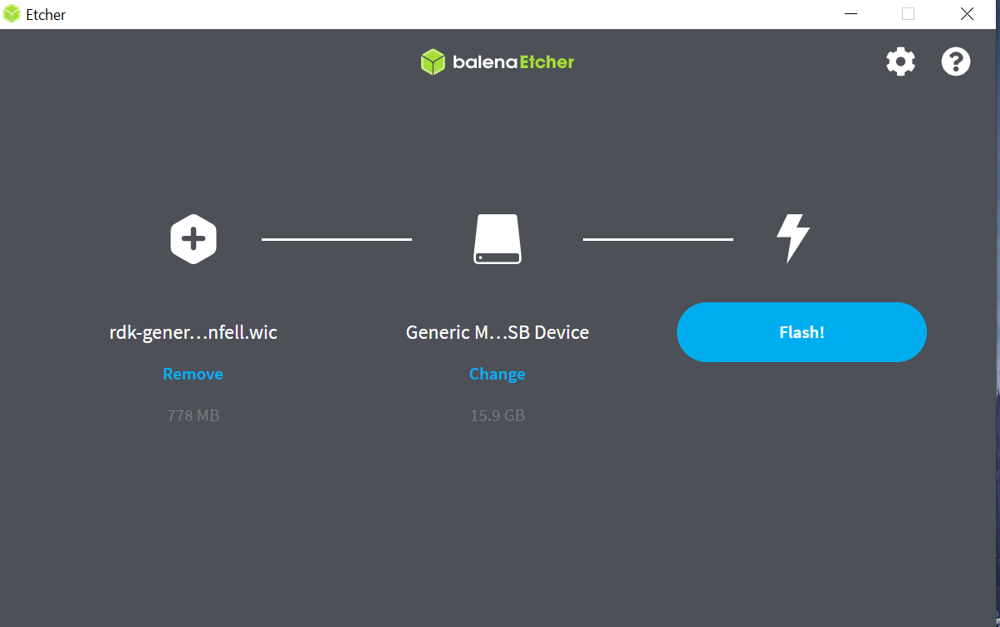
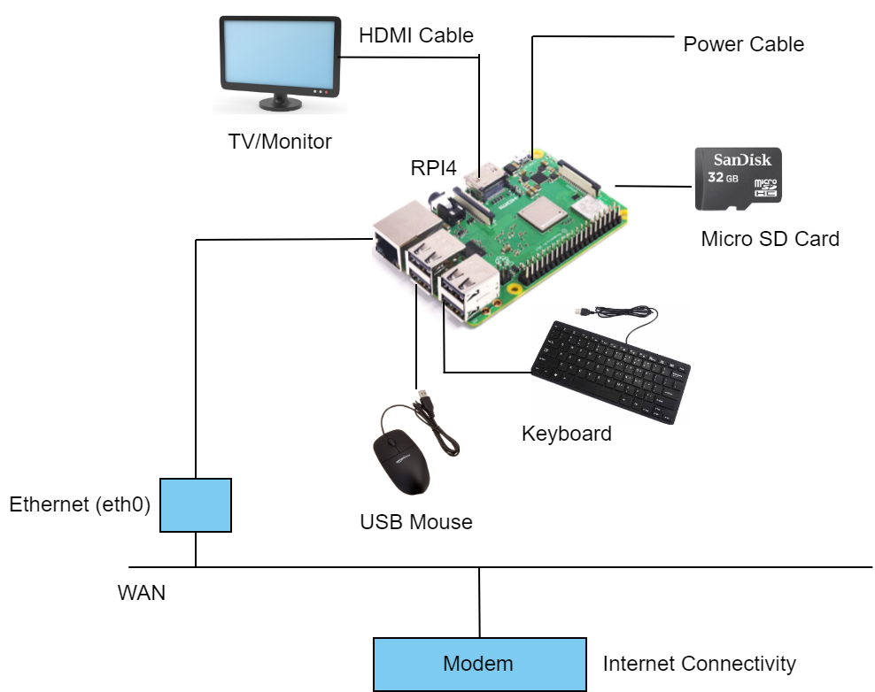
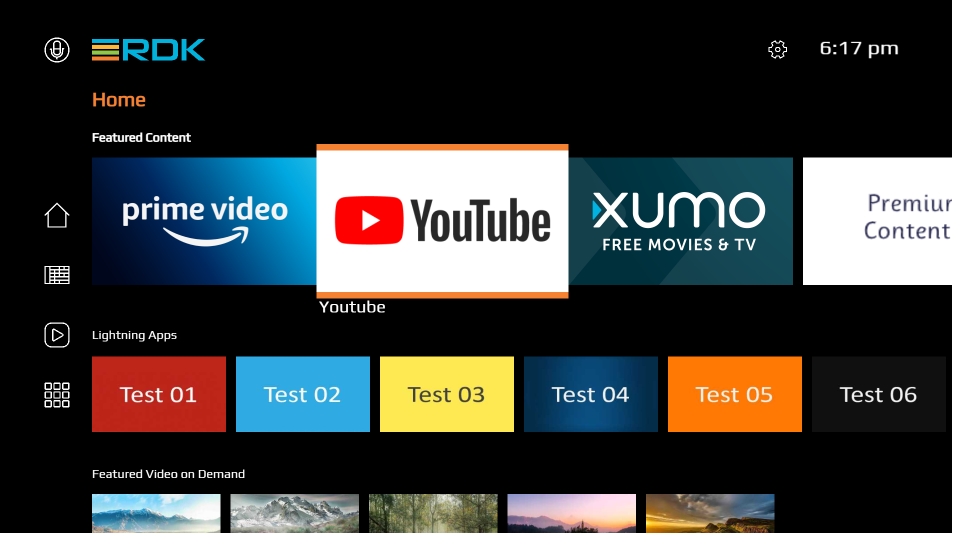
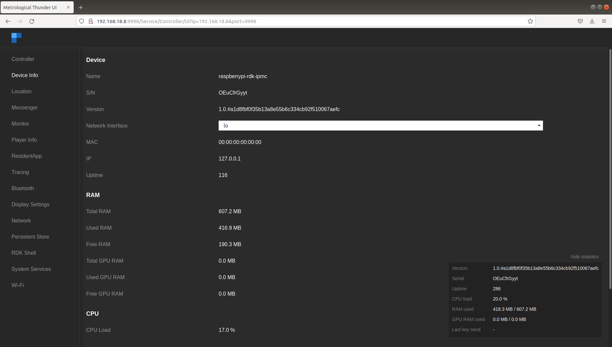
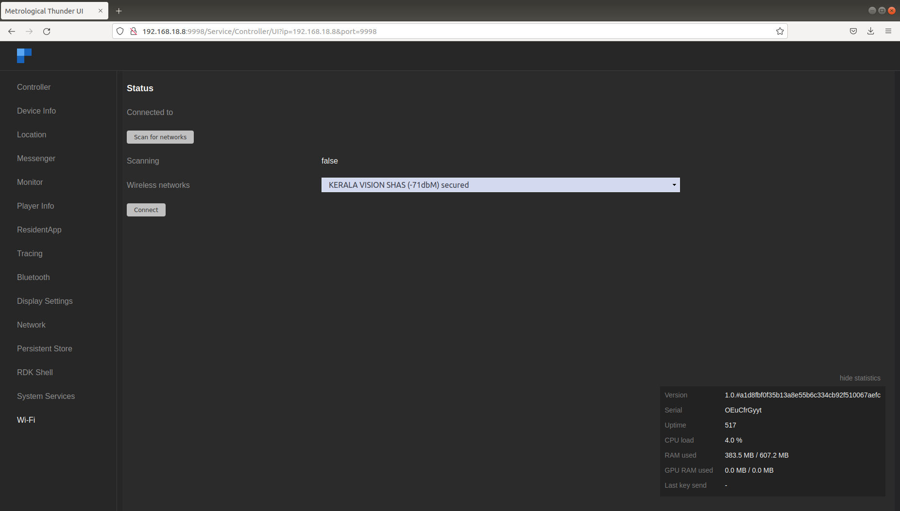

# Try out RDK for Entertainment

## Raspberry Pi Usage Guide

Raspberry Pi series consists of low-cost, credit card sized single board computers. These models feature an ARM CPU and an on-chip graphics processing unit (GPU). Raspberry Pi uses an SD card, which allows users to swap out different versions of the operating system or software updates, thereby speeding the development and testing process. This makes it an excellent tool for developing new applications or software and showcasing them to customers in remote locations or at trade shows

Follow the steps given below to download the RPI image, flash it, and to bring up RPI with flashed image.

### Download pre-compiled image

Get the pre-compiled RDK image from [here](./files/1.tgz)

### Flash Image

This section describes two methods for flashing an image onto an SD card:

* **Using the command line** (Linux environment)
* **Using the balenaEtcher app** (Windows environment)

#### Using Linux Command Line

1. **Insert the SD card** into the SD card port of a USB card reader or directly into a laptop.
   *Recommended: Use a 32 GB SD card with at least 12 GB of free space.*

2. **Verify that the SD card has been detected** by running one of the following commands:

```bash
lsblk
sudo fdisk -l
```

Example output:

```bash
   NAME   MAJ:MIN RM   SIZE RO TYPE MOUNTPOINT
   sda      8:0    0 931.5G  0 disk
   ├─sda1   8:1    0   350M  0 part
   ├─sda2   8:2    0     3G  0 part
   ├─sda3   8:3    0 896.4G  0 part /
   ├─sda4   8:4    0     1K  0 part
   └─sda5   8:5    0  31.8G  0 part [SWAP]
   sdb      8:16   1  14.9G  0 disk
   ├─sdb1   8:17   1    40M  0 part /media/raspberrypi
   └─sdb2   8:18   1   552M  0 part /media/dd5efb34-1d40-4e50-bbc2-a75d3e02af97
```

3. **Check if any partitions on the SD card are mounted**:

```bash
mount
```

Look for entries such as:

```bash
/dev/sdb1 on /media/raspberrypi type vfat (...)
/dev/sdb2 on /media/dd5efb34-1d40-4e50-bbc2-a75d3e02af97 type ext3 (...)
```

4. **Unmount all mounted SD card partitions** using:

```bash
sudo umount <partition>
```

Example:

```bash
sudo umount /dev/sdb1
sudo umount /dev/sdb2
```

Confirm unmounting by re-running `lsblk`. The `MOUNTPOINT` column should be empty for the SD card partitions.

5. **Flash the image to the SD card** using the `dd` command:

```bash
sudo dd if=<path-to-ImageName.Rpi-sdimg> of=<path-to-sd-card> bs=4M
```

Example:

```bash
sudo dd if=rdk-generic-mediaclient-wpe-image.Rpi-sdimg of=/dev/sdb bs=4M
```

Output:

```bash
149+0 records in
149+0 records out
624951296 bytes (625 MB) copied, 39.7752 s, 15.7 MB/s
```

6. **Safely remove the SD card**, then insert it into the Raspberry Pi's SD card slot.

#### Using balenaEtcher App

To flash the image onto an SD card using a graphical interface, you can use the **balenaEtcher** application:
👉 [Download balenaEtcher](https://www.balena.io/etcher/)

> **Note:**
>
> * It is recommended to use a **32 GB SD card** with **at least 12 GB of free space**.
> * **Remove all other portable storage devices** (USB drives, hard drives, SD cards) from your computer before proceeding to avoid flashing the wrong device.

**Steps:**

1. Open the **balenaEtcher** application.
2. Click **“Flash from file”** and select the downloaded RDK image.
3. Choose the correct **SD card drive**.
4. Click **“Flash”** to begin writing the image.




Once flashing is complete, **safely remove the SD card** and insert it into the **microSD card slot** on the underside of your **Raspberry Pi**.

---

### Bring Up and See UI

#### System Setup

Use the diagram below to set up your system:



1. Power on the Raspberry Pi.
2. The TV screen should display the **default RDK UI**:



#### Navigating the UI

* **Arrow Keys (Left/Right/Up/Down):** Navigate between content tiles
* **Enter Key:** Select or enter sub-menus/settings
* **Backspace Key:** Return to the previous screen

To view the **Raspberry Pi's IP address** (referred to as `machineIP`):

Navigate to:
**Settings → Network Configuration → Network Info → IP Address**


---

#### Accessing Controller UI

To access the **Controller UI**, open a browser and visit:

```bash
http://<RPi_IP>:9998
```



##### Controller UI Features

* **Enable/Disable Plugins:**
  Control plugin activation directly from the UI.
  

* **Wi-Fi Management:**
  Use the **Wi-Fi tab** to scan and connect to available wireless networks.
  

* **SSH Access:**
  You can connect via SSH using:

```bash
ssh root@<machineIP>
```

## RDK Accelerator

The **RDK Video Accelerator** is available globally as the core reference platform for RDK video applications. It enables the RDK community to rapidly develop, test, and deliver innovative services.

To learn more about its features and benefits, visit the [RDK Accelerator Home Page](https://wiki.rdkcentral.com/display/RDK/RDK+Accelerator+Home+Page).
